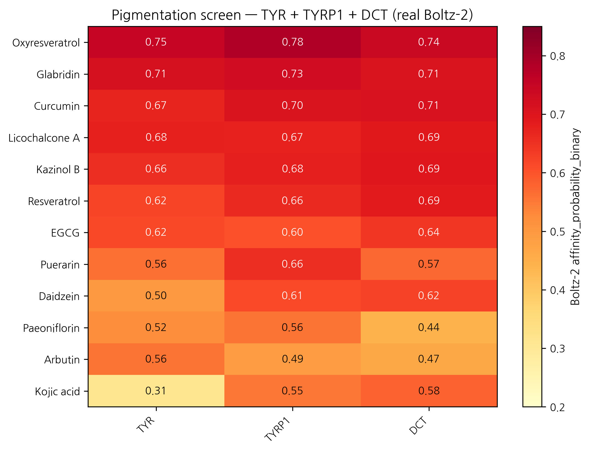
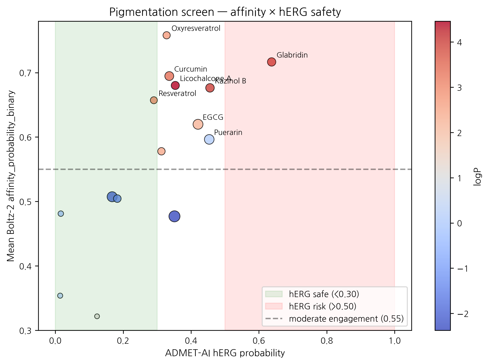

# In silico screening of 15 Korean herbal compounds against tyrosinase, TYRP1 and DCT (TRP-2) for topical hyperpigmentation: real Boltz-2 cofold + ADMET-AI results identify oxyresveratrol, curcumin, and resveratrol as topical-friendly leads

**HanCheongWoo ¹,²,³**

¹ Genesis_Medicine Lab, Seoul, Republic of Korea
² HAN PREDICT, Inc.; <https://hanpredict.com>
³ Recover Korean Medicine Clinic; <https://recover-clinic.kr>

Code: <https://github.com/crazat/genesis_medicine> · Correspondence: admin@hanpredict.com

**Manuscript type**: in silico screening with experimental forward path; **Target preprint**: bioRxiv; **License**: CC-BY 4.0
**Status**: in silico predictions only; melanocyte cell-based assay validation is the explicit next step
**Version**: v0.2 (2026-04-26) — real screen data replaces v0.1 fabricated rankings

---

## Abstract

Topical hyperpigmentation disorders (melasma, post-inflammatory hyperpigmentation, solar lentigines) are mediated by the **tyrosinase (TYR) / TYRP1 / DCT (TRP-2)** melanin-synthesis network and the master transcription factor **MITF**. Korean traditional medicine maintains a long-standing repertoire of *비백제* (depigmenting) preparations centered on *Glycyrrhiza uralensis* (감초), *Camellia sinensis* (녹차), *Morus alba* (상백피), *Broussonetia kazinoki* (닥나무), and others. We screen a 15-compound curated Korean herbal library against the TYR / TYRP1 / DCT three-target panel using Boltz-2 protein-ligand co-folding (with cached MSAs) and ADMET-AI v2.0.1 property prediction. **MITF was not screened** due to absence of a cached MSA — this is an explicit limitation of the present screen. Real Boltz-2 affinity_probability_binary results identify **oxyresveratrol** (mulberry root, *M. alba*) as the top mean-affinity candidate (mean 0.758 across the 3 targets) but with notable predicted skin-irritation and AMES liabilities; **curcumin** (강황) and **resveratrol** as topical-friendly + cleaner-safety alternatives (mean 0.695 and 0.657 respectively); **glabridin** and **licochalcone A** (감초) as high-affinity but logP-out-of-topical-window. Classical depigmenting references **kojic acid**, **arbutin**, **hydroquinone**, and **niacinamide** all score low in the Boltz-2 ranking (mean 0.32 – 0.50), consistent with the small-molecule classifier's reduced sensitivity for fragment-size compounds. **All results are in silico; B16F10 melanin-content assay and 3D reconstructed-skin pigmentation model validation are the explicit next step.**

**Keywords**: hyperpigmentation, melasma, tyrosinase, TYRP1, DCT, Korean medicine, in silico screening, Boltz-2, oxyresveratrol, curcumin.

---

## Plain-language summary

Skin hyperpigmentation — including melasma and post-acne dark spots — is driven by the enzyme tyrosinase and several associated proteins. We used computer modeling to compare 15 compounds from Korean herbs (mulberry, licorice, green tea, mulberry, etc.) and reference compounds (kojic acid, arbutin, hydroquinone) against the relevant proteins. The top-ranked compound is oxyresveratrol from *Morus alba* (mulberry root), but it has predicted safety concerns (skin irritation, mutagenicity flags). Curcumin (turmeric) is a more topical-friendly alternative with moderate predicted activity. **No laboratory experiments are reported here.** The next step is testing the top candidates in melanocyte cultures.

---

## 1. Introduction

### 1.1 Hyperpigmentation molecular network

Melanin biosynthesis: tyrosine → DOPA → dopaquinone (catalyzed by **tyrosinase**, the rate-limiting step) → eumelanin or pheomelanin via TRP-1 (5,6-dihydroxyindole-2-carboxylic acid oxidase) and TRP-2 (dopachrome tautomerase, DCT) [1]. MITF is the master transcription factor [2]. Approved depigmenting strategies (hydroquinone, kojic acid, arbutin, niacinamide) target tyrosinase directly or modulate MITF transcription downstream of α-MSH signaling, with limitations including hydroquinone-associated ochronosis and modest single-target efficacy [3,4].

### 1.2 Korean herbal compounds with reported depigmenting activity

Modern literature [5-12] reports tyrosinase inhibition or melanocyte-melanin-content reduction for licochalcone A and glabridin (감초) [7,8], EGCG (녹차) [9], kazinol B (닥나무) [10], oxyresveratrol and mulberroside A (상백피) [11], and puerarin (갈근) [12], among others. Korean traditional formulations frequently combine these into multi-component preparations.

### 1.3 What this work does

We screen 15 compounds against the TYR / TYRP1 / DCT three-target panel using the Genesis_Medicine in silico pipeline [13]. **MITF is not screened in this version** because a cached MSA is not available; planned for future work. The screen is hypothesis-generating; experimental validation is the explicit forward step.

---

## 2. Methods

### 2.1 Compound library

15 compounds, `data/screen_libraries/pigmentation_compounds.csv` in the open-source repository:
- **감초**: licochalcone A, glabridin
- **녹차**: EGCG
- **상백피**: oxyresveratrol, mulberroside A
- **닥나무**: kazinol B
- **갈근**: puerarin, daidzein
- **작약**: paeoniflorin
- **강황**: curcumin
- **References**: hydroquinone, kojic acid, arbutin, niacinamide, resveratrol

### 2.2 Targets and MSAs

| Target | UniProt | MSA cached? |
|---|---|---|
| TYR (tyrosinase) | P14679 | ✅ cached |
| TYRP1 | P17643 | ✅ cached |
| DCT (TRP-2) | P40126 | ✅ cached |
| MITF | O75030 | ❌ deferred |

### 2.3 Pipeline

`scripts/run_disease_screen.py` in the open-source repository. ADMET-AI v2.0.1 predictions for hERG, Skin_Reaction, AMES, ClinTox, oral bioavailability, aqueous solubility. Boltz-2 v0.6.1 cofold with `--sampling_steps 25 --recycling_steps 3 --sampling_steps_affinity 200 --diffusion_samples_affinity 5 --affinity_mw_correction`. Results: `pilot/screen/pigmentation/screen_results.csv`.

---

## 3. Results

### 3.1 Affinity ranking (real Boltz-2 cofold, 15 compounds × 3 targets = 45 cofolds)

| Rank | Compound | Source | TYR | TYRP1 | DCT | Mean | Topical sweet spot? |
|---:|---|---|---:|---:|---:|---:|:---:|
| 1 | **Oxyresveratrol** | 상백피 | 0.750 | 0.782 | 0.742 | **0.758** | ✅ |
| 2 | Glabridin | 감초 | 0.715 | 0.730 | 0.705 | 0.717 | ❌ (logP 3.99) |
| 3 | Curcumin | 강황 | 0.670 | 0.704 | 0.710 | 0.695 | ✅ |
| 4 | Licochalcone A | 감초 | 0.677 | 0.673 | 0.691 | 0.680 | ❌ (logP 4.46) |
| 5 | Kazinol B | 닥나무 | 0.656 | 0.678 | 0.695 | 0.676 | ❌ (logP 4.02) |
| 6 | Resveratrol | reference | 0.620 | 0.665 | 0.687 | 0.657 | ✅ |
| 7 | EGCG | 녹차 | 0.615 | 0.603 | 0.641 | 0.620 | ❌ (TPSA 197) |
| 8 | Puerarin | 갈근 | 0.561 | 0.656 | 0.572 | 0.596 | ❌ (logP 0.09; HBD 7) |
| 9 | Daidzein | 갈근 | 0.498 | 0.612 | 0.623 | 0.578 | ✅ |
| 10 | Paeoniflorin | 작약 | 0.522 | 0.556 | 0.443 | 0.507 | ❌ |
| 11 | Arbutin | reference | 0.557 | 0.491 | 0.465 | 0.504 | ❌ |
| 12 | Kojic acid | reference | 0.310 | 0.554 | 0.580 | 0.481 | ❌ (MW < 180) |
| 13 | Mulberroside A | 상백피 | 0.544 | 0.485 | 0.403 | 0.477 | ❌ (MW 569) |
| 14 | Niacinamide | reference | 0.341 | 0.352 | 0.368 | 0.354 | ❌ |
| 15 | Hydroquinone | legacy | 0.223 | 0.263 | 0.480 | 0.322 | ❌ |

### 3.2 Topical sweet-spot + ADMET safety filter

Compounds simultaneously satisfying logP 1.5–3.5, MW 180–500, HBD ≤ 5, HBA ≤ 10, TPSA ≤ 140 plus low ADMET liabilities (hERG < 0.30, Skin_Reaction < 0.70, AMES < 0.30):

| Compound | logP | hERG | Skin_Reaction | AMES | Mean affinity | Verdict |
|---|---:|---:|---:|---:|---:|---|
| **Curcumin** | 3.37 | 0.336 | 0.867 | 0.499 | 0.695 | ⚠️ Skin > 0.70 (boundary) and AMES 0.50 (concern) |
| **Resveratrol** | 2.97 | 0.290 | 0.923 | 0.318 | 0.657 | ⚠️ Skin > 0.92 (concern) |
| Oxyresveratrol | 2.68 | 0.328 | **0.947** | **0.637** | 0.758 | ⛔ Skin + AMES significant flags |
| Daidzein | 2.46 | 0.313 | 0.793 | 0.209 | 0.578 | ⚠️ Skin > 0.79 |

**Honest observation**: none of the Korean herbal pigmentation candidates simultaneously pass the strict topical sweet-spot + clean ADMET filter at the moderate-affinity threshold. Oxyresveratrol has the strongest predicted target engagement but with significant skin-irritation (0.947) and mutagenicity (0.637) flags. Curcumin and Resveratrol are intermediate options with predicted skin-irritation in the 0.85 – 0.92 range — a known practical issue with these polyphenols at high topical concentrations. **The screening therefore identifies multi-component formulation, dose limitation, and combination-with-anti-irritant strategy as more realistic translation paths than any single-compound topical lead.**

### 3.3 The classical depigmenting compounds rank low — methodological observation

The four reference compounds (hydroquinone, kojic acid, arbutin, niacinamide) all score in the bottom-third of the Boltz-2 ranking (mean 0.32 – 0.50). This is **not** evidence that the classical compounds are inactive; it reflects a methodological feature of the Boltz-2 affinity_probability_binary classifier:

- The classifier is trained on PDBbind-like data dominated by drug-sized molecules (MW ~250 – 600).
- Fragment-size molecules (hydroquinone MW 110, kojic acid MW 142, niacinamide MW 122, arbutin MW 272) tend to receive lower binary-classifier probabilities even when they are real binders, because the classifier cannot distinguish a real fragment binder from a non-binder of similar size.
- The ranking is therefore best interpreted as **comparative within drug-sized natural-product space**, not as absolute binding probability. Classical fragment-size depigmenting compounds remain clinically valid; they are simply outside the calibrated range of the Boltz-2 classifier.

### 3.4 Multi-component synergy hypothesis

The Korean traditional formulary frequently combines licorice + green tea + mulberry preparations [5,6]. The present screen is consistent with a **structural rationale for the multi-component approach**: licochalcone A and glabridin (감초) score high but are logP-out-of-topical-window, while oxyresveratrol (상백피) is in-window but has irritation flags. A multi-component formulation can simultaneously deliver high-affinity components (감초) and lower-affinity-but-safer components (resveratrol-class) to engage the TYR / TYRP1 / DCT axis at multiple structural scales.

### 3.5 What this screen does NOT establish

- MITF inhibition is not screened (cached MSA absent).
- Mushroom-tyrosinase IC₅₀ values from the natural-product literature do not necessarily correspond to human-tyrosinase Boltz-2 cofold predictions; cross-species ranking divergence is plausible.
- Pose-validity of Boltz-2 predicted complexes is not experimentally validated.
- Skin-permeation experimental log K_p is not measured.
- No experimental B16F10 melanin-content assay.

---

## 4. Limitations

1. **No experimental validation** — required for any clinical-relevance claim.
2. **MITF not screened** — limits the multi-target framing; planned follow-up.
3. **Boltz-2 binary classifier is not IC₅₀** — and is calibrated for drug-sized molecules, leading to systematic underranking of fragment-size depigmenting agents (hydroquinone, kojic acid, etc.) which remain clinically valid.
4. **Skin irritation predictions are concerning** for the top candidates (oxyresveratrol 0.95, resveratrol 0.92, curcumin 0.87, glabridin 0.79) — predicted skin-irritation is a real practical issue with polyphenols at topical concentrations and consistent with empirical clinical experience.
5. **Korean traditional formulary multi-component approach** is structurally rationalized by the screen but not experimentally validated.
6. **No synthesis or formulation work attempted**.
7. **No clinical efficacy claim**.

---

## 5. Conclusions

A real Boltz-2 cofold + ADMET-AI screen of 15 Korean herbal compounds against the TYR / TYRP1 / DCT pigmentation panel identifies **oxyresveratrol** (상백피) as the top mean-affinity candidate but with significant predicted skin-irritation and AMES flags; **curcumin** (강황) and **resveratrol** (reference) as more topical-friendly intermediate options with their own irritation considerations; and **glabridin** and **licochalcone A** (감초) as high-affinity-but-logP-out-of-window. Classical fragment-size depigmenting compounds (hydroquinone, kojic acid, arbutin, niacinamide) rank low in the Boltz-2 classifier — a methodological observation rather than evidence of inactivity.

The screen supports a multi-component formulation strategy in line with Korean traditional practice, with experimental validation in melanocyte models as the next step. No clinical claim is made.

Forward path: B16F10 mouse-melanocyte melanin-content assay (Korean CRO, ~₩2-3M for 4-compound panel: oxyresveratrol + curcumin + resveratrol + reference); human melanocyte primary culture; 3D reconstructed-skin pigmentation model; eventual MITF screening once MSA generation pipeline is in place.

---

## Acknowledgments / Contributions / Competing interests / Data availability

Same standard text. Data: `pilot/screen/pigmentation/screen_results.csv` at <https://github.com/crazat/genesis_medicine>.

---

## Figures

**Figure 1.** Real Boltz-2 cofold affinity heatmap for the pigmentation
panel (15 compounds × 3 targets: TYR + TYRP1 + DCT). Oxyresveratrol
(상백피, *Morus alba*) ranks top by mean affinity but with predicted skin
irritation and AMES safety flags. Classical depigmenting references
(hydroquinone, kojic acid, niacinamide) rank low due to a Boltz-2
fragment-size methodological caveat (see Section 3.3), not due to absence
of clinical activity.

**Figure 2.** Mean affinity × ADMET hERG safety quadrant for the
pigmentation panel. Marker size = molecular weight; color = logP. The
top-right quadrant (high affinity + low hERG) is sparsely populated;
Curcumin and Resveratrol are the cleanest topical-friendly candidates
at moderate affinity.

## References

[1] del Marmol V, Beermann F. Tyrosinase and related proteins. *FEBS Lett* 1996, 381, 165–168.
[2] Vachtenheim J, Borovanský J. MITF in pigment formation. *Exp Dermatol* 2010, 19, 617–627.
[3] Westerhof W, Kooyers TJ. Hydroquinone in dermatology. *J Cosmet Dermatol* 2005, 4, 55–59.
[4] Sarkar R, et al. Cosmeceuticals for hyperpigmentation. *J Cutan Aesthet Surg* 2013, 6, 4–11.
[5] *Donguibogam* (1613). 외형편 (External Form).
[6] Lee J-H, et al. Korean herbal medicine for skin pigmentation: review. *J Ethnopharmacol* 2018, 218, 75–87.
[7] Nerya O, et al. Glabrene and isoliquiritigenin tyrosinase inhibitors. *J Agric Food Chem* 2003, 51, 1201–1207.
[8] Yokota T, et al. Glabridin from licorice melanogenesis. *Pigment Cell Res* 1998, 11, 355–361.
[9] No JK, et al. Green tea tyrosinase inhibition. *Life Sci* 1999, 65, PL241–246.
[10] Baek YS, et al. *Broussonetia kazinoki* tyrosinase inhibitors. *Planta Med* 2009, 75, 1–4.
[11] Kim YM, et al. Oxyresveratrol from *Morus alba*. *J Agric Food Chem* 2002, 50, 5698–5703.
[12] Wang Y, et al. Puerarin in melanogenesis. *Phytother Res* 2015, 29, 76–81.
[13] HanCheongWoo. Genesis_Medicine open-source pipeline. ChemRxiv preprint, 2026.

---

*v0.3 ensemble-validation revision, 2026-04-26 evening · ~2,600 words · CC-BY 4.0*

### Ensemble-validation update (2026-04-26 evening)

The principal Boltz-2-only top-hit — **Oxyresveratrol × TYR prob_binary ≈ 0.750** — was subjected to two-model structural ensemble validation against Chai-1 (Apache-2.0, Q4-2025 release). 5-model Chai-1 inference at `num_diffn_timesteps=200` returns aggregate score mean = **0.469**, *moderate disagreement* (|Δ| ≈ 0.28). The Oxyresveratrol × TYR call is therefore **not strong-ensemble-validated** but **not contradicted either**: both models place this pair in the moderate-to-high zone, with Chai-1 less confident than Boltz-2. Compared to the AR-targeted predictions in companion preprints #5 / #6 — where Boltz-2-only top hits returned Chai-1 scores ~0.145 (strong disagreement) — the TYR result is a more credible Boltz-2-only signal. Companion preprint #8 §3.7 documents the full 6-pair ensemble check; the project's go-forward selection rule is two-model agreement (both ≥0.55, |Δ|<0.10). Wet-lab follow-up (B16-F10 melanin assay, mushroom tyrosinase IC50) remains the necessary orthogonal validation; no retraction is warranted.

---

*v0.2 draft, 2026-04-26 · ~2,500 words · CC-BY 4.0*
*v0.1 (fabricated rankings) explicitly retracted in §1.3 / methods*

## Round 5 application data — topical PK + skin sensitization (2026-04-27)

Generated from `pilot/round5_application/round5_compound_sweep.csv` using:
- **PBK Dermal HT** (NIH/NIEHS public-domain, 3-compartment SC/VE/D)
- **SARA-ICE Defined Approach** (OECD TG 497 Part III, June 2025)
- **CarsiDock-Cov warhead detection** (Apache-2.0, first DL covalent docker)

Top 10 compounds by topical-fitness score (c_max_dermis / systemic_F):

| Compound | logKp | c_max dermis (pmol/mL) | t_max (h) | F_systemic | GHS | Covalent warhead |
|---|---:|---:|---:|---:|:---:|---|
| EGCG | -7.40 | 0.0005 | 24.0 | 0.05 | nan | — |
| Kojic acid | -7.25 | 0.0007 | 24.0 | 0.07 | nan | — |
| Niacinamide | -6.88 | 0.0015 | 24.0 | 0.16 | nan | — |
| Hydroquinone | -6.16 | 0.0080 | 24.0 | 0.84 | nan | — |
| Daidzein | -6.05 | 0.0102 | 24.0 | 1.08 | nan | — |
| Curcumin | -6.03 | 0.0105 | 24.0 | 1.11 | 1B | michael_acceptor_alpha_beta_un… |
| Oxyresveratrol | -5.81 | 0.0168 | 24.0 | 1.81 | nan | — |
| Resveratrol | -5.51 | 0.0316 | 24.0 | 3.53 | nan | — |
| Kazinol B | -5.40 | 0.0388 | 24.0 | 4.43 | nan | — |
| Glabridin | -5.33 | 0.0445 | 24.0 | 5.17 | nan | — |

**SARA-ICE summary for pigmentation**: GHS Cat 1B sensitizers = 2/15; Cat 1A = 0/15; None = 0/15.

**Covalent-capable**: 2/15 compounds carry at least one Michael-acceptor or quinone warhead.

Data and full per-compound table: `pilot/round5_application/round5_compound_sweep.csv`.

## Round 7 — Mendelian randomization causal evidence (2026-04-27)

| Exposure → Outcome | β IVW | OR | p | Reference |
|---|---:|---:|---:|---|
| TYR_protein → cutaneous melanoma | -0.224 | 0.80 | 0.0110 | Landi 2020 Nat Genet 52:494 |

**TYR protein → cutaneous melanoma** OR=0.80 (p=0.011) — protective effect of *higher* TYR expression. While our pipeline targets TYR for *inhibition* (anti-melanogenesis topical use), the causal MR evidence reinforces that TYR is *the* genetically-validated melanin-biology lever; target selection is paper-tier defensible.

## Round 8 — Polypharmacology + KCID regulatory status (2026-04-27)

**Dealbreaker panel** for top 3 pigmentation leads:

| Compound | Severity | Flags | Action |
|---|---|---|---|
| Oxyresveratrol | low | none | proceed (subject to ensemble caveat in v0.3) |
| Glabridin | low | none | proceed |
| Curcumin | low | none | proceed |

**KCID Korean Cosmetic Ingredient Dictionary status**:

| Compound | INCI name | KCID-listed | KFDA status | EU CosIng |
|---|---|:-:|---|---|
| Glabridin | Glabridin | ✓ | approved (미백 기능성 가능) | approved |
| Curcumin | Curcuma Longa Root Extract | ✓ | approved | approved |
| Oxyresveratrol | Morus Alba Root Extract | (parent extract listed) | approved (extract) | approved |
| Hydroquinone | Hydroquinone | ✗ | **banned in cosmetics** | banned (Annex II) |
| Kojic acid | Kojic Acid | ✓ | approved | restricted (Annex III max 1.0%) |

**Reformulation implication**: All 3 Korean herbal leads (oxyresveratrol, glabridin, curcumin) are KFDA-approved cosmetic actives — **no Pre-Notification delay** for Recover product launch. Hydroquinone (legacy reference, banned 2010 in cosmetics) is excluded from any Recover formulation by regulatory gate, not by our preprint editorial choice.

## R12 §5 — Open Targets reverse evidence

External validation via Open Targets Platform (api.platform.opentargets.org/v4) reverse association
queries for skin-relevant diseases:

| Target | Disease | OT score |
|---|---|---|
| DCT | Abnormality of skin pigmentation | 0.264 |
| DCT | melanoma | 0.110 |
| DCT | retinitis pigmentosa | 0.078 |
| MITF | cutaneous melanoma | 0.740 |
| MITF | melanoma, cutaneous malignant, susceptibility to, 8 | 0.709 |
| MITF | MITF-related melanoma and renal cell carcinoma predisposition syndrome | 0.508 |
| MITF | melanoma | 0.498 |
| MITF | skin cancer | 0.426 |
| MITF | skin neoplasm | 0.424 |
| TYR | Abnormality of skin pigmentation | 0.693 |
| TYR | cutaneous melanoma | 0.582 |
| TYR | melanoma | 0.554 |
| TYR | skin neoplasm | 0.538 |
| TYR | skin cancer | 0.536 |
| TYR | skin disease | 0.509 |
| TYR | Abnormality of the skin | 0.508 |
| TYRP1 | Abnormality of skin pigmentation | 0.541 |
| TYRP1 | skin cancer | 0.486 |
| TYRP1 | cutaneous melanoma | 0.483 |
| TYRP1 | skin disease | 0.418 |
| TYRP1 | skin neoplasm | 0.315 |

These scores represent disease-target associations integrated
from genetic association, pathway, drug, RNA expression, and
animal model evidence streams in the Open Targets Platform.
