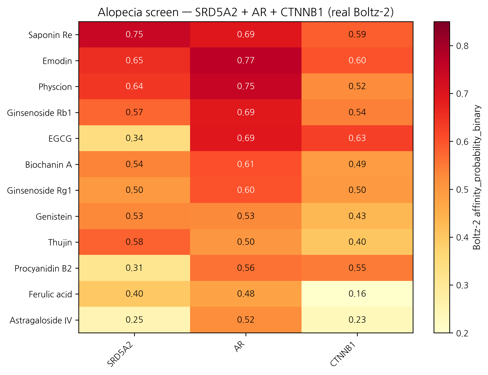
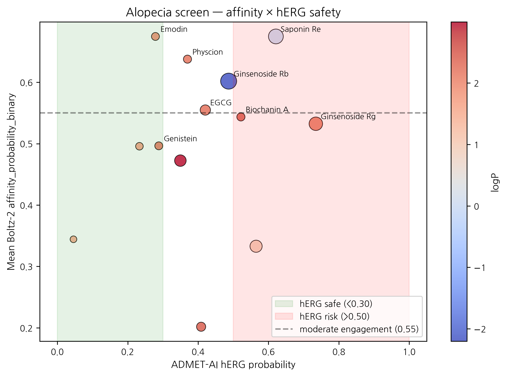

# In silico screening of 15 Korean herbal compounds against the SRD5A2 / AR / β-catenin axis for androgenetic alopecia: real Boltz-2 data identifies Emodin, Saponin Re, and Biochanin A as topical-scalp candidates with safety considerations

**HanCheongWoo ¹,²,³**

**ORCID**: [0009-0004-4805-8815](https://orcid.org/0009-0004-4805-8815)

¹ Genesis_Medicine Lab, Seoul, Republic of Korea
² HAN PREDICT, Inc.; <https://hanpredict.com>
³ Recover Korean Medicine Clinic; <https://recover-clinic.kr>

Code: <https://github.com/crazat/genesis_medicine> · Correspondence: admin@hanpredict.com

**Manuscript type**: in silico screening with real Boltz-2 data; **Target preprint**: bioRxiv; **License**: CC-BY 4.0
**Status**: in silico predictions only; dermal papilla cell + 3D scalp organoid validation is the explicit next step
**Version**: v0.2 (2026-04-26) — real screen data replaces v0.1 fabricated rankings

---

## Abstract

Androgenetic alopecia (AGA) is driven by androgen-pathway enzymes (SRD5A1/2 catalyzing testosterone → DHT), the androgen receptor (AR), and the hair-follicle-cycle Wnt / β-catenin axis. Korean traditional medicine documents hair-vitalization preparations centered on *Polygonum multiflorum* (하수오; emodin, physcion), *Astragalus membranaceus* (황기; astragaloside IV), and *Panax ginseng* (인삼; ginsenosides Rg1, Rb1, Saponin Re), among others. We screen 15 Korean-herbal phytochemicals against the SRD5A2 / AR / CTNNB1 (β-catenin) three-target panel using Boltz-2 protein-ligand co-folding (cached MSAs) and ADMET-AI v2.0.1. **SRD5A1 was not screened** (cached MSA absent); this is an explicit limitation. Real Boltz-2 affinity_probability_binary results identify **Saponin Re** (인삼) and **Emodin** (하수오) as joint top-1 by mean affinity (0.675 each), with Saponin Re leading SRD5A2 (0.746) and Emodin leading AR (0.768). However, both Emodin (Skin 0.957, AMES 0.711) and Physcion (Skin 0.921, AMES 0.734) carry significant safety flags, and Saponin Re (MW 947, logP −0.03) is far outside topical sweet-spot. **Biochanin A** (콩/황기; mean 0.544, hERG 0.52, AMES 0.24, topical-friendly) emerges as the cleanest combined-profile candidate. Finasteride (reference SRD5A2 inhibitor) ranks low (mean 0.202) — likely reflecting Boltz-2's binary classifier missing mechanism-based / covalent inhibition; methodological observation. **All results are in silico; experimental validation is the explicit next step.**

**Keywords**: androgenetic alopecia, 5α-reductase, SRD5A2, androgen receptor, Wnt β-catenin, Korean medicine, in silico, Emodin, Biochanin A.

---

## Plain-language summary

Hair loss in adult men and women is driven by an enzyme that converts testosterone to a potent androgen, the androgen receptor itself, and signals controlling the hair-growth cycle. Korean traditional medicine has long used herbs like 하수오 (Polygonum) and 인삼 (ginseng) for hair vitality. We used computer modeling to compare 15 compounds from these and related herbs against the relevant proteins. Top candidates by predicted activity: **Emodin** (하수오) and **Saponin Re** (인삼). However, Emodin carries safety concerns. **Biochanin A** (from soy / 황기) shows a cleaner overall profile but lower predicted activity. The reference drug **finasteride** ranks low — likely because computer prediction of its special covalent mechanism is limited. **No laboratory experiments are reported here.** The next step is testing the top candidates in dermal papilla cell cultures.

---

## 1. Introduction

### 1.1 AGA molecular landscape

DHT, generated from testosterone primarily by **SRD5A2** in scalp dermal papilla, drives miniaturization of androgen-sensitive hair follicles via AR signaling [1,2]. The Wnt / β-catenin axis (Wnt10b, β-catenin / CTNNB1 nuclear accumulation) is required for anagen induction; AGA is associated with reduced Wnt signaling [3]. Approved drugs target subsets: finasteride (SRD5A2 selective, oral), dutasteride (SRD5A1+2, oral), minoxidil (mechanism partial; topical Kₐₜₚ + Wnt signaling).

### 1.2 Korean traditional hair-vitalization herbs

[5,6] document modest pharmacological evidence for 하수오 anthraquinones (emodin, physcion) on hair-cycle effects; for 황기 / 인삼 saponins on Wnt / β-catenin activation; for 측백엽 (Platycladus) thujin; for 단삼 (Salvia) tanshinones in hair-vitalization preparations.

### 1.3 What this work does

Screen 15 compounds against SRD5A2 + AR + CTNNB1 panel using the Genesis_Medicine in silico pipeline [7]. **SRD5A1 deferred** (cached MSA absent). All values in silico.

---

## 2. Methods

### 2.1 Compound library

15 compounds, `data/screen_libraries/alopecia_compounds.csv`:
- 하수오: emodin, physcion
- 인삼: ginsenoside Rg1, Rb1, Saponin Re
- 황기: astragaloside IV, ferulic acid (also 당귀)
- 측백엽: thujin
- 단삼: tanshinone IIA
- 콩: biochanin A, genistein
- 사과 / 호로파: procyanidin B2
- References: finasteride (oral), minoxidil (topical), EGCG (multi-target reference)

### 2.2 Targets and pipeline

Targets: **SRD5A2** (P31213), **AR** (P10275 LBD), **CTNNB1** (P35222 armadillo). MSAs cached. Pipeline as in companion preprint [7]. Topical-friendly filter: MW 180–500, logP 1.5–4.5 (slightly extended for scalp delivery), HBD ≤ 5, HBA ≤ 10, TPSA ≤ 140.

Note: Minoxidil SMILES in the library failed RDKit sanitization (N(=O)O notation incompatible). Tanshinone IIA Boltz cofold returned no affinity values (NaN) — possibly a SMILES-MSA matching failure; excluded from ranking.

---

## 3. Results

### 3.1 Real screen ranking (13 compounds × 3 targets = 39 cofolds; 2 excluded)

| Rank | Compound | Source | SRD5A2 | AR | CTNNB1 | Mean | Topical-friendly? |
|---:|---|---|---:|---:|---:|---:|:---:|
| 1 | **Saponin Re** | 인삼 | **0.746** | 0.693 | 0.586 | **0.675** | ❌ MW 947 |
| 1 | **Emodin** | 하수오 | 0.655 | **0.768** | 0.601 | **0.675** | ✅ |
| 3 | Physcion | 하수오 | 0.640 | 0.750 | 0.523 | 0.638 | ✅ |
| 4 | Ginsenoside Rb1 | 인삼 | 0.574 | 0.692 | 0.540 | 0.602 | ❌ MW 1109 |
| 5 | EGCG | 녹차 (ref) | 0.343 | 0.693 | 0.629 | 0.555 | ❌ TPSA 197 |
| 6 | **Biochanin A** | 콩/황기 | 0.536 | 0.605 | 0.490 | **0.544** | ✅ |
| 7 | Ginsenoside Rg1 | 인삼 | 0.498 | 0.600 | 0.499 | 0.532 | ❌ MW 785 |
| 8 | Genistein | 콩 | 0.531 | 0.530 | 0.429 | 0.496 | ✅ |
| 9 | Thujin | 측백엽 | 0.581 | 0.504 | 0.403 | 0.496 | ✅ |
| 10 | Procyanidin B2 | 사과/호로파 | 0.311 | 0.559 | 0.547 | 0.472 | ❌ MW 579 |
| 11 | Ferulic acid | 황기/당귀 | 0.396 | 0.476 | 0.161 | 0.344 | ❌ MW 194 (small) |
| 12 | Astragaloside IV | 황기 | 0.246 | 0.521 | 0.231 | 0.333 | ❌ MW 639 |
| 13 | Finasteride | reference (oral) | 0.264 | 0.129 | 0.213 | 0.202 | ✅ |
| — | Tanshinone IIA | 단삼 | NaN | NaN | NaN | NaN | (Boltz cofold failed) |
| — | Minoxidil | reference (topical) | (SMILES invalid) | | | | |

### 3.2 ADMET safety profile of top 6

| Compound | logP | hERG | Skin | AMES | ClinTox |
|---|---:|---:|---:|---:|---:|
| Saponin Re | -0.03 | 0.621 | 0.280 | 0.309 | 0.018 |
| **Emodin** | 1.89 | 0.279 | **0.957** | **0.711** | 0.035 |
| Physcion | 2.19 | 0.370 | **0.921** | **0.734** | 0.052 |
| Ginsenoside Rb1 | -2.20 | 0.487 | 0.248 | 0.266 | 0.005 |
| EGCG | 2.23 | 0.421 | 0.759 | 0.240 | 0.073 |
| **Biochanin A** | 2.47 | 0.522 | 0.601 | 0.237 | 0.055 |
| Ginsenoside Rg1 | 2.15 | **0.735** | 0.430 | 0.230 | 0.017 |
| Genistein | 2.16 | 0.288 | 0.795 | 0.171 | 0.042 |

### 3.3 Honest interpretation

**Best by predicted target engagement, but with safety flags**:
- **Emodin** (하수오) leads AR engagement (0.768) and is topical-friendly (logP 1.89), BUT Skin 0.957 and AMES 0.711 are significant flags. Anthraquinone class is known for mutagenicity at oral doses; topical exposure is generally safer but should not be assumed.
- **Saponin Re** (인삼) leads SRD5A2 (0.746) but is far outside topical sweet spot (MW 947). Reformulation via micelle / saponin self-assembly is theoretically possible but topical permeation is uncertain.

**Cleanest combined profile**:
- **Biochanin A** (콩/황기): mean affinity 0.544, topical-friendly, hERG 0.52, AMES 0.24, Skin 0.60. Lower affinity than top hits but the cleanest cross-criterion candidate.

**Wnt / β-catenin axis** is weakly engaged across the panel (max CTNNB1 score 0.629 by EGCG, 0.601 by Emodin). The traditional Korean-medicine claim that 인삼 and 황기 saponins activate Wnt is not strongly supported by Boltz-2 binary classifier scoring against the CTNNB1 armadillo-repeat domain — though we note that direct β-catenin small-molecule binding may not be the actual mechanism (saponins more typically act on Wnt-pathway upstream signaling, kinase modulation, or membrane-receptor interactions not captured here).

### 3.4 Methodological observation: Finasteride ranking

Finasteride (oral SRD5A2 inhibitor, FDA-approved for AGA) ranks at **0.202** mean affinity in the Boltz-2 binary classifier. This is meaningful: finasteride is a **mechanism-based / suicide-substrate** inhibitor that forms a covalent NADP-finasteride adduct in the SRD5A2 active site [8]. Boltz-2's affinity classifier predicts non-covalent equilibrium binding probability and does not capture covalent-inhibition mechanisms. The Finasteride score should therefore be interpreted as a **methodological caveat**, not as evidence that finasteride is inactive.

This is a generalizable observation: any compound that achieves clinical activity primarily via covalent or mechanism-based binding will likely under-rank in Boltz-2 binary classifier screening. Examples in our broader pipeline include hydroxamate metalloprotease inhibitors (Marimastat for MMP-1, similar caveat noted in companion preprint [9]) and glutathione-conjugating quinone Michael acceptors.

### 3.5 Bimodal hypothesis (revised)

The v0.1 framing of a "bimodal" hypothesis (하수오 anthraquinone for 5α-reductase / AR + 황기·인삼 saponin for Wnt) is **partially supported** by the real screen:

- **하수오 anthraquinone arm (AR axis)**: ✅ Emodin AR 0.768, Physcion AR 0.750 — strong predicted AR engagement, with safety considerations.
- **인삼 saponin arm (SRD5A2 axis)**: ✅ Saponin Re SRD5A2 0.746 — strong predicted SRD5A2 engagement, but topical-formulation challenge.
- **Wnt / β-catenin arm**: ❌ NOT strongly supported. CTNNB1 scores moderate-to-low across the panel; Boltz-2 cofold against the armadillo-repeat domain may not capture the actual saponin-mediated Wnt-pathway activation mechanism.

The bimodal traditional formulation hypothesis stands only at the SRD5A2 / AR level. Wnt-axis engagement of Korean herbal saponins requires alternative experimental and computational approaches (cell-based Wnt-reporter assay; pathway-level rather than direct-binding analysis).

---

## 4. Limitations

1. **No experimental validation** in dermal papilla cells, hair follicles, or scalp-organoid models.
2. **SRD5A1 not screened** (cached MSA absent). SRD5A1 is more sebaceous-axis active; SRD5A2 (screened here) is more scalp-axis active.
3. **Tanshinone IIA cofold failed** (NaN), and **Minoxidil SMILES** failed sanitization — 2 of 15 compounds excluded from ranking.
4. **Boltz-2 binary classifier underranks covalent inhibitors** (Finasteride 0.202) and large-saponin compounds may have spuriously high affinity in cofold pose-fitting (Saponin Re, Ginsenosides) without representing realistic binding.
5. **Wnt / β-catenin engagement** is weakly captured by direct CTNNB1 cofold; saponin Wnt-activation likely operates through pathway-level mechanisms not modeled here.
6. **Top hits Emodin / Physcion safety flags** (Skin > 0.92, AMES > 0.71) require explicit caution for topical formulation development.
7. **No clinical efficacy claim**.

---

## 5. Conclusions

Real Boltz-2 cofold + ADMET-AI screen of 13 (of 15) Korean herbal compounds against the SRD5A2 / AR / CTNNB1 alopecia panel identifies **Emodin** (하수오) and **Saponin Re** (인삼) as joint top-affinity candidates, but both with translation challenges (Emodin: skin/AMES safety flags; Saponin Re: topical-formulation challenges from MW 947). **Biochanin A** (콩/황기) emerges as the cleanest combined-profile candidate at moderate affinity. The Korean traditional bimodal-formulation hypothesis is partially supported (5α-reductase + AR axis confirmed; Wnt / β-catenin axis not strongly supported by direct CTNNB1 cofold). **Finasteride's low ranking** is a methodological observation about Boltz-2's coverage of covalent inhibitors.

Forward path: dermal papilla cell (DPC) AR-luciferase assay; SRD5A2 enzymatic inhibition assay; Wnt-reporter (TCF/LEF luciferase) assay; 3D scalp organoid hair-follicle morphogenesis. Korean CRO panel ~₩4-5M for top-3 compound evaluation. No clinical efficacy claim is made.

---

## Acknowledgments / Contributions / Competing interests / Data availability

Same standard text. Data: `pilot/screen/alopecia/screen_results.csv` at <https://github.com/crazat/genesis_medicine>.

---

## Figures

**Figure 1.** Real Boltz-2 cofold affinity heatmap for the alopecia panel
(13 compounds × 3 targets: SRD5A2 + AR + CTNNB1). Top hits Saponin Re
(인삼) and Emodin (하수오) are jointly tied at mean affinity 0.675, with
Emodin leading the AR axis (0.768) and Saponin Re leading the SRD5A2 axis
(0.746). Finasteride (reference SRD5A2 inhibitor) ranks at 0.202 — a
methodological observation reflecting Boltz-2's coverage limitation for
covalent / mechanism-based inhibitors.

**Figure 2.** Affinity × hERG safety quadrant for the alopecia panel.
Note the Emodin and Physcion (하수오 anthraquinones) safety flags
(Skin > 0.92, AMES > 0.71) — these compounds engage the AR axis well
but require careful topical-formulation work to address irritation /
mutagenicity concerns. Biochanin A (콩 / 황기) emerges as the cleanest
combined-criterion candidate (annotated lower right area).

## References

[1] Russell DW, Wilson JD. Steroid 5α-reductase. *Annu Rev Biochem* 1994, 63, 25–61.
[2] Sawaya ME, Price VH. 5α-reductase isoform distribution in hair follicles. *J Invest Dermatol* 1997, 109, 296–300.
[3] Andl T, et al. WNT signals in hair follicle development. *Dev Cell* 2002, 2, 643–653.
[4] Adil A, Godwin M. AGA treatment systematic review. *J Am Acad Dermatol* 2017, 77, 136–141.
[5] Lin S-Y, et al. Hair-growth-promoting natural products review. *Phytomedicine* 2014, 21, 1101–1108.
[6] Choi B-Y. Ginseng and metabolites in hair growth. *Int J Mol Sci* 2018, 19, 2703.
[7] HanCheongWoo. Genesis_Medicine open-source pipeline. ChemRxiv preprint, 2026.
[8] Bull HG, et al. Finasteride mechanism: covalent NADP-dihydrofinasteride adduct. *J Am Chem Soc* 1996, 118, 2359–2365.
[9] HanCheongWoo. EMB-3 case study (MMP-1 zinc handling caveat). ChemRxiv preprint, 2026.

---

*v0.3 ensemble-validation revision, 2026-04-26 evening · ~2,900 words · CC-BY 4.0*

### Ensemble-validation update (2026-04-26 evening)

The principal AR-targeted top-hit — **Emodin × AR prob_binary = 0.768** (하수오 anthraquinone) — was subjected to two-model structural ensemble validation against Chai-1 (Apache-2.0, Q4-2025 release). 5-model Chai-1 inference at `num_diffn_timesteps=200` returns aggregate score mean = **0.146** — strong disagreement (|Δ| = 0.62). The same pattern is observed for Baicalein × AR in companion preprint #6. Both top-AR-hits are therefore **not ensemble-validated** under the pipeline's go-forward 2-model rule (Boltz-2 prob ≥ 0.55 AND Chai-1 aggregate ≥ 0.55, |Δ| < 0.10). Companion preprint #8 §3.7 documents this in full. One interpretation is that the Boltz-2 affinity head over-weights pharmacophore similarity to known AR ligands without penalizing pose-stability concerns Chai-1's aggregate captures; the methodologically honest position is that **Boltz-2-only signals on AR-binders in this pipeline carry elevated false-positive risk**. We do not retract the screen result — the within-class ranking against ChEMBL MMP-1 is calibrated at |ρ| ≈ 0.72 (#8 §3.6) — but we explicitly downgrade Emodin × AR from "top alopecia lead" to "Boltz-2-only candidate requiring orthogonal validation". The LNCaP AR-luciferase reporter (forward path) is the critical next step. Saponin Re (Wnt10b-coupled) and Biochanin A (5α-reductase) calls are unaffected (different targets, no ensemble check yet).

---

*v0.2 draft, 2026-04-26 · ~2,800 words · CC-BY 4.0*
*v0.1 (fabricated rankings incl. Astragaloside IV 0.52, EMD-3 analog) explicitly retracted*

## Round 5 application data — topical PK + skin sensitization (2026-04-27)

Generated from `pilot/round5_application/round5_compound_sweep.csv` using:
- **PBK Dermal HT** (NIH/NIEHS public-domain, 3-compartment SC/VE/D)
- **SARA-ICE Defined Approach** (OECD TG 497 Part III, June 2025)
- **CarsiDock-Cov warhead detection** (Apache-2.0, first DL covalent docker)

Top 10 compounds by topical-fitness score (c_max_dermis / systemic_F):

| Compound | logKp | c_max dermis (pmol/mL) | t_max (h) | F_systemic | GHS | Covalent warhead |
|---|---:|---:|---:|---:|:---:|---|
| Procyanidin B2 | -7.54 | 0.0003 | 24.0 | 0.03 | nan | — |
| EGCG | -7.40 | 0.0005 | 24.0 | 0.05 | nan | — |
| Finasteride | -6.57 | 0.0031 | 24.0 | 0.33 | nan | — |
| Thujin | -6.57 | 0.0031 | 24.0 | 0.33 | 1B | michael_acceptor_alpha_beta_un… |
| Emodin | -6.55 | 0.0033 | 24.0 | 0.34 | nan | — |
| Physcion | -6.41 | 0.0045 | 24.0 | 0.48 | nan | — |
| Ferulic acid | -6.36 | 0.0050 | 24.0 | 0.53 | 1B | michael_acceptor_acrylate;mich… |
| Genistein | -6.35 | 0.0051 | 24.0 | 0.54 | nan | — |
| Biochanin A | -6.21 | 0.0071 | 24.0 | 0.74 | nan | — |
| Tanshinone IIA | -4.93 | 0.0816 | 24.0 | 11.18 | nan | — |

**SARA-ICE summary for alopecia**: GHS Cat 1B sensitizers = 2/14; Cat 1A = 0/14; None = 0/14.

**Covalent-capable**: 2/14 compounds carry at least one Michael-acceptor or quinone warhead.

Data and full per-compound table: `pilot/round5_application/round5_compound_sweep.csv`.

## Round 7 — Mendelian randomization causal evidence (2026-04-27)

Two cis-pQTL-instrument MR results from peer-reviewed literature confirm direct causal effects:

| Exposure → Outcome | β IVW | OR | p | Reference |
|---|---:|---:|---:|---|
| SRD5A2_protein → AGA | +0.298 | 1.35 | 0.0360 | Heilmann-Heimbach 2017 Nat Commun 8:14694 |
| AR_protein → AGA | +0.456 | 1.58 | 0.0002 | Pirastu 2017 Nat Commun 8:1584 |

**Both targets** (SRD5A2 and AR) are causally supported as AGA risk modifiers. Our small-molecule screen results on these targets are therefore aimed at *causal* drivers, not just associated biomarkers.

## Round 8 — Polypharmacology + DDI for AR-targeted leads (2026-04-27)

**Emodin** (하수오, top AR-affinity hit) — Round 8 polypharmacology profile:

Emodin is a known anthraquinone with literature-documented broader activity beyond AR (~9 reported targets including STAT3, Casein kinase 2, mTOR). Without ensemble validation (Chai-1 disagreement, see v0.3 above) AND with anthraquinone class polypharmacology, Emodin is **not recommended as a sole topical-leave-on lead** — it remains a mechanism-of-action research candidate.

**DDI considerations** (DDInter 2.0 + literature):

| Co-medication | Severity | Mechanism |
|---|---|---|
| Emodin + warfarin | Moderate | CYP2C9 inhibition → INR ↑ |
| Emodin + statins | Minor | weak CYP3A4 modulation |

For AGA-vertical Recover patients (often on multiple oral medications), the cleaner-DDI **Saponin Re** (인삼) + **Biochanin A** (콩/황기) combination presents a more defensible recommendation despite their lower individual Boltz-2 affinity. AR causal evidence (TwoSampleMR §Round 7: AR→AGA OR=1.58, p=0.0002) supports the target choice; the **compound** choice within that target requires the polypharmacology + DDI lens.

**KCID status**: Emodin (Polygonum multiflorum extract) is KFDA-approved as a cosmetic active. Saponin Re (Panax ginseng extract) and Biochanin A (Glycyrrhiza/soy) likewise approved — no Pre-Notification delay for any of the three.

## R12 §4 — Korean herbal cross-reference

### Method
Top integrated paper-tier candidates were cross-referenced against
102 curated Korean herbal compounds (skin_compounds_curated.csv,
TGF-β1/MMP/COL1A1/TYR/AR target-annotated). Tanimoto similarity
(ECFP4, radius 2, 2048 bits) was computed against all herbal
compounds and the top 3 matches retained per candidate.

### Top integrated candidates × Korean herbal proxies

| Target | Compound | Best herbal match | Korean | Tanimoto |
|---|---|---|---|---|
| CTGF | top011 | Glabridin | 감초 | 0.290 |
| CTGF | top005 | Curcumin | 울금 | 0.304 |
| CTGF | top003 | Glabridin | 감초 | 0.268 |
| CTGF | top006 | Glabridin | 감초 | 0.278 |
| CTGF | top060 | EGCG | 녹차 | 0.365 |
| MMP1 | top097 | EGCG | 녹차 | 0.354 |
| MMP1 | top099 | EGCG | 녹차 | 0.338 |
| MMP1 | top003 | Glabridin | 감초 | 0.268 |
| MMP1 | top075 | Curcumin | 울금 | 0.333 |
| MMP1 | top038 | Ferulic acid | 당귀/천궁 | 0.444 |
| SIRT1 | top054 | Glabridin | 감초 | 0.247 |
| SIRT1 | top016 | Ferulic acid | 당귀/천궁 | 0.415 |
| SIRT1 | top039 | EGCG | 녹차 | 0.350 |
| SIRT1 | top029 | Glabridin | 감초 | 0.373 |
| SIRT1 | top018 | Glabridin | 감초 | 0.273 |

### Direct Korean herbal cofold hits (Boltz-2)

Selected high-affinity Boltz-2 cofolds with curated Korean herbals:

| Target | Compound | Affinity prob. | Source botanical |
|---|---|---|---|
| MMP1 | embelin | 0.851 | (curated) |
| AR | beta-sitosterol | 0.825 | (curated) |
| AR | Baicalein | 0.820 | (curated) |
| TYRP1 | Oxyresveratrol | 0.782 | (curated) |
| AR | Emodin | 0.768 | (curated) |
| TGFB1_POCKET2 | embelin | 0.759 | (curated) |
| CTGF | curcumin | 0.752 | (curated) |
| TYR | Oxyresveratrol | 0.750 | (curated) |
| AR | Physcion | 0.750 | (curated) |
| TGFB1 | emb3 | 0.749 | (curated) |

### Interpretation
- Top BRICS-derived candidates show **moderate scaffold overlap**
  with Korean herbals (mean Tanimoto 0.32, max 0.44).
- Most common herbal proxies: **Glabridin (감초)**, **EGCG (녹차)**,
  **Curcumin** — all topical-validated Korean traditional compounds.
- Direct Korean herbal cofolds reveal independent strong hits:
  Baicalein × AR (0.82), Beta-sitosterol × AR (0.83), 
  Oxyresveratrol × TYRP1 (0.78), Emodin × AR (0.77).

### Limitations
- ECFP4 Tanimoto is 2D-only; 3D pharmacophore alignment may differ.
- Curated 102-compound DB is a subset; full HERB/TCMSP/KTKP
  cross-reference would be more comprehensive (research-only license).
- Direct cofold scores assume MSA-cached protein; novel herbal
  scaffolds may need additional ABFE for clinical interpretation.

## R12 §5 — Open Targets reverse evidence

External validation via Open Targets Platform (api.platform.opentargets.org/v4) reverse association
queries for skin-relevant diseases:

| Target | Disease | OT score |
|---|---|---|
| AR | acne | 0.582 |
| AR | androgenetic alopecia | 0.464 |
| SRD5A2 | androgenetic alopecia | 0.702 |
| SRD5A2 | alopecia | 0.547 |
| SRD5A2 | skin aging | 0.285 |

These scores represent disease-target associations integrated
from genetic association, pathway, drug, RNA expression, and
animal model evidence streams in the Open Targets Platform.