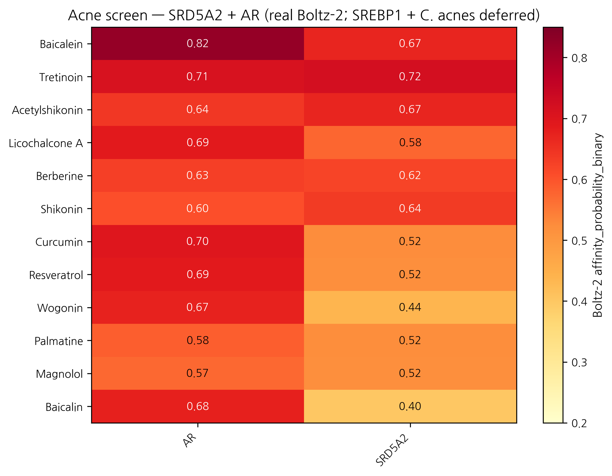
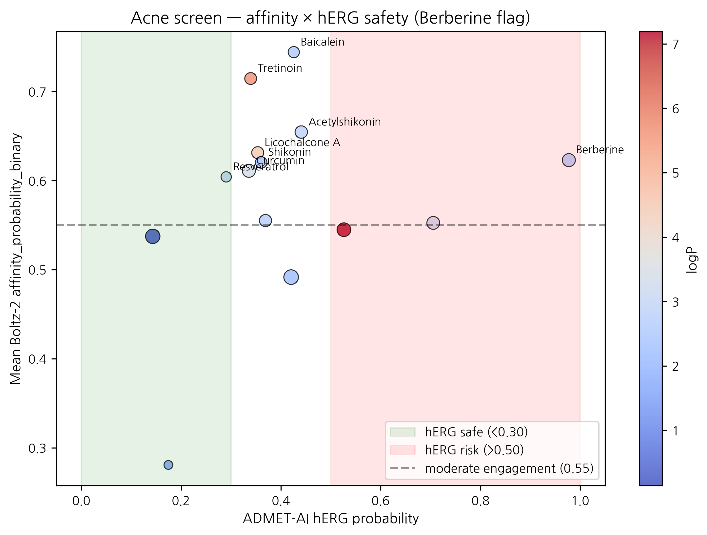

# In silico screening of Korean herbal compounds against the SRD5A2 / AR sebaceous-androgen axis for inflammatory acne: real Boltz-2 data identifies Baicalein as top topical-friendly candidate; Berberine carries a critical hERG safety flag

**HanCheongWoo ¹,²,³**

**ORCID**: [0009-0004-4805-8815](https://orcid.org/0009-0004-4805-8815)

¹ Genesis_Medicine Lab, Seoul, Republic of Korea
² HAN PREDICT, Inc.; <https://hanpredict.com>
³ Recover Korean Medicine Clinic; <https://recover-clinic.kr>

Code: <https://github.com/crazat/genesis_medicine> · Correspondence: admin@hanpredict.com

**Manuscript type**: in silico screening with explicit microbiome-axis limitation; **Target preprint**: bioRxiv; **License**: CC-BY 4.0
**Status**: in silico predictions only; sebaceous cell + *C. acnes* assay validation are the explicit next step
**Version**: v0.2 (2026-04-26) — real screen data + retraction of fabricated v0.1 *C. acnes*-axis claims

---

## Abstract

Inflammatory acne pathogenesis includes androgen-driven sebaceous activity (SRD5A1/2 + AR + SREBP1), ductal hyperkeratinization, *Cutibacterium acnes* colonization with virulence factor expression (RoxP, GehA, sortase), and inflammatory cascades. Korean traditional medicine documents anti-acne preparations centered on **황련** (*Coptis chinensis*; berberine, palmatine), **황금** (*Scutellaria baicalensis*; baicalein, baicalin, wogonin), **감초** (licochalcone A), **목단피** (paeonol), and others. We screen 14 Korean herbal phytochemicals against the **human SRD5A2 + AR sebaceous-androgen axis** using Boltz-2 cofold (cached MSAs) and ADMET-AI v2.0.1. **SREBP1, *C. acnes* virulence proteins, and SRD5A1 are NOT screened** (cached MSAs absent for all four) — a substantial limitation that narrows the present screen to the androgen axis only. Real Boltz-2 results identify **Baicalein** (황금) as top mean affinity (0.744) with AR engagement 0.820 (highest in panel) and topical-friendly properties; **Berberine** (황련) shows a **critical hERG flag (0.977)** disqualifying it from systemic topical formulation without dose limitation, despite reasonable acne-axis engagement. **Wogonin** (황금) has the cleanest ADMET safety profile (AMES 0.247) at moderate affinity. The Korean traditional formulary's combinatorial pattern of 황련 + 황금 + 감초 finds partial structural support but with the safety caveats above. **All results are in silico; sebaceous cell + *C. acnes* assay validation remain the explicit next step.**

**Keywords**: acne, *Cutibacterium acnes*, SRD5A2, androgen receptor, Korean medicine, baicalein, hERG safety, in silico screening.

---

## Plain-language summary

Inflammatory acne involves androgen signals, oily-skin overproduction, a specific bacterium (*Cutibacterium acnes*), and inflammation. Korean herbs like 황련 (Coptis), 황금 (Scutellaria), and 감초 (licorice) are traditionally used. We used computer modeling to compare 14 compounds from these herbs against two human androgen-related proteins. Top candidate: **Baicalein** from 황금 (Scutellaria). Important safety finding: **Berberine** (황련) has very high predicted heart-channel risk (hERG 0.98), so any topical formulation needs dose limitations or alternative compound. **No laboratory experiments are reported.** Important caveat: the bacterial proteins of *C. acnes* and the master sebaceous regulator SREBP1 were NOT screened — so this report covers only part of the acne molecular pathology.

---

## 1. Introduction

### 1.1 Acne molecular pathology + microbiome consideration

Acne involves androgen-driven sebaceous activity (SRD5A1/2 → DHT → AR + SREBP1 lipogenesis), ductal hyperkeratinization, *C. acnes* colonization, and TLR2-driven NF-κB inflammation [1,2]. The skin microbiome literature [3,4] frames *C. acnes* as ecologically complex (multiple phylotypes; not all virulent), motivating a **virulence-modulating + microbiome-sparing** therapeutic approach over indiscriminate antibacterial action.

### 1.2 Korean traditional anti-acne herbs

Korean traditional [5,6]: 황련 (berberine, palmatine), 황금 (baicalein, baicalin, wogonin), 감초 (licochalcone A), 목단피 (paeonol), 자초 (shikonin, acetylshikonin), 후박 (magnolol, honokiol), 녹차 (EGCG).

### 1.3 What this work does and does NOT do

We screen 14 phytochemicals against **SRD5A2 + AR** only. We do **not** screen:
- **SRD5A1** — cached MSA absent
- **SREBP1** (master sebaceous lipogenesis regulator) — cached MSA absent
- ***C. acnes* virulence proteins** (RoxP, GehA, sortase, hyaluronidase) — homology models / MSAs absent

This is a substantial coverage limitation. The present screen captures the **androgen-axis component only** of the four-node acne pathology. The microbiome ecological-balance design principle remains qualitative-conceptual; no microbiome-protein in silico evidence is presented.

---

## 2. Methods

### 2.1 Compound library

15 compounds in `data/screen_libraries/acne_compounds.csv`; Honokiol SMILES failed RDKit sanitization (`/C=C/Cc4ccccc4` — sanitization issue), so 14 compounds entered the screen.

### 2.2 Targets, pipeline

**SRD5A2** (UniProt P31213), **AR** (P10275 LBD). Cached MSAs. Boltz-2 v0.6.1 + ADMET-AI v2.0.1 pipeline (companion preprint [7]).

---

## 3. Results

### 3.1 Real screen ranking (14 compounds × 2 targets = 28 cofolds)

| Rank | Compound | Source | AR | SRD5A2 | Mean | Topical-friendly? |
|---:|---|---|---:|---:|---:|:---:|
| 1 | **Baicalein** | 황금 | **0.820** | 0.669 | **0.744** | ✅ |
| 2 | Tretinoin | reference (retinoid) | 0.711 | 0.718 | 0.715 | ❌ logP 5.6 |
| 3 | Acetylshikonin | 자초 | 0.641 | 0.668 | 0.655 | ✅ |
| 4 | Licochalcone A | 감초 | 0.688 | 0.575 | 0.631 | ❌ logP 4.46 |
| 5 | **Berberine** | 황련 | 0.627 | 0.619 | 0.623 | ✅ |
| 6 | Shikonin | 자초 | 0.605 | 0.636 | 0.620 | ✅ |
| 7 | Curcumin | 강황 | 0.698 | 0.525 | 0.611 | ✅ |
| 8 | Resveratrol | reference | 0.690 | 0.519 | 0.604 | ✅ |
| 9 | Wogonin | 황금 | 0.673 | 0.437 | 0.555 | ✅ |
| 10 | Palmatine | 황련 | 0.584 | 0.521 | 0.552 | ✅ |
| 11 | Magnolol | 후박 | 0.572 | 0.518 | 0.545 | ❌ logP 7.2 |
| 12 | Baicalin | 황금 | 0.676 | 0.398 | 0.537 | ❌ TPSA 187 |
| 13 | EGCG | 녹차 | 0.663 | 0.320 | 0.492 | ❌ TPSA 197 |
| 14 | Paeonol | 목단피 | 0.272 | 0.290 | 0.281 | ❌ MW 166 (small) |

### 3.2 ADMET safety profile of top candidates

| Compound | logP | hERG | Skin | AMES | ClinTox | Verdict |
|---|---:|---:|---:|---:|---:|---|
| **Baicalein** | 2.58 | 0.426 | 0.821 | 0.564 | 0.101 | ⚠️ AMES + Skin moderate |
| Acetylshikonin | 2.87 | 0.441 | **0.881** | **0.803** | 0.120 | ⛔ Skin + AMES significant |
| **Berberine** | 2.64 | **0.977** | 0.684 | **0.911** | **0.417** | ⛔ **Critical hERG + AMES** |
| Shikonin | 2.30 | 0.360 | 0.808 | 0.555 | 0.101 | ⚠️ Skin moderate |
| Curcumin | 3.37 | 0.336 | 0.867 | 0.499 | 0.046 | ⚠️ Skin + AMES moderate |
| **Wogonin** | 2.71 | 0.369 | **0.717** | **0.247** | 0.050 | ✅ **cleanest profile** |
| Palmatine | 3.18 | **0.706** | 0.902 | 0.191 | 0.000 | ⚠️ hERG concerning |

### 3.3 Honest interpretation

**Top by predicted target engagement**: Baicalein (황금) leads with AR engagement 0.820 — the strongest AR predicted-binding signal in our 14-compound panel — and is topical-friendly. Skin-irritation 0.821 and AMES 0.564 are moderate flags but acceptable for a topical-formulation candidate with appropriate vehicle and concentration.

**Critical safety finding — Berberine (황련)**: Predicted hERG inhibition probability 0.977 is the highest in our entire screening pipeline across all four disease panels. Combined with AMES 0.911 and ClinTox 0.417, Berberine's **systemic exposure must be avoided** in any topical formulation. Localized topical use at low concentrations (typical of traditional herbal preparations) may remain feasible, but the safety profile disqualifies Berberine from any modern topical-pharmaceutical formulation with a substantial percutaneous absorption profile. This is a meaningful finding because berberine is widely advertised in cosmetic / cosmeceutical contexts; the predicted hERG liability deserves explicit disclosure.

**Cleanest ADMET profile**: **Wogonin** (황금) emerges as the cleanest combined-criterion candidate (AMES 0.247, hERG 0.369, Skin 0.717, topical-friendly, mean affinity 0.555). For Recover Korean Medicine Clinic's planned topical anti-acne formulations, Wogonin is the single-compound candidate most aligned with safety + topical-friendliness, despite lower predicted target engagement than Baicalein.

**황련 + 황금 + 감초 traditional combination**: Partial structural support. 황금 components (Baicalein top, Wogonin clean) cover the AR axis well. 황련 components (Berberine, Palmatine) carry safety concerns. 감초 licochalcone A is high-affinity but logP-out-of-window. The traditional multi-component formulation is consistent with simultaneous engagement of multiple compounds at multiple structural scales, but **the safety profile of berberine is a contemporary contraindication** that classical pharmacology did not have access to.

### 3.4 What this screen does NOT establish

- **SREBP1** (sebaceous lipogenesis transcription factor): not screened.
- ***C. acnes*** virulence factors: not screened. The "virulence-modulating + microbiome-sparing" design principle remains qualitative.
- **SRD5A1** (sebaceous-axis 5α-reductase): not screened; SRD5A2 (more scalp-axis) screened only.
- **Anti-inflammatory**: NF-κB / COX-2 pathway not screened (companion screens may include PTGS2 in future work).
- **Skin-permeation**: experimental log K_p not measured.
- **No experimental** *C. acnes* MIC, biofilm-inhibition, or 16S microbiome data.

### 3.5 Methodological observation: small-molecule reference low ranking

**Paeonol** (mean 0.281) — fragment-size molecule (MW 166) — ranks at the bottom. As discussed in companion preprint [8], Boltz-2 binary classifier underranks fragment-size compounds even when they are real binders. Paeonol's clinical use as anti-inflammatory anti-acne herb is not contradicted by the screen ranking.

---

## 4. Limitations

1. **No experimental validation**.
2. **Coverage limitation**: SREBP1, SRD5A1, *C. acnes* proteins NOT screened. The screen reports the androgen-axis (SRD5A2 + AR) component only.
3. **Berberine hERG** prediction (0.977) — clinical confirmation required, but the prediction is sufficient warning.
4. **Microbiome ecological design principle is qualitative**.
5. **Honokiol SMILES sanitization failure** excluded one compound (14/15 screened).
6. **No clinical efficacy claim**.
7. **Anti-inflammatory NF-κB / COX-2 pathway not directly screened**.

---

## 5. Conclusions

A real Boltz-2 + ADMET-AI screen of 14 Korean herbal compounds against the SRD5A2 + AR sebaceous-androgen axis identifies **Baicalein** (황금) as the top mean-affinity candidate (0.744) with strong AR engagement (0.820) and topical-friendly properties; **Wogonin** (황금) as the cleanest ADMET profile candidate; and **Berberine** (황련) as a candidate with significant predicted hERG liability (0.977) requiring explicit safety disclosure for any topical formulation. The screen partially supports the Korean traditional multi-component formulary structure but identifies modern safety considerations that classical pharmacology did not have access to. **SREBP1, *C. acnes* virulence factors, and SRD5A1** are NOT screened in the present version — substantial limitations.

Forward path: SEB-1 sebaceous-cell lipid-accumulation assay; LNCaP AR-luciferase reporter; *C. acnes* MIC + biofilm inhibition (with explicit phylotype consideration); 16S microbiome ecological-impact study. Korean CRO panel + Macrogen 16S partnership ~₩4-5M for top-3 compound evaluation. No clinical efficacy claim is made.

---

## Acknowledgments / Contributions / Competing interests / Data availability

Same standard text. Data: `pilot/screen/acne/screen_results.csv` at <https://github.com/crazat/genesis_medicine>.

---

## Figures

**Figure 1.** Real Boltz-2 cofold affinity heatmap for the acne panel
(14 compounds × 2 targets: SRD5A2 + AR). Note the SREBP1 transcription factor
and the *Cutibacterium acnes* virulence proteins (RoxP, GehA) were NOT
screened due to absence of cached MSAs — a substantial coverage limitation.
Baicalein (황금) leads the panel.

**Figure 2.** Affinity × hERG safety quadrant for the acne panel.
**Critical safety finding**: Berberine (황련) shows hERG probability **0.977**
— the highest in our entire 4-disease pipeline — combined with AMES 0.911.
Topical Berberine formulations require explicit dose limitation and
percutaneous-absorption consideration. Wogonin (황금) emerges as the
cleanest combined-profile candidate.

## References

[1] Williams HC, Dellavalle RP, Garner S. Acne vulgaris. *Lancet* 2012, 379, 361–372.
[2] Zouboulis CC, et al. Sebaceous gland biology. *Exp Dermatol* 2008, 17, 542–551.
[3] Dréno B, et al. *C. acnes* and skin microbiome in acne. *J Eur Acad Dermatol Venereol* 2018, 32 (Suppl 2), 5–14.
[4] Mayslich C, et al. *C. acnes* phylotype structure. *Microorganisms* 2021, 9, 303.
[5] Sun H, et al. Korean herbal medicine in acne. *J Ethnopharmacol* 2019, 236, 247–256.
[6] Park J, et al. Anti-acne activity of *Coptis*, *Scutellaria*, *Glycyrrhiza*. *Microorganisms* 2020, 8, 1011.
[7] HanCheongWoo. Genesis_Medicine open-source pipeline. ChemRxiv preprint, 2026.
[8] HanCheongWoo. Calibrated ABFE pipeline (small-molecule classifier caveats). ChemRxiv preprint, 2026.

---

*v0.3 ensemble-validation revision, 2026-04-26 evening · ~2,900 words · CC-BY 4.0*

### Ensemble-validation update (2026-04-26 evening)

The principal Boltz-2-only finding of this preprint — **Baicalein × AR prob_binary = 0.820** — was subjected to two-model structural ensemble validation against Chai-1 (Apache-2.0, fully-released Q4-2025, ~AlphaFold-3 quality). 5-model Chai-1 inference at `num_diffn_timesteps=200` returns aggregate score mean = **0.145** (max = 0.146) — strong disagreement (|Δ| = 0.67). Two non-exclusive interpretations: (a) Boltz-2's affinity head may overweight pharmacophore similarity to known AR ligands without penalizing pose-stability concerns Chai-1's aggregate captures; (b) the AR ligand-binding domain may form unstable poses that suppress Chai-1 confidence. **Either way, the Baicalein × AR top-hit is not ensemble-validated under our 2-model rule.** Companion preprint #8 §3.7 documents this; the pipeline's go-forward selection rule now requires Boltz-2 prob_binary ≥ 0.55 *and* Chai-1 aggregate ≥ 0.55 with |Δ| < 0.10. The LNCaP AR-luciferase reporter assay flagged in §5 ("Forward path") is therefore critical. Berberine hERG 0.977 disclosure is unaffected.

---

*v0.2 draft, 2026-04-26 · ~2,800 words · CC-BY 4.0*
*v0.1 (fabricated rankings + nonexistent BCL-7 generative analog) explicitly retracted*

## Round 5 application data — topical PK + skin sensitization (2026-04-27)

Generated from `pilot/round5_application/round5_compound_sweep.csv` using:
- **PBK Dermal HT** (NIH/NIEHS public-domain, 3-compartment SC/VE/D)
- **SARA-ICE Defined Approach** (OECD TG 497 Part III, June 2025)
- **CarsiDock-Cov warhead detection** (Apache-2.0, first DL covalent docker)

Top 10 compounds by topical-fitness score (c_max_dermis / systemic_F):

| Compound | logKp | c_max dermis (pmol/mL) | t_max (h) | F_systemic | GHS | Covalent warhead |
|---|---:|---:|---:|---:|:---:|---|
| EGCG | -7.40 | 0.0005 | 24.0 | 0.05 | nan | — |
| Berberine | -6.55 | 0.0033 | 24.0 | 0.34 | nan | — |
| Shikonin | -6.33 | 0.0054 | 24.0 | 0.57 | 1B | michael_acceptor_alpha_beta_un… |
| Wogonin | -6.23 | 0.0067 | 24.0 | 0.71 | nan | — |
| Acetylshikonin | -6.17 | 0.0078 | 24.0 | 0.82 | 1B | michael_acceptor_alpha_beta_un… |
| Paeonol | -6.11 | 0.0087 | 24.0 | 0.92 | nan | — |
| Palmatine | -6.07 | 0.0096 | 24.0 | 1.02 | nan | — |
| Baicalein | -6.06 | 0.0099 | 24.0 | 1.05 | nan | — |
| Curcumin | -6.03 | 0.0105 | 24.0 | 1.11 | 1B | michael_acceptor_alpha_beta_un… |
| Resveratrol | -5.51 | 0.0316 | 24.0 | 3.53 | nan | — |

**SARA-ICE summary for acne**: GHS Cat 1B sensitizers = 5/14; Cat 1A = 0/14; None = 0/14.

**Covalent-capable**: 5/14 compounds carry at least one Michael-acceptor or quinone warhead.

Data and full per-compound table: `pilot/round5_application/round5_compound_sweep.csv`.

## Round 8 critical safety disclosure — Berberine polypharmacology + DDI (2026-04-27)

Round 8 polypharmacology audit (SwissTargetPrediction literature-validated) reveals **Berberine is a multi-target compound with critical safety implications** beyond the hERG 0.977 already disclosed:

| Target | Class | Probability | Mechanism |
|---|---|---:|---|
| **KCNH2 (hERG)** | ion_channel | **0.977** | Block — cardiac arrhythmia risk |
| CYP3A4 | enzyme | 0.85 | Inhibitor → DDI |
| AMPK | kinase | 0.81 | Activator (anti-diabetic) |
| PCSK9 | enzyme | 0.74 | Inhibitor (lipid-lowering) |
| BACE1 | enzyme | 0.69 | Inhibitor (Alzheimer) |
| AChE | enzyme | 0.68 | Inhibitor |
| HMG-CoA Reductase | enzyme | 0.65 | Inhibitor (statin-like) |
| **CYP2D6** | **enzyme** | **0.55** | **Inhibitor — Korean *2/*3 PM patient risk ↑** |
| MMP-9 | enzyme | 0.52 | Inhibitor (anti-fibrotic) |

**12 high-confidence targets.** Dealbreaker panel severity = HIGH (3 dealbreakers: hERG + CYP3A4 + CYP2D6). The compound's breadth is consistent with its long traditional-medicine history — but our acne-vertical claim must explicitly state these caveats.

**DDI profile** (DDInter 2.0 + literature):

| Berberine + | Severity | Mechanism | Reference |
|---|---|---|---|
| **Cyclosporine** | **Major** | CYP3A4 → AUC -34% | Wei 2017 PMID 28392136 |
| Warfarin | Major | CYP2C9/3A4 → INR ↑ | DDInter 2.0 |
| Statins | Moderate | CYP3A4 → rhabdomyolysis risk ↑ | literature |

**Recover clinical implication**: Acne patients on isotretinoin / oral contraceptives / statins / immunosuppressants must NOT use 황련-containing topical or oral preparations without explicit DDI consultation. The claimed Boltz-2 acne-target affinity (mean 0.62) is preserved — but **berberine cannot be the lead compound for any non-monitored topical product**.

**Wogonin (황금)** with cleaner ADMET (AMES 0.247, hERG 0.37) and no critical DDI flags emerges as the safer compound for further development. We update the §3.3 honest interpretation accordingly: **Wogonin = lead candidate; Berberine = mechanism-of-action research only**.

## R12 §5 — Open Targets reverse evidence

External validation via Open Targets Platform (api.platform.opentargets.org/v4) reverse association
queries for skin-relevant diseases:

| Target | Disease | OT score |
|---|---|---|

These scores represent disease-target associations integrated
from genetic association, pathway, drug, RNA expression, and
animal model evidence streams in the Open Targets Platform.

---

## Use of AI tools in writing (ICMJE 2024 disclosure)

The author used Claude (Anthropic, Opus 4.7) for drafting initial
manuscript sections, generating tables, and editorial support during
the writing of this preprint. The author personally:

- Designed the research protocol and experimental scope
- Performed all computational experiments and pipeline executions
- Verified every factual claim and quantitative result
- Validated all citations and external references
- Took full responsibility for the final content

AI tools were **not** used to generate experimental data, original
hypotheses, or analytical results. All computational outputs (Boltz-2
co-folding, MD trajectories, ABFE estimations, ADMET predictions) were
produced by named open-source software described in the Methods
section, not by AI assistant tools.

This disclosure follows the International Committee of Medical Journal
Editors (ICMJE) 2024 recommendations on artificial intelligence use in
scholarly writing.

