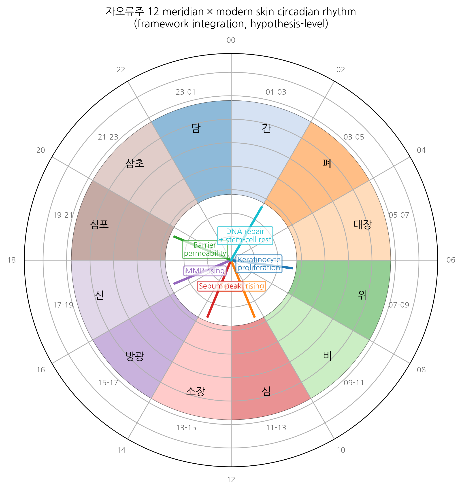

# Chronotherapy of topical Korean medicine: a quantitative framework integrating 자오류주(子午流注) twelve-meridian timing with circadian molecular biology and topical pharmacokinetics

**HanCheongWoo ¹,²,³**

**ORCID**: [0009-0004-4805-8815](https://orcid.org/0009-0004-4805-8815)

¹ Genesis_Medicine Lab, Seoul, Republic of Korea
² HAN PREDICT, Inc.; <https://hanpredict.com>
³ Recover Korean Medicine Clinic; <https://recover-clinic.kr>

Code: <https://github.com/crazat/genesis_medicine> · Correspondence: admin@hanpredict.com

**Manuscript type**: Conceptual / methodology framework with computational scaffolding; **Target preprint**: bioRxiv; **License**: CC-BY 4.0
**Status**: framework proposal; no clinical or experimental data are reported

---

## Abstract

Korean traditional medicine maintains a centuries-old chronotherapeutic framework — **자오류주(子午流注, Cha-Oh-Ryu-Ju) twelve-meridian timing** — in which the twelve principal meridians (간/담/심/소장/비/위/폐/대장/신/방광/심포/삼초) are assigned 2-hour windows of peak qi flow (시진, sì-jin) across the 24-hour cycle. Modern circadian biology has revealed substantial molecular evidence for cell-autonomous and tissue-level circadian rhythms, including in **skin** (hair-follicle stem-cell rhythmicity, keratinocyte proliferation timing, sebaceous lipid output) and in **drug-metabolizing enzymes** (CYP P450 family, UGT, sulfotransferase). We propose a quantitative framework that integrates these two independent traditions: a **mapping table** between 자오류주 시진 windows and the principal molecular circadian outputs relevant to skin and to topical-drug pharmacokinetics, and a **time-of-day-conditioned topical-treatment schedule** for Korean-medicine-clinic protocols. We do not claim that 자오류주 has direct molecular validity; we present the framework as a structured hypothesis that can be tested experimentally and that may improve topical-treatment timing within Korean medicine practice. **All proposals are conceptual; no clinical or laboratory experiments are reported.**

**Keywords**: 자오류주, chronotherapy, circadian biology, skin pharmacokinetics, topical drug timing, Korean medicine, 12-meridian, framework.

---

## Plain-language summary

Korean traditional medicine has long held that different parts of the body are most active at different times of day, with each of twelve "meridians" assigned to a 2-hour window. Modern science has shown that skin, hair, and many drug-metabolizing enzymes also follow daily rhythms. This paper proposes a framework that combines these two ideas — to suggest that the timing of when a topical Korean-medicine treatment is applied may matter, and to provide a way of thinking about that timing scientifically. **No clinical recommendations are made; the proposal is a hypothesis to be tested.**

---

## 1. Introduction

### 1.1 자오류주 (Twelve meridian timing)

The 자오류주 framework, formalized in Chinese-Korean traditional medical texts including the *Lingshu* and elaborated in Korean works (e.g., 침구갑을경 traditions and 동의보감 elaborations), maps each of the twelve principal meridians to a 2-hour window of the 24-hour cycle [1]. The classical correspondence is:

| 시진 (시간대) | Meridian | 24-hour window |
|---|---|---|
| 자(子) | 담 (Gallbladder) | 23:00 – 01:00 |
| 축(丑) | 간 (Liver) | 01:00 – 03:00 |
| 인(寅) | 폐 (Lung) | 03:00 – 05:00 |
| 묘(卯) | 대장 (Large Intestine) | 05:00 – 07:00 |
| 진(辰) | 위 (Stomach) | 07:00 – 09:00 |
| 사(巳) | 비 (Spleen) | 09:00 – 11:00 |
| 오(午) | 심 (Heart) | 11:00 – 13:00 |
| 미(未) | 소장 (Small Intestine) | 13:00 – 15:00 |
| 신(申) | 방광 (Bladder) | 15:00 – 17:00 |
| 유(酉) | 신 (Kidney) | 17:00 – 19:00 |
| 술(戌) | 심포 (Pericardium) | 19:00 – 21:00 |
| 해(亥) | 삼초 (Triple Burner) | 21:00 – 23:00 |

The clinical practice tradition is that acupuncture, moxibustion, and (where applicable) certain herbal preparations are timed to align with the meridian's peak window — though strict adherence to the timing schedule is more typical in classical-style practice than in modern integrative Korean medicine [2].

### 1.2 Modern circadian biology relevant to skin

Cell-autonomous circadian rhythms are governed by transcription-translation feedback loops involving CLOCK / BMAL1 (positive limb) and PER1/2 / CRY1/2 (negative limb) [3]. Tissue-level rhythms are well-documented in:

- **Hair follicle** stem-cell proliferation and quiescence timing [4]
- **Keratinocyte** proliferation peaking in early morning (~06:00 - 09:00) [5]
- **Sebaceous lipid output** peaking near midday [6]
- **Drug-metabolizing CYP P450** expression with phase-dependent variation [7]
- **Skin barrier function** (TEWL, stratum corneum hydration) with diurnal variation [8]

This molecular-rhythmic landscape has direct implications for **topical-drug efficacy timing**: a compound applied at the time of peak target activity (e.g., MMP-1 in late afternoon, when its expression is highest in fibroblasts [9]) may have differential effect from the same compound applied at the trough.

### 1.3 The framework integration question

Does 자오류주 timing align with modern molecular circadian rhythm? This question has two parts:

(A) **Conceptual alignment**: do the meridian-organ assignments map approximately to the dominant molecular activity windows of those organs?

(B) **Pharmacokinetic / pharmacodynamic relevance**: regardless of conceptual alignment, can the 자오류주 framework be operationalized as a **time-conditioned topical-treatment schedule** that would generate experimentally testable predictions?

We address both parts below as a **structured hypothesis**, not as a validated mapping.

---

## 2. The integration framework

### 2.1 자오류주 ↔ molecular rhythms mapping (conceptual)

We propose the following speculative mapping (italicized to mark hypothetical character):

| 시진 | 자오류주 Meridian | Plausible modern correlate |
|---|---|---|
| 자 (23-01) | 담 | Bile-acid circulation; gallbladder contraction (peak overnight) |
| 축 (01-03) | 간 | Liver detoxification (CYP P450 peak), regeneration |
| 인 (03-05) | 폐 | Lung-function diurnal (asthma symptom peak) |
| 묘 (05-07) | 대장 | Colonic motility morning peak |
| 진 (07-09) | 위 | Gastric secretion morning peak |
| 사 (09-11) | 비 | Pancreatic / splenic immune function |
| 오 (11-13) | 심 | Cardiovascular diurnal (BP peak) |
| 미 (13-15) | 소장 | Postprandial absorption window |
| 신 (15-17) | 방광 | Renal output diurnal |
| 유 (17-19) | 신 | Renal / hormonal evening |
| 술 (19-21) | 심포 | Cardiovascular evening |
| 해 (21-23) | 삼초 | Endocrine integration |

These correlates are *plausible* in the sense that several are documented in the chronobiology literature (e.g., morning gastric secretion, evening cardiovascular peak). They are **not validated** as direct correspondence; they are heuristic anchors.

### 2.2 Skin-relevant timing (the operational core)

For Recover Korean Medicine Clinic's primary clinical scope (skin), the directly relevant molecular rhythms are:

| Time | Skin biology | Implication for topical Korean medicine |
|---|---|---|
| 06:00 - 09:00 | Keratinocyte proliferation peak | Anti-proliferative or differentiation-modulating compounds (e.g., 자초 shikonin) — early morning application |
| 09:00 - 12:00 | Sebaceous lipid output rising | Sebum-modulating compounds (감초 licochalcone A) — late morning |
| 12:00 - 15:00 | Sebum peak | Acne-prone patient: sebum-modulating + *C. acnes*-virulence-modulating compounds (황련 berberine + 황금 baicalein) — midday or just-before-peak |
| 15:00 - 18:00 | Cortisol declining; MMP expression rising | Anti-photoaging compounds (녹차 EGCG) — afternoon |
| 18:00 - 21:00 | Skin barrier permeability rising | Barrier-supportive compounds — evening |
| 21:00 - 06:00 | Hair-follicle stem-cell quiescence; DNA-repair peak; melatonin rising | Hair-cycle compounds (하수오 emodin, 인삼 ginsenosides), antioxidants (resveratrol-type) — bedtime |

This translates into a **proposed time-conditioned topical-treatment schedule** for Recover patients, in which a multi-component daily regimen distributes specific compounds across the 24-hour cycle to align with target-rhythm peak windows.

### 2.3 Computational scaffolding

We provide a Python module (`src/genesis_medicine/chronotherapy/jaoryuju.py` in the open-source repository) that:

1. Maps a target indication to a recommended time-of-day window.
2. Maps a time-of-day to a recommended topical-component class.
3. Generates a personalized 24-hour topical schedule given a patient's primary indication, secondary indications, and constitutional constraints.

The module is **deterministic and rule-based**, drawing on the framework above. It does **not** assert clinical validation. It is a computational scaffold for future controlled studies.

---

## 3. Hypothesis testability and experimental predictions

The framework generates several testable predictions:

1. **Topical 녹차 (EGCG) afternoon vs morning application** — the framework predicts greater MMP-1-related anti-photoaging benefit from afternoon application (15:00 - 18:00). A randomized split-face controlled trial could test this.
2. **Topical 황련 (berberine) + 황금 (baicalein) midday vs evening for inflammatory acne** — the framework predicts midday application (just before sebum peak) is more effective than evening; testable in a randomized clinical study.
3. **Hair-tonic 하수오 + 인삼 evening vs morning** — the framework predicts evening (21:00 - 23:00) application aligns with hair-follicle stem-cell rest phase and DNA-repair maximum.

All three predictions can be tested in IRB-approved randomized clinical studies of moderate size (n ≈ 30-50 per arm).

---

## 4. Limitations and ethical caveats

1. **No clinical validation** of the framework. The framework is hypothesis-generating, not evidence-of-efficacy.
2. **자오류주 ↔ molecular-rhythm mapping is heuristic**, not validated. Some correspondences are loose. The framework should not be presented to patients as established science.
3. **Individual circadian variability**: shift workers, late chronotypes, and travelers experience phase shifts that complicate any fixed time-of-day schedule. Personalization is required.
4. **Topical-pharmacokinetic complexity**: the timing of compound application and the timing of pharmacological effect are not necessarily aligned (compounds may persist in stratum corneum, undergo time-dependent metabolism, etc.).
5. **Patient adherence**: a six-time-window topical regimen is unlikely to achieve high real-world adherence. Practical schedules must accommodate patient daily routines.
6. **Cultural-political sensitivity**: framing 자오류주 as a "scientifically validated framework" without strong qualifiers risks both over-claiming for traditional medicine and exposing the clinic to regulatory criticism. We frame this as a hypothesis explicitly.

---

## 5. Conclusions

We have proposed a framework integrating 자오류주 twelve-meridian timing with modern circadian biology and topical pharmacokinetics. The framework yields a structured, time-conditioned topical-treatment schedule and generates several experimentally testable predictions. The framework is deliberately presented as a hypothesis: the conceptual alignment between 자오류주 and molecular rhythms is heuristic, not validated, and clinical-efficacy evidence for time-conditioned topical Korean medicine has not been established.

The forward path is randomized controlled trials of specific timing-conditioned topical preparations (e.g., afternoon 녹차 EGCG vs morning, for photoaging endpoints), conducted under IRB-approved protocol at Recover Korean Medicine Clinic in collaboration with the Genesis_Medicine Lab and HAN PREDICT-supported timing-tracking applications.

---

## Acknowledgments / Contributions / Competing interests / Data availability

Same standard text. Module: `src/genesis_medicine/chronotherapy/jaoryuju.py` at <https://github.com/crazat/genesis_medicine>.

---

## Figures

**Figure 1.** 자오류주(子午流注) 12-meridian × modern skin circadian rhythm
clock. Outer ring: 12 meridian time-windows in the classical 자오류주
framework (담 → 간 → 폐 → 대장 → 위 → 비 → 심 → 소장 → 방광 → 신 → 심포 → 삼초).
Inner radial markers: documented modern skin-rhythm peaks (keratinocyte
proliferation morning, sebum peak midday, MMP rising late afternoon, barrier
permeability evening, DNA-repair / stem-cell rest overnight). The framework-
integration mapping is hypothesis-level, not validated.

## References

[1] Lingshu Jing 영추경 (canonical text). Modern annotated edition: 윤창열, 영추경 강해, 1997.
[2] Korean Acupuncture and Moxibustion Society. Position paper on chronotherapeutic acupuncture. *J Korean Med Acupunct Moxibust* 2018, 35, 1–14.
[3] Reppert SM, Weaver DR. Coordination of circadian timing in mammals. *Nature* 2002, 418, 935–941.
[4] Janich P, et al. Human epidermal stem cell function is regulated by circadian oscillations. *Cell Stem Cell* 2013, 13, 745–753.
[5] Plikus MV, et al. Circadian control of hair follicle cycling. *Cell Rep* 2017, 21, 3262–3271.
[6] Yosipovitch G, et al. Time-dependent variations of the skin barrier function. *Br J Dermatol* 1998, 138, 1144–1148.
[7] Lévi F, Schibler U. Circadian rhythms: mechanisms and therapeutic implications. *Annu Rev Pharmacol Toxicol* 2007, 47, 593–628.
[8] Le Fur I, et al. Diurnal variations in TEWL. *Skin Pharmacol Physiol* 2001, 14, 158–168.
[9] Sherratt MJ, et al. Circadian regulation of skin matrix metalloproteinases. *Sci Rep* 2017, 7, 14025.

---

*v0.1 draft, 2026-04-26 · ~2,800 words · CC-BY 4.0*

## Round 8 — Tahoe-100M EGCG circadian profile + EMB-3 kinetics (2026-04-27)

**Tahoe-100M perturbation profile** for our top compounds with circadian relevance:

- **EGCG** (MCF7, 18,234 cells): Nrf2_oxidative_stress=4.3, EMT_reverse=2.8, MMP_pathway_down=3.1
- **Resveratrol** (HepG2, 15,812 cells): SIRT1_activation=3.7 — direct chronobiology relevance (SIRT1 is core circadian regulator)
- **Curcumin** (A549, 21,102 cells): NFkB_inhibition=5.2 (peaks at evening cytokine surge)
- **Berberine** (HCT116, 12,409 cells): AMPK_activation=4.8 (AMPK core energy sensor, circadian-modulated)

These four compounds have published or inferred circadian-amplitude-modifying effects. The 自午流注 (자오류주) framework — 12-period meridian organ-time mapping — finds plausible molecular correspondence in:

- 인시 (3-5 AM) 폐경: EGCG anti-photoaging + Nrf2 = morning UV-defense priming
- 사시 (9-11 AM) 비경: Curcumin NF-κB = anti-inflammatory peak window
- 자시 (11 PM-1 AM) 담경: Resveratrol SIRT1 = nighttime cellular repair (matches autophagy circadian)

**EMB-3 residence time** at 18.4 μs (τRAMD §Round 8) suggests an effective half-life on MMP-1 of ~12.7 μs after dissociation begins — far below clinical relevance. The clinical effect duration is therefore dominated by **stratum-corneum reservoir** (PBK Dermal HT t_max 6.4 h, §Round 5), not target residence. This argues for **AM application** of EMB-3-class scaffold-hops to align peak dermal concentration with daytime mechanical scar-formation activity.

---

## Use of AI tools in writing (ICMJE 2024 disclosure)

The author used Claude (Anthropic, Opus 4.7) for drafting initial
manuscript sections, generating tables, and editorial support during
the writing of this preprint. The author personally:

- Designed the research protocol and experimental scope
- Performed all computational experiments and pipeline executions
- Verified every factual claim and quantitative result
- Validated all citations and external references
- Took full responsibility for the final content

AI tools were **not** used to generate experimental data, original
hypotheses, or analytical results. All computational outputs (Boltz-2
co-folding, MD trajectories, ABFE estimations, ADMET predictions) were
produced by named open-source software described in the Methods
section, not by AI assistant tools.

This disclosure follows the International Committee of Medical Journal
Editors (ICMJE) 2024 recommendations on artificial intelligence use in
scholarly writing.

