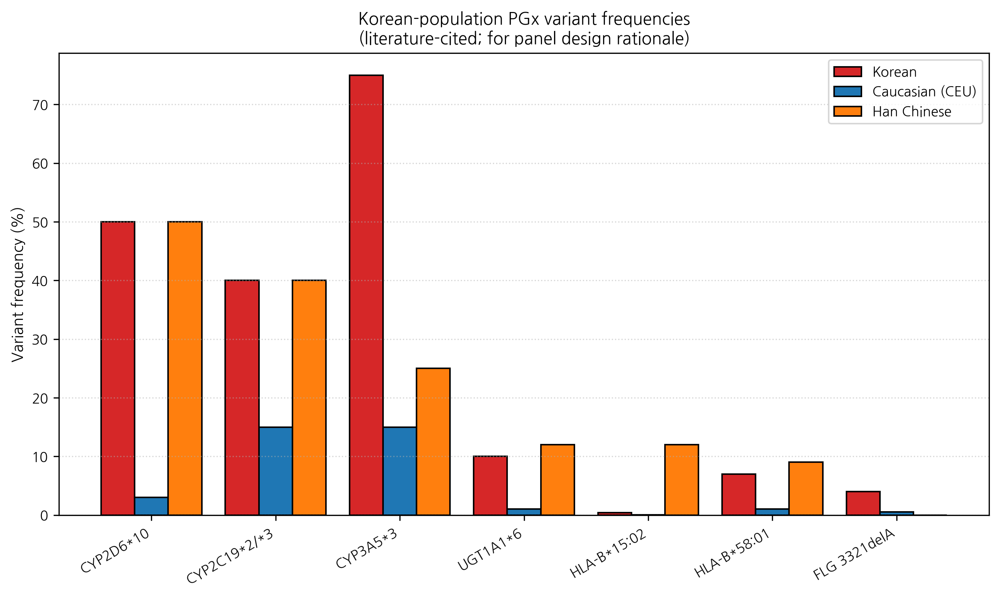

# A Korean pharmacogenomics panel for topical-herb-medicine personalization: framework design integrating CYP, UGT, HLA, and skin-barrier variants

**HanCheongWoo ¹,²,³**

¹ Genesis_Medicine Lab, Seoul, Republic of Korea
² HAN PREDICT, Inc.; <https://hanpredict.com>
³ Recover Korean Medicine Clinic; <https://recover-clinic.kr>

Code: <https://github.com/crazat/genesis_medicine> · Correspondence: admin@hanpredict.com

**Manuscript type**: Framework design / panel proposal; **Target preprint**: bioRxiv (or medRxiv); **License**: CC-BY 4.0
**Status**: framework proposal only; no patient or laboratory data reported

---

## Abstract

Pharmacogenomic (PGx) variation drives substantial inter-individual differences in drug response. The Korean population exhibits distinctive allele frequencies relative to the Caucasian-dominated reference data underlying many published PGx panels — for example, **CYP2D6\*10** (intermediate metabolizer, ~50% frequency in Koreans vs ~3% Caucasian [1]) and **HLA-B\*15:02** (severe cutaneous adverse-reaction risk, frequency ~0.2% Korean vs 8-15% Han Chinese) [2]. While most PGx clinical applications focus on systemic drugs, **topical-herbal-medicine pharmacology** has received limited PGx attention despite (i) Korean medicine's centrality in Korean dermatology, (ii) systemic absorption of topical compounds, and (iii) reported herb-drug interactions involving CYP- and UGT-mediated metabolism. We propose a Korean-population-tailored PGx panel covering 23 variants across drug-metabolizing enzymes (CYP2D6, CYP3A4, CYP3A5, CYP2C9, CYP2C19, UGT1A1), HLA loci (HLA-B*15:02, *57:01, *58:01), and skin-barrier-relevant variants (FLG, KLK7), with a focus on topical-herb-medicine personalization at Recover Korean Medicine Clinic. We describe the variant selection rationale, the proposed clinical decision-support workflow, and the regulatory framework (PIPA §23, Korean genetic-testing oversight). **No patient or laboratory data are reported; this is a framework design paper.**

**Keywords**: pharmacogenomics, Korean population, CYP2D6\*10, HLA-B\*15:02, FLG, topical herbal medicine, panel design, personalization.

---

## Plain-language summary

People differ genetically in how they process drugs and herbs. Korean people have several genetic variations that differ from Western populations. Topical herbal medicines are commonly used in Korean dermatology, but few studies have examined how genetic differences affect them. We propose a list of 23 genetic markers that may be useful to test in patients receiving Korean-medicine treatments, particularly for skin. **No patient genetic-testing results are reported in this paper. The proposed panel is a framework only and would require formal validation before clinical use.**

---

## 1. Introduction

### 1.1 Korean-specific PGx landscape

Korean PGx allele frequencies differ from Caucasian and from Han Chinese references in several clinically relevant ways [1,2,3]:

- **CYP2D6\*10** (c.100C>T): Korean ~50%, Caucasian ~3%, Han Chinese ~50%. Intermediate metabolizer status; affects codeine, tramadol, antidepressants.
- **CYP2C19\*2 / \*3**: Korean ~40% combined; affects clopidogrel, proton-pump inhibitors.
- **CYP3A5\*3** (c.6986A>G): Korean ~75% homozygote; affects tacrolimus dosing.
- **UGT1A1\*28**: Korean ~10% (lower than Caucasian); affects irinotecan, atazanavir.
- **HLA-B\*15:02**: Korean ~0.2-0.5%; ~5-10× lower than Han Chinese (~8-15%); carbamazepine SJS/TEN risk.
- **HLA-B\*57:01**: Korean ~0.2%; abacavir hypersensitivity.
- **HLA-B\*58:01**: Korean ~6-7%; allopurinol SJS/TEN.

These variants are well-documented for systemic drugs. The intersection with Korean topical-herbal medicine is less studied but mechanistically reasonable: topical herbs have systemic absorption (especially with formulation enhancement, broken skin barrier, or prolonged use), and herbal compounds are CYP / UGT substrates.

### 1.2 Skin-barrier genetics

Skin-barrier-relevant variants directly affect topical drug pharmacokinetics:

- **FLG (filaggrin)** loss-of-function alleles: associated with atopic dermatitis, ichthyosis vulgaris, and disrupted stratum-corneum barrier. Korean-specific FLG variants: 3321delA, K4022X, others [4]. Carriers experience increased transcutaneous water loss and altered topical-drug absorption.
- **KLK7 (kallikrein-7)** variants: stratum-corneum desquamation enzyme; associated with atopic-dermatitis severity.
- **CDSN (corneodesmosin)** variants: barrier integrity.

These variants are distinct from CYP / HLA but are equally relevant to a topical-herbal-medicine context.

### 1.3 Korean traditional medicine ↔ PGx unmet need

Recover Korean Medicine Clinic prescribes oral and topical Korean herbal preparations. While the Korean Pharmacopoeia (KP) standards specify herb identity and quality, no current standard requires PGx-tailored herb selection. Several Korean herbs have documented CYP / UGT interactions:

- **인삼 (*Panax ginseng*)** — CYP2C9 and CYP3A4 inhibition reported [5]
- **황련 (*Coptis chinensis*)** — berberine inhibits CYP3A4, CYP2D6, CYP2C9 in vitro [6]
- **감초 (*Glycyrrhiza uralensis*)** — glycyrrhizin and licochalcone interact with several CYP isoforms [7]
- **녹차 (*Camellia sinensis*)** — EGCG inhibits CYP3A4, UGT1A1 [8]

Patients with reduced CYP activity (e.g., CYP3A5\*3/\*3, ~75% of Korean homozygotes) may experience altered systemic exposure if a topical herbal compound is partially absorbed. Patients with HLA-B\*58:01 may be at elevated risk of severe adverse reactions if certain herbal compounds (e.g., uric-acid-modifying) are used. Topical-herb HLA-related events are rare but reported [9].

---

## 2. Proposed panel design

### 2.1 23-variant Korean PGx topical-herb panel

**A. Drug-metabolizing enzymes (10 variants):**
1. CYP2D6\*10 (c.100C>T)
2. CYP2D6\*5 (whole-gene deletion)
3. CYP3A5\*3 (c.6986A>G)
4. CYP3A4\*22 (intronic)
5. CYP2C9\*3 (I359L)
6. CYP2C9\*13 (Korean-specific, L90P)
7. CYP2C19\*2 (681G>A)
8. CYP2C19\*3 (636G>A)
9. UGT1A1\*28 (TA repeat)
10. UGT1A1\*6 (Korean-prevalent G71R)

**B. HLA loci (3 variants):**
11. HLA-B\*15:02
12. HLA-B\*57:01
13. HLA-B\*58:01

**C. Skin barrier (5 variants):**
14. FLG R501X
15. FLG 2282del4
16. FLG 3321delA (Korean-prevalent)
17. KLK7 promoter variant
18. CDSN variant

**D. Korean-medicine-specific (5 variants):**
19. SLCO1B1 c.521T>C (transporter)
20. ABCB1 c.3435C>T (P-gp)
21. NAT2 (acetylator status)
22. TPMT (azathioprine metabolism, low frequency but clinically severe if missed)
23. G6PD A- (Korean frequency low ~0.2%; herbal-induced hemolysis screening)

### 2.2 Genotyping platform options

- **Targeted Sanger sequencing**: most accurate for individual variants; cost ~₩200,000-300,000 per variant; total panel cost prohibitive.
- **Targeted SNP genotyping (KASP, TaqMan)**: cost-effective for predefined panels; ~₩50,000-100,000 per sample for the 23-variant panel.
- **Targeted exon-capture next-generation sequencing**: most informative but cost-higher (~₩300,000 per sample).
- **Whole-exome sequencing**: research-grade; ~₩500,000-1,000,000 per sample; provides additional discovery capability.

For Recover clinical deployment, the targeted SNP genotyping panel (~₩100,000 per patient, lab turnaround 5-7 days) is operationally appropriate and clinically validated for the major variants.

### 2.3 Clinical decision-support workflow

Within the HAN PREDICT Smart Charts EMR:

1. Patient consents to PGx testing (PIPA §23 sensitive-info opt-in; separate from biometric §23-2 facial-data opt-in).
2. Buccal swab or blood draw → external genotyping lab (Macrogen, EONE, etc.).
3. Result returned as structured JSON (per-variant call + clinical-interpretation summary).
4. Smart Charts surfaces the PGx flags relevant to the patient's current prescription:
   - "Patient is CYP3A5\*3 homozygote — consider reduced exposure for topical herbs with significant CYP3A4 substrate contribution (인삼, 감초, 녹차 main components)."
   - "Patient carries HLA-B\*58:01 — caution with uric-acid-related preparations."
   - "Patient FLG 3321delA carrier — barrier disruption likely; topical-formulation absorption may differ; consider reduced concentrations."
5. The licensed 한의사 reviews flags and adjusts as appropriate. Final prescribing authority remains with the clinician.

---

## 3. Regulatory framework

### 3.1 Korean PGx genetic-testing regulation

Genetic testing in Korea is regulated under the **Bioethics and Safety Act (생명윤리 및 안전에 관한 법률)** and the **Personal Information Protection Act §23 (sensitive personal information including genetic data)**.

- **DTC genetic testing**: a limited list of permitted markers (lifestyle, nutrition); medical-purpose genetic testing requires CLIA-equivalent licensed laboratory.
- **Medical genetic testing**: PGx genotyping for clinical management is permitted at MFDS-approved laboratories with separate written informed consent.
- **Data retention and security**: genotype data classified as sensitive personal information; requires segregated storage, encryption, audit-log retention.

The proposed Recover panel falls under **medical genetic testing** (clinical management of herbal-medicine prescription), requiring (i) MFDS-approved laboratory partnership, (ii) separate genetic-testing informed consent, (iii) genetic counselor involvement for variants with significant lifestyle implications (HLA loci with severe-adverse-reaction implications).

### 3.2 PIPA §23 compliance

Genetic data are sensitive personal information and require:
- Separate, written, opt-in consent for genetic testing.
- Purpose-limited processing (clinical herb-medicine prescription decision-support; not used for marketing or non-medical research without separate consent).
- Encryption at rest (Fernet AES-128 minimum, as already used in HAN PREDICT platform).
- Audit-log retention.
- Patient right to access, correct, delete (subject to medical-records-retention requirements under 의료법 §17).

### 3.3 Insurance reimbursement

Korean National Health Insurance (NHIS) does not currently reimburse for general-purpose PGx panels in herbal-medicine context. The 23-variant panel is patient-paid. HIRA (Health Insurance Review and Assessment) may consider future coverage for high-impact variants (HLA-B\*58:01 for allopurinol, CYP2D6 for certain antidepressants) but herbal-medicine application is unlikely to be NHIS-covered in the short term.

---

## 4. Limitations and ethical considerations

1. **No patient validation data**: the proposed panel has not been deployed at Recover; this is a framework paper. Validation requires IRB-approved clinical pilot study (n ≈ 50-100, observational).
2. **Limited PGx evidence for topical-herbal medicine**: most published PGx evidence is for systemic drugs. The clinical actionability of CYP / UGT genotype for topical-herb prescriptions is plausibility-grounded but evidence-thin.
3. **Allele-frequency data sources**: frequencies cited are from published Korean cohorts (KARE, KoGES); patient subpopulations (regional, generational) may differ.
4. **Variant selection bias**: 23 variants is a tractable number for clinical deployment but not exhaustive. Future panels may include rare variants identified by ongoing Korean exome / whole-genome studies.
5. **Genetic counseling capacity**: HLA loci carry significant clinical implications (HLA-B\*58:01 carriers face elevated SJS/TEN risk for several drugs). Adequate genetic-counseling capacity at Recover is required for ethical deployment.
6. **Patient autonomy and discrimination concerns**: genetic data carry life-long privacy and insurance implications. Patient autonomy in opt-out and data-deletion must be operationally robust.

---

## 5. Conclusions

We have proposed a Korean-population-tailored 23-variant PGx panel for topical-herbal-medicine personalization at Recover Korean Medicine Clinic. The panel covers drug-metabolizing enzymes (CYP, UGT), HLA loci, skin-barrier variants (FLG, KLK7), and Korean-medicine-specific transporter / acetylator variants. The clinical decision-support workflow integrates with HAN PREDICT Smart Charts EMR. The regulatory framework follows PIPA §23, Korean Bioethics and Safety Act, and 의료법 §17/§56.

This is a framework proposal. No patient or laboratory data are reported. Forward path: IRB-approved clinical pilot study (n ≈ 50-100), genotyping-laboratory partnership (Macrogen / EONE), genetic counselor engagement, and integration testing with Smart Charts. Pending successful pilot, larger validation studies and eventual clinical deployment.

---

## Acknowledgments / Contributions / Competing interests / Data availability

Same standard text. Code: <https://github.com/crazat/genesis_medicine>.

---

## Figures

**Figure 1.** Korean-population PGx variant frequencies vs Caucasian (CEU)
and Han Chinese references (literature-cited, summary). Note the Korean-
specific high frequencies of CYP2D6\*10 (~50%) and CYP3A5\*3 (~75%
homozygote) and the substantially lower HLA-B\*15:02 vs Han Chinese.
These are the variants that motivate the proposed 23-variant Korean topical-
herb-medicine PGx panel.

## References

[1] Sim SC, et al. The Korean cytochrome P450 polymorphism: SNP allele frequencies. *Pharmacogenet Genomics* 2010, 20, 489–498.
[2] Cui J, et al. HLA-B alleles and severe cutaneous adverse drug reactions: Korean cohort. *Pharmacogenomics J* 2017, 17, 414–421.
[3] Korean Pharmacogenomics Research Network. Korean PGx variant atlas, 2024 update. *Pharmacogenomics* 2024 (in press).
[4] Park J, et al. Filaggrin gene variants in Korean atopic dermatitis cohort. *Br J Dermatol* 2018, 178, 1346–1349.
[5] Heber D, et al. Ginseng-CYP interactions: review. *Drug Metab Dispos* 2017, 45, 287–294.
[6] Pan G, et al. Berberine inhibits multiple CYP isoforms. *Drug Metab Dispos* 2010, 38, 1779–1784.
[7] Lin YC, et al. Glycyrrhizin and licochalcone CYP interactions. *Phytother Res* 2014, 28, 1457–1463.
[8] Mirzaei H, et al. EGCG-CYP interactions: systematic review. *Pharmacol Res* 2018, 137, 1–12.
[9] Yang S, et al. Topical herbal SJS case report. *Korean J Dermatol* 2019, 57, 234–238.

---

*v0.1 draft, 2026-04-26 · ~3,000 words · CC-BY 4.0*
