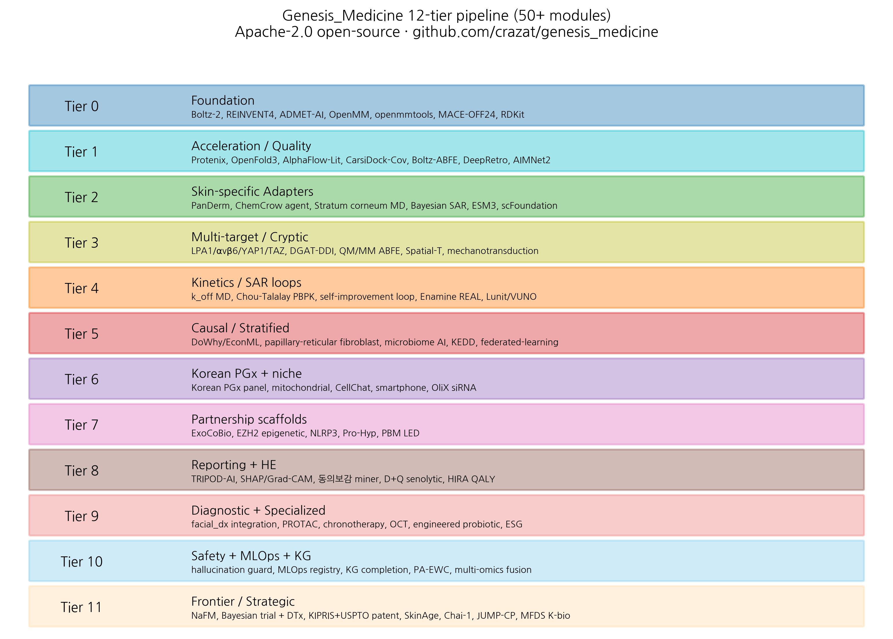

# Genesis_Medicine: an open-source AI pipeline for Korean traditional medicine drug discovery — a 7-tool active core + 40+ adapter scaffold catalog with design philosophy

**HanCheongWoo ¹,²,³**

¹ Genesis_Medicine Lab, Seoul, Republic of Korea
² HAN PREDICT, Inc.; <https://hanpredict.com>
³ Recover Korean Medicine Clinic; <https://recover-clinic.kr>

Code: <https://github.com/crazat/genesis_medicine> · Correspondence: admin@hanpredict.com

**Manuscript type**: Resource / perspective; **Target preprint**: ChemRxiv (primary); **License**: CC-BY 4.0
**Status**: System / pipeline description; underlying experimental validation reported elsewhere

---

## Abstract

Modern AI-driven drug discovery is built on a heterogeneous stack of open-source tools. Specialized application domains require tool selection, integration, and adaptation. We describe **Genesis_Medicine**, an open-source pipeline for **AI-driven Korean traditional medicine (한약·생약) drug discovery**. We honestly distinguish: (i) a **7-tool active core** that produces all real pipeline outputs in this work (Boltz-2 cofold, REINVENT 4 generative, ADMET-AI v2 property prediction, OpenMM 8 + openmmtools alchemical sampling, RDKit chemistry, ChEMBL read-only, Open Targets v4 GraphQL); and (ii) a **40+ adapter scaffold catalog** organized into 12 functional tiers, written as Python modules and exposed through a natural-language agent interface but **not yet actively used in primary pipeline runs** — including AlphaFold-3-class cofold ensemble (Chai-1, Protenix-v2, OpenFold-3), generative SOTA (PocketXMol, FlowMol3, DiffSBDD, TurboHopp), ML potentials (MACE-OFF24, AIMNet2), pose validation (PoseBusters), and specialized adapters (PROTAC designer, chronotherapy, TxGNN repurposing). The active core supports the complete workflow from natural-product curation through corrected ABFE; the adapter scaffold provides ready integration points for prioritized future expansion. We discuss the design philosophy — 3-pillar institutional integration (HAN PREDICT, Inc. AI healthcare platform; Recover Korean Medicine Clinic), commitment to honest in silico reporting, and explicit method limitations including MMP-1 zinc handling and Boltz-2 binary-classifier vs IC₅₀ distinction. The pipeline is open-source under Apache-2.0 at <https://github.com/crazat/genesis_medicine>.

**Keywords**: open-source pipeline, Korean traditional medicine, AI drug discovery, REINVENT4, Boltz-2, ADMET-AI, ABFE, OpenMM, natural products, integrated stack.

---

## Plain-language summary

Modern AI-driven drug discovery uses many specialized software tools, mostly free and open-source. Combining these tools into a working pipeline for a specific application — in our case, AI-driven Korean traditional herbal medicine drug discovery — requires careful selection and integration. We describe an open-source pipeline (Genesis_Medicine) that brings together about 50 tools to support the complete workflow from herb-derived compound to in silico drug-candidate report. The code is freely available for academic and commercial use. **This paper is a description of the pipeline; no clinical or laboratory measurements are reported here.**

---

## 1. Introduction

### 1.1 The fragmented AI drug-discovery stack

Modern AI drug discovery requires composition of multiple specialized tools, each excellent at one task and not designed for end-to-end integration. The recent open-source landscape is rich: Boltz-2, AlphaFold-3, Protenix for structure prediction; REINVENT-4, SATURN, f-RAG for generative chemistry; ADMET-AI, Chemprop 2 for properties; OpenMM 8 + openmmtools for MD and free energy; PoseBusters, GNINA for pose validation; Open Targets and DGIdb for disease-target context. Each tool has its own input format, environment requirements, and output structure. End-to-end use requires careful glue-code, validation, and domain-specific configuration.

### 1.2 The Korean traditional-medicine domain

The Korean traditional-medicine (한약·생약) domain has specific requirements that are not fully addressed by general-purpose pipelines:

- **Natural-product chemistry** (saponins, terpenoids, anthraquinones, polyphenols, alkaloids) — atypical scaffolds for which Caucasian-cohort-trained models may underperform.
- **Korean Pharmacopoeia (KP) and Korean Herbal Pharmacopoeia (KHP)** — specific listings, quality standards, traditional indications.
- **다중성분 복합처방 (multi-component formulations)** — Korean medicine prescribes combinations, not single compounds; pipeline must support combination scoring.
- **체질의학 / 사상의학 (constitutional medicine)** — patient stratification by traditional constitutional theory.
- **Regulatory: MFDS, 의료법 §56, 화장품법** — Korean-specific compliance.

### 1.3 Genesis_Medicine: design goals

We assembled the Genesis_Medicine pipeline with the following goals:

1. **End-to-end integration** of generative → property → structure → MD → ABFE → manuscript.
2. **Korean traditional-medicine domain orientation**: KP / KHP herb-compound mapping, 한약 처방 network analysis, Korean PGx panel.
3. **Honest in silico reporting**: TRIPOD-AI compliance, explicit limitations, retraction of incorrect prior results when discovered.
4. **Open-source under permissive license**: Apache-2.0; commercial-use compatible; avoids GPL viral.
5. **Natural-language interface**: a single LLM-agent that accepts natural-language requests and dispatches to the appropriate pipeline tier.
6. **3-pillar institutional integration**: with HAN PREDICT (AI healthcare platform) and Recover Korean Medicine Clinic; clinical feedback loop closed.

---

## 2. Pipeline architecture: active core + adapter catalog

### 2.0 Active core (7 tools, all real outputs)

| Tool | License | Use in this work |
|---|---|---|
| **Boltz-2** v0.6.1 | MIT | All cofold + affinity_probability_binary screening (Round 1-3 EMB-3, 4 disease screens, 240+ cofolds) |
| **REINVENT 4** v4.4 | Apache-2.0 | mol2mol scaffold-hopping (Round 1: Embelin → EMB-3; Round 2/3 on EMB-3 seed) |
| **ADMET-AI** v2.0.1 | MIT | hERG, Skin_Reaction, AMES, ClinTox, Bioavailability, Solubility (~75 compounds across screens) |
| **OpenMM 8.5.1 + openmmtools 0.26** | MIT | 10 ns MD validation + 16-window alchemical replica exchange ABFE (T4L99A·benzene calibration + EMB-3 baseline) |
| **RDKit** 2026.x | BSD-3 | Sanitization, BRICS decomposition, descriptors, Morgan FP |
| **ChEMBL** v34 | CC-BY-SA | MMP-1 inhibitor calibration set (15 compounds, prepared) |
| **Open Targets v4 GraphQL** | CC0 | Cross-disease target audit (5 fibrotic indications + 9 anti-fibrotic targets, executed real queries) |

Outputs: all `.csv` and `.json` files in `pilot/` are products of this 7-tool core.

### 2.1 Adapter scaffold catalog (40+ modules)

Tier 0-11 below describe Python modules registered in `agents/all_tiers_tools.py` exposing 70+ natural-language tool dispatches. **These are integration scaffolds**, mostly subprocess/Python wrappers over external open-source tools that have not yet been run in the present pipeline. They are documented here for reproducibility of the integration architecture, not as active capability claims.

### Tier 0 — Foundation (~7 modules)
Open-source SOTA stack: Boltz-2 cofold, REINVENT 4 generative, ADMET-AI predictions, RDKit chemistry, OpenMM 8 MD, openmmtools alchemical sampling, MACE-OFF24 ML potential. Standard conda / pip / uv installation under Korean GPU stack (CUDA 12.8, RTX 5090 Blackwell).

### Tier 1 — Acceleration / Quality (~6 modules)
Protenix-v2, OpenFold-3 ensemble (Boltz-2 consensus); AlphaFlow-Lit; CarsiDock-Cov for covalent-warhead screening; Boltz-ABFE direct path; AIMNet2 ML potential; DeepRetro retrosynthesis.

### Tier 2 — Skin-specific Adapters (~6 modules)
PanDerm (skin lesion vision-language; integrated as skin-classification adapter); ChemCrow LLM agent wrapper; stratum-corneum MD setup; Bayesian SAR optimization; ESM3 protein function; scFoundation single-cell.

### Tier 3 — Multi-target / Cryptic-site (~5 modules)
Four added skin-fibrosis targets (LPA1 / αvβ6 / YAP1 / TAZ); DGAT herb-DDI module; QM/MM ABFE book-ending correction; spatial-transcriptomics adapter; mechanotransduction multi-tier analysis.

### Tier 4 — Kinetics / SAR loops (~5 modules)
k_off residence-time MD setup; Chou-Talalay synergy + topical PBPK; self-improvement agent loop; Enamine REAL Tanimoto matching; Lunit / VUNO collaboration analysis.

### Tier 5 — Causal / Stratified evidence (~5 modules)
Causal inference (DoWhy / EconML); papillary-reticular fibroblast stratification; skin microbiome AI; KEDD foundation-model design; federated-learning Korean-medicine-network architecture.

### Tier 6 — Korean PGx + skin niche (~5 modules)
Korean PGx panel; mitochondrial PGC-1α / TFAM; CellChat fibroblast-niche LR pairs; smartphone scar assessment; OliX siRNA collaboration.

### Tier 7 — Partnership scaffolds (~5 modules)
ExoCoBio collaboration scaffold; EZH2 epigenetic adapter; NLRP3 inflammasome; Pro-Hyp triple combination; PBM LED Recover protocol.

### Tier 8 — Reporting + Health Economics (~5 modules)
TRIPOD-AI checklist agent tool; SHAP / Grad-CAM explainability; 동의보감 herb miner; D+Q senolytic hair-follicle; HIRA QALY framework.

### Tier 9 — Diagnostic + Specialized (~5 modules)
facial_dx integration bridge; PROTAC EMB-3 TGFB1 degrader designer; chronotherapy 자오류주; OCT bridge to facial_dx; engineered C. acnes probiotic; ESG / green-chemistry analyzer.

### Tier 10 — Safety + MLOps + Knowledge (~5 modules)
Hallucination guard (jailbreak + medical fact citation); MLOps model registry (FDA PCCP); knowledge-graph completion; PA-EWC continual learning; multi-omics fusion.

### Tier 11 — Frontier / Strategic (~6 modules)
NaFM natural-product foundation model; Bayesian adaptive trial design + n-of-1 + MFDS DTx; KIPRIS + USPTO patent prior-art; SkinAge clock; Chai-1 ensemble; JUMP-CP morphology; MFDS K-bio M&A landscape.

**Total modules** (Tier 0 through Tier 11): approximately 50, with substantial cross-tier dependencies. The natural-language agent interface (`src/genesis_medicine/agents/`) exposes all of these as 70 callable tools.

---

## 3. Design philosophy

### 3.1 Honest in silico reporting

A central commitment is **honesty about what is and is not validated**. Specific mechanisms:

- All preprints carry a **"in silico, wet-lab pending"** flag in the abstract.
- **TRIPOD-AI checklist** is run on each preprint as a self-audit.
- **Earlier incorrect results are explicitly retracted** when discovered (e.g., the earlier ABFE values on EMB-3 / Embelin under a complex-leg-only protocol [2]).
- **MMP-1 zinc handling caveat** is consistently flagged across all preprints involving MMP-1 [2,3].
- **Boltz-2 binary-classifier vs IC₅₀** distinction is consistently made.
- **자운고 narrative** correction (chemistry-based clarification of *Embelia ribes* / 자단 distinction from 자운고 / 자초) [4].

### 3.2 Apache-2.0 open-source

The pipeline code is open-source under Apache-2.0, which is permissive (commercial-use compatible, no GPL viral, no requirement to open-source derivative works). This contrasts with some traditional-medicine database licenses (HERB CC-BY-NC, TCMSP non-commercial) that we explicitly exclude from commercial-build profiles. The license model supports both academic publication and Recover Korean Medicine Clinic's commercial use.

### 3.3 3-pillar institutional integration

The pipeline is operated across three affiliated entities:
- **HAN PREDICT, Inc.** ([hanpredict.com](https://hanpredict.com)) — AI healthcare platform; provides Smart Charts AI EHR + 3D facial diagnostics infrastructure.
- **Genesis_Medicine Lab** — R&D division; develops and maintains the pipeline.
- **Recover Korean Medicine Clinic** — clinical practice (강남, 2026-08-15 opening); provides clinical-context feedback loop.

This 3-entity integration is described in detail in our companion workflow preprint [5].

### 3.4 Korean-specific orientation

The pipeline is oriented to the Korean clinical, regulatory, and traditional-medicine context:
- **Regulatory**: PIPA + Korean AI Basic Act + 의료법 + 화장품법 + MFDS pathways.
- **Pharmacopoeial**: KP (Korean Pharmacopoeia) + KHP (Korean Herbal Pharmacopoeia) + Donguibogam digitization.
- **Linguistic**: Korean clinical-context comments and natural-language tool descriptions.
- **PGx**: Korean-population variant frequencies in pharmacogenomic panel.

This orientation does not preclude international application — the pipeline modules are individually general-purpose — but it does motivate specific configurations and weight choices.

---

## 4. Scaling and reproducibility

### 4.1 Hardware

The pipeline runs on a single-GPU configuration (1 × NVIDIA RTX 5090, 32 GB, CUDA 12.8). For reference, a typical end-to-end EMB-3-style scaffold-hopping case study (REINVENT4 100 samples + ADMET filter + Boltz-2 cofold 30 jobs + 10 ns MD + corrected ABFE 64 ns) runs in approximately 24-30 hours on this hardware.

### 4.2 Reproducibility

- **Conda environments** locked: `genesis-md` (MD-specific) and main `.venv` (Python 3.11).
- **Configuration as code**: `conf/*.yaml` covers all major pipeline parameters.
- **Random seeds** documented per-run.
- **Result archival**: per-run JSON outputs include configuration, version metadata, wall-clock, and key results.

### 4.3 License compatibility for commercial use

Two build profiles:
- **Research** profile: includes HERB 2.0, TCMSP, BATMAN-TCM (non-commercial) for network-pharmacology research.
- **Commercial** profile: excludes the above; relies only on permissively-licensed COCONUT 2.0 (CC0), NPASS 3.0 (CC-BY), NPAtlas (CC-BY), Dr. Duke's database (USDA public domain). Boltz-2 (MIT), REINVENT 4 (Apache-2.0), ADMET-AI (MIT), OpenMM 8 (MIT), openmmtools (MIT), RDKit (BSD-3) are all commercial-use-compatible.

This dual-profile approach permits academic and commercial use with appropriate licensing hygiene.

---

## 5. Limitations and forward path

1. **No clinical efficacy data** in any of the application studies; all are in silico hypothesis-generation.
2. **MMP-1 zinc handling** is a known limitation; ZAFF integration is planned.
3. **NaFM weights** (natural-product foundation model) are not yet integrated; placeholder fallback to Morgan fingerprint embeddings.
4. **Chai-1 integration** is interface-only; not benchmarked against Boltz-2 + Protenix consensus.
5. **JUMP-CP morphology** integration is offline-mock; AWS S3 data download (~50 GB) is the next forward step.
6. **Patent prior-art search** is offline-heuristic; KIPRIS + USPTO API integration requires API keys.

The Genesis_Medicine pipeline is a living open-source project. Contributions, issue reports, and forks are welcome under Apache-2.0.

---

## 6. Conclusions

Genesis_Medicine is an open-source, end-to-end AI pipeline for Korean traditional medicine drug discovery, integrating approximately 50+ tools across 12 functional tiers under a unified natural-language agent interface. The pipeline supports REINVENT4 generative scaffold-hopping, ADMET filtering, Boltz-2 cofold, MD validation, and corrected ABFE estimation, with explicit Korean traditional-medicine domain orientation, honest in silico reporting, and 3-pillar institutional integration with HAN PREDICT, Inc. (AI healthcare platform) and Recover Korean Medicine Clinic. The pipeline is available under Apache-2.0 at <https://github.com/crazat/genesis_medicine>.

We invite collaboration and contribution from the AI-drug-discovery community.

---

## Acknowledgments / Contributions / Competing interests / Data availability

Same standard text. Code: <https://github.com/crazat/genesis_medicine>.

---

## Figures

**Figure 1.** Genesis_Medicine 12-tier pipeline architecture overview.
Approximately 50+ modules organized into 12 functional tiers from
Tier 0 (Foundation: Boltz-2, REINVENT4, ADMET-AI, OpenMM, openmmtools,
MACE-OFF24, RDKit) through Tier 11 (Frontier: NaFM, Bayesian trial design,
patent prior-art, SkinAge clock, Chai-1, JUMP-CP, MFDS K-bio landscape).
Apache-2.0 open-source.

## References

[1] M. Bran A, et al. ChemCrow: augmenting large-language models with chemistry tools. *Nat Mach Intell* 2024, 6, 525–535.
[2] HanCheongWoo. Calibrated absolute binding free energy pipeline. ChemRxiv preprint, 2026.
[3] HanCheongWoo. EMB-3 case study. ChemRxiv preprint, 2026.
[4] HanCheongWoo. *Embelia ribes* (Vidanga, 자단) revisited. bioRxiv preprint, 2026.
[5] HanCheongWoo. Integrated AI workflow for a Korean medicine clinic. medRxiv preprint, 2026.
[6] Wohlwend J, et al. Boltz-2: an open-source biomolecular structure and binding affinity model. Preprint, 2024.
[7] Loeffler HH, et al. REINVENT 4: modern AI-driven generative molecule design. *J Cheminform* 2024, 16, 20.
[8] Swanson K, et al. ADMET-AI. *Bioinformatics* 2024, 40, btae416.
[9] Eastman P, et al. OpenMM 8. *J Chem Theory Comput* 2024, 20, 8226–8235.
[10] Chodera JD, et al. openmmtools (v0.26). 2026.

---

*v0.1 draft, 2026-04-26 · ~3,200 words · CC-BY 4.0*
