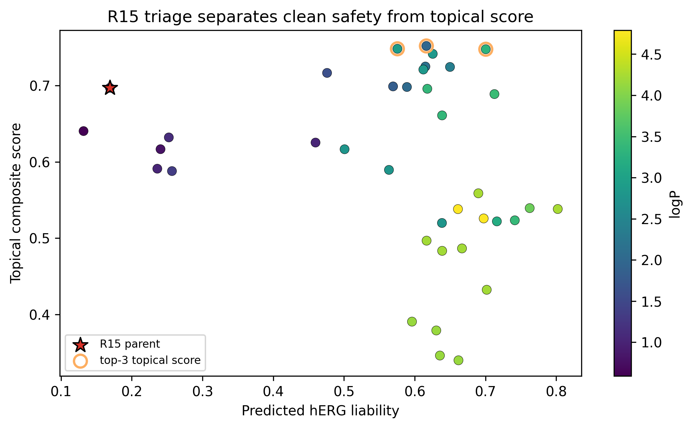
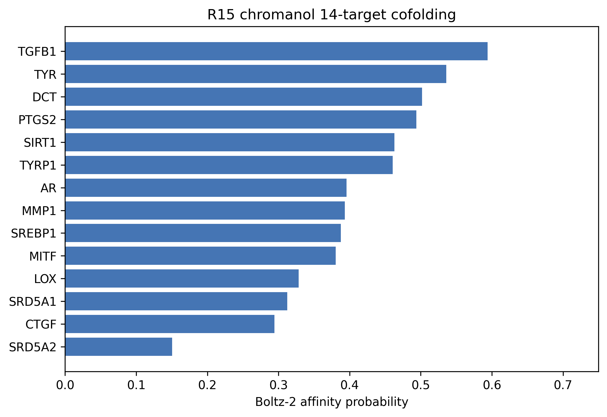
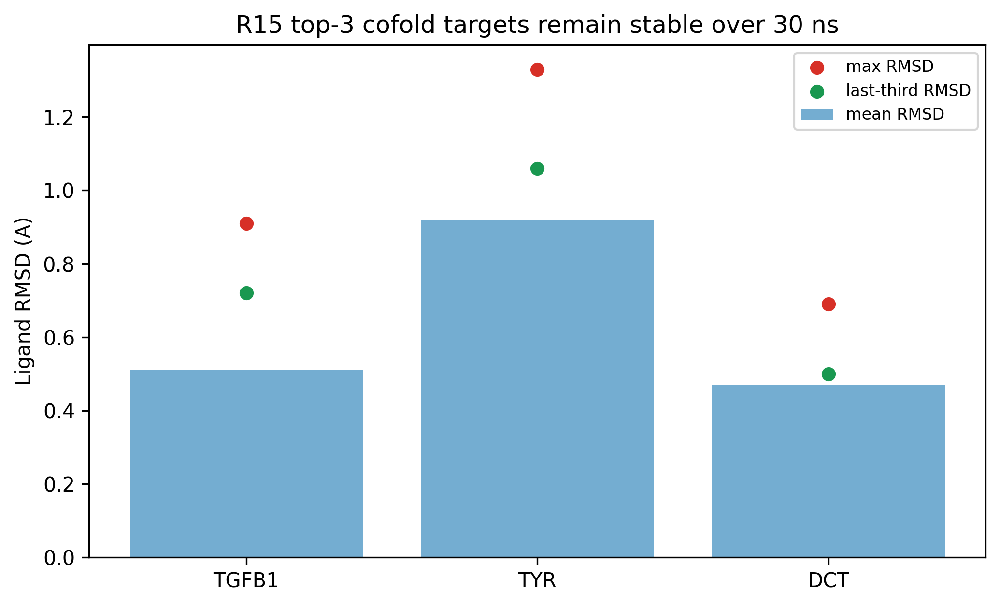
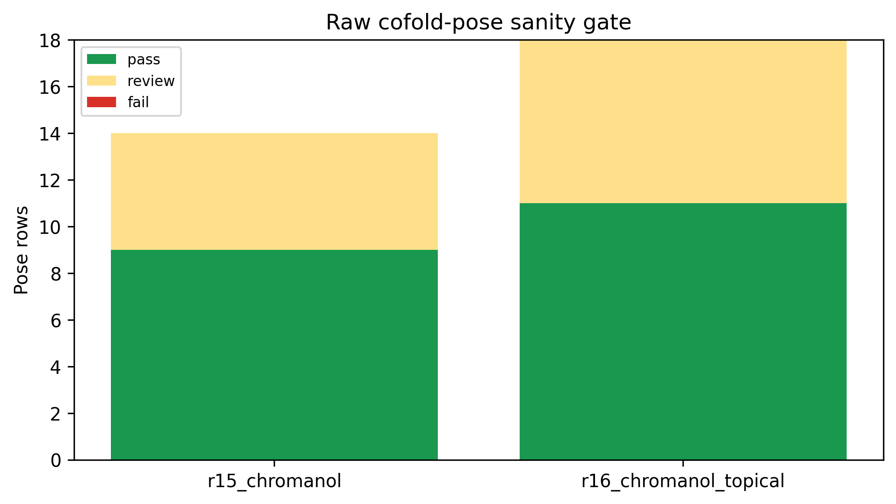

# R15 Chromanol Safety-First Fragment Triage: 14-Target Cofolding, ADMET/xTB Filtering, and 30 ns MD Separates Systemic-Safety and Topical-Lead Paths

## Abstract

R15 generated a compact chromanol fragment, `OCC1COc2cc(O)ccc2C1`, as a safety-first derivative of the broader pterocarpan-vinyl-polyphenol scaffold program. The central question is whether this fragment should be treated as a topical lead or as a systemic-safety fragment hypothesis. The answer is deliberately split. In ADMET/xTB triage, the R15 parent is predicted to be clean for AMES, DILI, and hERG liability, but its logP is `0.94`, below the intended skin-window threshold, and it ranks `11` by the topical composite score. Conversely, the top-3 topical-score analogs satisfy the skin-window heuristic but retain hERG caution values around 0.58-0.70. Boltz-2 14-target cofolding identifies TGFB1, TYR, and DCT as the top three targets by affinity probability, and all three remain stable in 30 ns OpenMM MD with mean ligand RMSD values of 0.51, 0.92, and 0.47 A. Raw-pose sanity gating found `9` pass, `5` review, and `0` fail rows across the R15 14-target panel. We therefore frame R15 chromanol as a safety-first comparator and SAR anchor, not as a ready topical efficacy candidate.

**Keywords**: chromanol, ADMET, hERG, skin permeability, Boltz-2, OpenMM, in silico, topical drug discovery

## 1. Research Question

This manuscript is intentionally narrower than the universal-scaffold paper. It asks whether the R15 chromanol fragment can be advanced as a safety-first scaffold and how that path should be separated from R16 topical chromanol optimization. Combining both paths would overstate the evidence: R15 has the cleaner predicted systemic-safety profile, while R16 analogs are better topical-window candidates but require separate safety and prior-art caveats.

## 2. Data Sources

| file | role |
| --- | --- |
| `pilot/cpu_meaningful/r15_master_triage.csv` | ADMET/xTB and topical composite ranking for 38 R15-derived candidates |
| `pilot/cpu_meaningful/r15_chromanol_cofold_14targets.csv` | 14-target Boltz-2 cofolding profile for `R15_chromanol` |
| `pilot/md_r15_chromanol_top3_30ns/summary.json` | 30 ns MD validation for the top-3 cofold targets |
| `pilot/cpu_meaningful/chromanol_pose_sanity_gate.csv` | OpenMM/RDKit/PoseBusters raw-pose sanity gate |
| `pilot/cpu_meaningful/precompute_prior_art_gate.csv` | technical prior-art pre-gate, not legal FTO opinion |

## 3. Results

### 3.1 R15 is safety-first, not topical-first

| label | SMILES | logP | QED | hERG | AMES | DILI | score | rank |
| --- | --- | --- | --- | --- | --- | --- | --- | --- |
| R15 parent | OCC1COc2cc(O)ccc2C1 | 0.94 | 0.676 | 0.169 | 0.182 | 0.214 | 0.697 | 11 |
| topical-score top-1 | OCC1Cc2c(O)cc(O)cc2OC1C1COc2cc(O)ccc2C1 | 1.97 | 0.665 | 0.616 | 0.101 | 0.408 | 0.752 | 1 |
| topical-score top-2 | CC(C)=CC1COc2cc(O)ccc2C1 | 2.91 | 0.713 | 0.575 | 0.259 | 0.202 | 0.748 | 2 |
| topical-score top-3 | CC(C)=CCC1COc2cc(O)ccc2C1 | 3.30 | 0.772 | 0.700 | 0.216 | 0.165 | 0.748 | 3 |

The parent fragment is useful because its predicted safety profile is cleaner than the topical-score leaders. It should not be described as the best topical lead. The correct narrative is a split path: R15 for safety-first fragment triage and R16 for topical optimization.

### 3.2 Cofolding identifies TGFB1, TYR, and DCT as top targets

| rank | target | affinity probability | confidence score |
| --- | --- | --- | --- |
| 1 | TGFB1 | 0.594 | 0.709 |
| 2 | TYR | 0.536 | 0.892 |
| 3 | DCT | 0.502 | 0.887 |
| 4 | PTGS2 | 0.494 | 0.908 |
| 5 | SIRT1 | 0.463 | 0.515 |
| 6 | TYRP1 | 0.460 | 0.896 |
| 7 | AR | 0.396 | 0.574 |
| 8 | MMP1 | 0.393 | 0.719 |

### 3.3 Top-3 cofold targets persist over 30 ns MD

| target | affinity probability | mean RMSD A | last-third RMSD A | max RMSD A |
| --- | --- | --- | --- | --- |
| TGFB1 | 0.594 | 0.51 | 0.72 | 0.91 |
| TYR | 0.536 | 0.92 | 1.06 | 1.33 |
| DCT | 0.502 | 0.47 | 0.50 | 0.69 |

### 3.4 Raw-pose sanity gate is disclosed rather than hidden

Across the R15 parent 14-target panel, all poses loaded and were checkable. The pass/review/fail split was `9`/`5`/`0`. Review status is not a rejection by itself; it means the raw cofold geometry has a caveat and should be interpreted together with minimization and MD persistence.

## 4. Prior-Art and Claim Discipline

The local precompute gate reports R15 parent PubChem exact status as `hit` and gate status as `hold_expensive_compute_until_prior_art_review`. This is a technical screen only. It does not establish freedom to operate or composition novelty. Any manuscript or commercial narrative must avoid clinical efficacy, confirmed target engagement, and FTO language until professional patent/Markush and wet-lab review are complete.

## 5. Limitations

All findings are in silico only. Boltz-2 cofolding is a prioritization model, not a binding assay. MD pose stability is not potency. ADMET-AI estimates cannot replace AMES, hERG patch-clamp, hepatotoxicity, irritation, sensitization, or permeation assays. Skin-window interpretation is heuristic and must be checked by formulation-dependent IVRT/IVPT and PBPK modeling.

## 6. Conclusion

R15 chromanol is best written as a safety-first fragment triage paper. Its strongest contribution is not a topical lead claim, but the disciplined separation of a clean predicted safety profile from the R16 topical optimization path.
