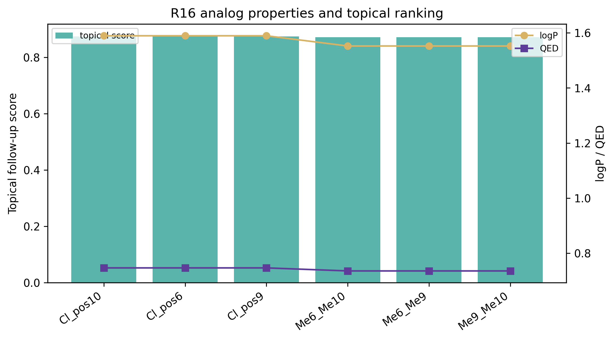
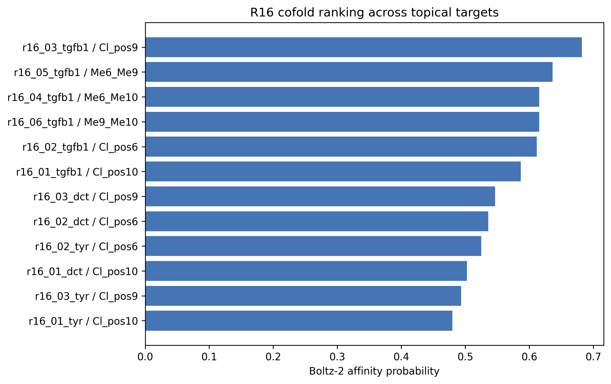
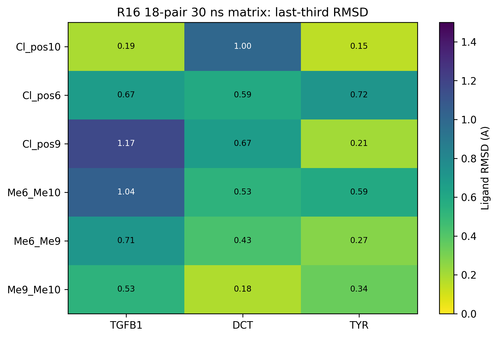
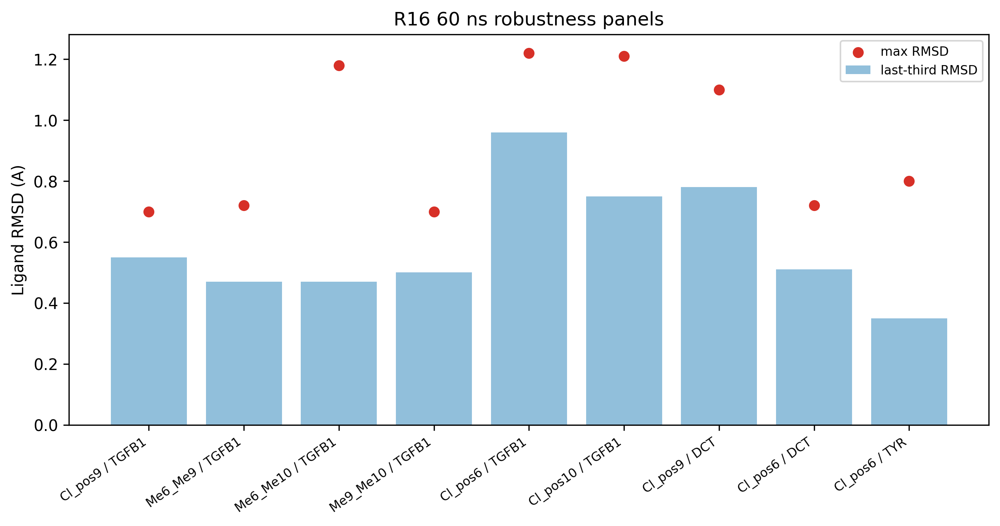
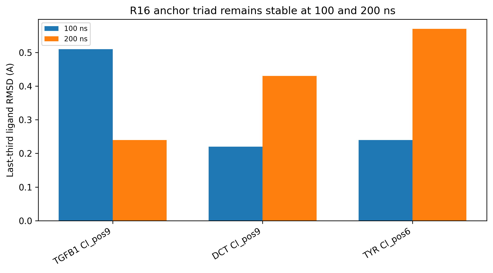

# R16 Topical Chromanol Lead Short Communication: 18-Pair 30 ns Matrix, 60 ns Robustness Panels, and Complete 200 ns Anchor-Triad Follow-up

## Abstract

R16 optimized the R15 chromanol fragment toward a topical lead hypothesis by increasing skin-window compatibility while preserving a compact chromanol core. We evaluated six chloro/dimethyl analogs across TGFB1, DCT, and TYR using Boltz-2 cofolding, an 18-pair 30 ns OpenMM stability matrix, two 60 ns robustness panels, and 100 ns plus 200 ns anchor-triad follow-up. The top cofold row was `r16_03_tgfb1` (`R15_chromanol_Cl_pos9`, `OCC1COc2cc(O)c(Cl)cc2C1`) with affinity probability `0.682`. All 18 30 ns matrix entries were stable, the TGFB1 top-six 60 ns panel completed 6/6 stable, and the DCT/TYR representative 60 ns panel completed 3/3 stable. The 200 ns long-horizon anchor triad also completed 3/3 stable: TGFB1 `R15_chromanol_Cl_pos9` max RMSD 0.71 A, DCT `R15_chromanol_Cl_pos9` max RMSD 1.05 A, and TYR `R15_chromanol_Cl_pos6` max RMSD 0.80 A. These data support an in-silico topical optimization hypothesis, not clinical efficacy, confirmed binding, composition novelty, or freedom to operate.

**Keywords**: chromanol, topical drug discovery, TGFB1, DCT, TYR, Boltz-2, OpenMM, in silico, prior-art gate

## 1. Research Question

This manuscript separates the topical R16 analog path from the R15 safety-first parent path. The question is whether R16 chloro/dimethyl chromanol analogs can be prioritized as topical in-silico candidates after target cofolding, raw-pose sanity checks, 30-60 ns robustness panels, and complete 200 ns long-horizon anchor follow-up.

## 2. Data Sources

| file | role |
| --- | --- |
| `pilot/cpu_meaningful/r16_chromanol_topical_manifest.csv` | six R16 topical chromanol analog definitions and topical scores |
| `pilot/cpu_meaningful/r16_chromanol_topical_cofold.csv` | 18 Boltz-2 cofold rows across TGFB1, DCT, and TYR |
| `pilot/cpu_meaningful/r16_topical_chromanol_30ns_matrix_summary.csv` | 18-pair 30 ns MD matrix |
| `pilot/md_r16_chromanol_topical_tgfb1_top6_60ns/summary.json` | TGFB1 top-six 60 ns robustness panel |
| `pilot/md_r16_chromanol_topical_pigment_representative_60ns/summary.json` | DCT/TYR representative 60 ns panel |
| `pilot/md_r16_chromanol_anchor_triad_100ns/summary.json` | TGFB1/DCT/TYR 100 ns anchor triad |
| `pilot/md_r16_chromanol_anchor_triad_200ns/summary.json` | complete 200 ns long-horizon anchor triad |
| `pilot/cpu_meaningful/precompute_prior_art_gate.csv` | technical prior-art pre-gate, not legal FTO opinion |

## 3. Results

### 3.1 Analog properties

### 3.2 Cofold ranking

| rank | job_id | target | analog | affinity probability | logP | QED |
| --- | --- | --- | --- | --- | --- | --- |
| 1 | r16_03_tgfb1 | TGFB1 | R15_chromanol_Cl_pos9 | 0.682 | 1.59 | 0.747 |
| 2 | r16_05_tgfb1 | TGFB1 | R15_chromanol_Me6_Me9 | 0.636 | 1.55 | 0.736 |
| 3 | r16_04_tgfb1 | TGFB1 | R15_chromanol_Me6_Me10 | 0.616 | 1.55 | 0.736 |
| 4 | r16_06_tgfb1 | TGFB1 | R15_chromanol_Me9_Me10 | 0.615 | 1.55 | 0.736 |
| 5 | r16_02_tgfb1 | TGFB1 | R15_chromanol_Cl_pos6 | 0.612 | 1.59 | 0.747 |
| 6 | r16_01_tgfb1 | TGFB1 | R15_chromanol_Cl_pos10 | 0.587 | 1.59 | 0.747 |
| 7 | r16_03_dct | DCT | R15_chromanol_Cl_pos9 | 0.546 | 1.59 | 0.747 |
| 8 | r16_02_dct | DCT | R15_chromanol_Cl_pos6 | 0.536 | 1.59 | 0.747 |
| 9 | r16_02_tyr | TYR | R15_chromanol_Cl_pos6 | 0.525 | 1.59 | 0.747 |
| 10 | r16_01_dct | DCT | R15_chromanol_Cl_pos10 | 0.502 | 1.59 | 0.747 |

### 3.3 Complete 18-pair 30 ns matrix

All 18 R16 chromanol topical target pairs completed 30 ns MD with `stable_30ns=True`. Across the matrix, the maximum RMSD was `1.38` A and the maximum last-third RMSD was `1.17` A.

| job_id | target | analog | affinity probability | mean RMSD A | last-third RMSD A | max RMSD A |
| --- | --- | --- | --- | --- | --- | --- |
| r16_06_dct | DCT | R15_chromanol_Me9_Me10 | 0.420 | 0.22 | 0.18 | 0.68 |
| r16_05_dct | DCT | R15_chromanol_Me6_Me9 | 0.421 | 0.45 | 0.43 | 0.81 |
| r16_04_dct | DCT | R15_chromanol_Me6_Me10 | 0.329 | 0.51 | 0.53 | 0.68 |
| r16_02_dct | DCT | R15_chromanol_Cl_pos6 | 0.536 | 0.56 | 0.59 | 0.81 |
| r16_03_dct | DCT | R15_chromanol_Cl_pos9 | 0.546 | 0.38 | 0.67 | 1.00 |
| r16_01_dct | DCT | R15_chromanol_Cl_pos10 | 0.502 | 0.74 | 1.00 | 1.25 |
| r16_01_tgfb1 | TGFB1 | R15_chromanol_Cl_pos10 | 0.587 | 0.21 | 0.19 | 0.66 |
| r16_06_tgfb1 | TGFB1 | R15_chromanol_Me9_Me10 | 0.615 | 0.54 | 0.53 | 0.81 |
| r16_02_tgfb1 | TGFB1 | R15_chromanol_Cl_pos6 | 0.612 | 0.55 | 0.67 | 0.87 |
| r16_05_tgfb1 | TGFB1 | R15_chromanol_Me6_Me9 | 0.636 | 0.68 | 0.71 | 0.89 |
| r16_04_tgfb1 | TGFB1 | R15_chromanol_Me6_Me10 | 0.616 | 0.99 | 1.04 | 1.24 |
| r16_03_tgfb1 | TGFB1 | R15_chromanol_Cl_pos9 | 0.682 | 0.81 | 1.17 | 1.38 |
| r16_01_tyr | TYR | R15_chromanol_Cl_pos10 | 0.480 | 0.28 | 0.15 | 0.68 |
| r16_03_tyr | TYR | R15_chromanol_Cl_pos9 | 0.493 | 0.24 | 0.21 | 0.67 |
| r16_05_tyr | TYR | R15_chromanol_Me6_Me9 | 0.422 | 0.46 | 0.27 | 0.93 |
| r16_06_tyr | TYR | R15_chromanol_Me9_Me10 | 0.430 | 0.46 | 0.34 | 0.71 |
| r16_04_tyr | TYR | R15_chromanol_Me6_Me10 | 0.351 | 0.36 | 0.59 | 0.74 |
| r16_02_tyr | TYR | R15_chromanol_Cl_pos6 | 0.525 | 0.69 | 0.72 | 0.91 |

### 3.4 60 ns robustness panels

The TGFB1 top-six 60 ns panel completed `6/6` stable entries, and the representative DCT/TYR pigmentation panel completed `3/3` stable entries. The strongest single analog across both target families is `R15_chromanol_Cl_pos9`, which carries TGFB1 and DCT support. `R15_chromanol_Cl_pos6` is the strongest TYR-focused follow-up.

### 3.5 Complete 100 ns and 200 ns anchor triads

| name | target | analog | affinity probability | mean RMSD A | last-third RMSD A | max RMSD A |
| --- | --- | --- | --- | --- | --- | --- |
| r16_03_tgfb1__R15_chromanol_Cl_pos9__200ns | TGFB1 | R15_chromanol_Cl_pos9 | 0.682 | 0.27 | 0.24 | 0.71 |
| r16_03_dct__R15_chromanol_Cl_pos9__200ns | DCT | R15_chromanol_Cl_pos9 | 0.546 | 0.34 | 0.43 | 1.05 |
| r16_02_tyr__R15_chromanol_Cl_pos6__200ns | TYR | R15_chromanol_Cl_pos6 | 0.525 | 0.49 | 0.57 | 0.80 |

### 3.6 Pose sanity and prior-art gates

The R16 raw-pose sanity split is `11` pass, `7` review, and `0` fail rows. Review-level rows are disclosed as raw Boltz-pose caveats and interpreted with minimized/MD stability.

The precompute prior-art gate classifies the R16 chromanol analog rows as `{'hold_expensive_compute_until_markush_review': 9, 'cheap_compute_allowed_prior_art_pending': 9}`. The practical implication is strict: existing R16 data can be written as in-silico prioritization, but new 100-200 ns expansion, RBFE/ABFE, synthesis/purchase, commercial novelty, and FTO claims should wait for PubChem/SureChEMBL/PATENTSCOPE/Lens/EPO OPS plus professional Markush and attorney claim-chart review.

## 4. Development Interpretation

`R15_chromanol_Cl_pos9` is the strongest TGFB1-first topical hypothesis because it combines the highest cofold probability, stable 30 ns target-diverse MD, stable TGFB1 60 ns MD, representative DCT 60 ns support, and stable TGFB1/DCT 200 ns long-horizon anchors. `R15_chromanol_Cl_pos6` is the strongest TYR-focused pigmentation follow-up because it carries DCT/TYR 60 ns support and stable TYR 200 ns anchoring. This is a prioritization statement only.

## 5. Limitations

All findings are in silico only. Boltz-2 cofolding is not a biochemical assay. MD pose stability is not potency, target engagement, residence time, or skin exposure. Photosafety, sensitization, hERG, AMES, DILI, irritation, IVRT/IVPT, PBPK, formulation compatibility, and target-engagement assays remain required. A `PubChem no_hit` or local distinctness result is not a freedom-to-operate opinion because Markush and use claims can still cover unmade or unlisted analogs.

## 6. Conclusion

R16 is the strongest current topical chromanol in-silico lead family in Genesis_Medicine. The completed 30 ns, 60 ns, 100 ns, and 200 ns panels justify manuscript completion and CRO hypothesis packaging, while the prior-art gate blocks stronger commercial and follow-on expensive-compute claims until Markush/FTO review is complete.
