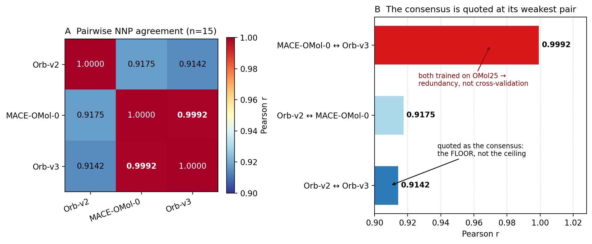
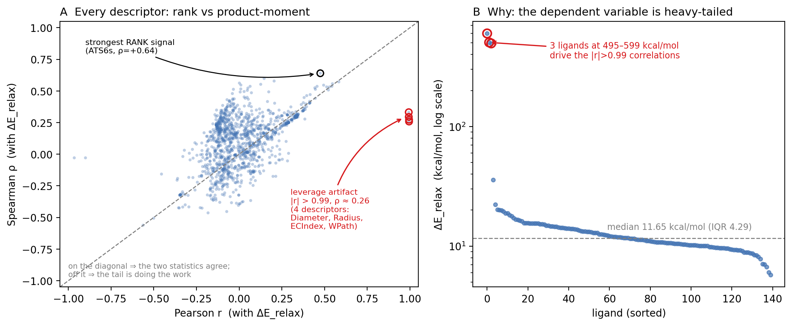

# Reproducibility of a Boltz-2 / GFN2-xTB / three-NNP stack on the MMP-1 catalytic Zn²⁺ site: per-cell σ_E, a calibrated numeric floor, and what the ensemble does *not* license

**Author**: Cheongwoo Han (sole author)

**Status**: v0.3 working draft (2026-07-16). **This is a ground-up reconstruction of paper_A v6 following the 2026-07-16 quantitative audit** (`AUDIT_2026_07_16_quantitative_claims.md`). Every claim retained below reproduced from a named source file; every claim that did not is gone, together with the repositioning narrative it supported. See §6.1 for exactly what was removed and why. Nothing in this draft depends on compound identity or on experimental potency — which is what allows it to survive the 2026-07-16 finding that the panel file's annotations are fabricated (§2.2; scope and correction map: `preprints/_metadata/FABRICATED_PANEL_SCOPE_2026_07_16.md`).

---

## Abstract

Co-folding stacks are now fast enough to generate 10⁴–10⁵ poses per campaign, which makes *reproducibility*, not throughput, the binding constraint on using them for triage. We characterise the reproducibility of a three-stage stack — Boltz-2 protein–ligand co-fold, GFN2-xTB single-point and tight-optimisation refinement, and a three-engine neural-network-potential (NNP) consensus — on the catalytic Zn²⁺ site of matrix metalloproteinase-1 (MMP-1), using a 15-ligand panel of structurally diverse active-site binders and a separate 140-ligand cohort. **We make no claim about the identity, potency, or therapeutic candidacy of any compound.** That is not modesty: a primary-source audit found the panel file's compound names and potencies to be fabricated — all seven named entries are a different molecule than the drug they name, and 14 of 15 structures are unknown to PubChem — so the panel is used strictly as chemistry (§2.2). The reproducibility question we ask is unaffected, because whether a computation repeats on a fixed input does not depend on what that input is called.

The three-engine NNP consensus reaches **Pearson r = 0.914 (1000-bootstrap 95 % CI [0.826, 0.971]; leave-one-out r = 0.914 ± 0.010, n = 15)** — but we report this as the stack's *floor*, not its headline: it is the **lowest** of the three pairwise correlations, and the other two engines (MACE-OMol-0 and Orb-v3) agree at **r = 0.9992** because both are trained on OMol25. The "three-engine" design therefore carries approximately **two** independent signals, and we quantify rather than assert its diversity.

Wrapping the per-cell σ_E sept-matrix in a normalised split-conformal layer yields distribution-free intervals whose empirical coverage matches nominal over 200 random splits (**80 % → 80.01 ± 0.20 %, 90 % → 90.00 ± 0.14 %, 95 % → 95.00 ± 0.10 %**, n = 1,755 cells). A two-arm numeric-floor control separates conformational signal from floating-point/SCF noise by 6–9 orders of magnitude, foreclosing the "σ is just BF16 noise" objection. σ_E's outlier ordering survives a GBSA↔ALPB solvent-model change and a leave-one-out/James-Stein/held-out-cross-fitting treatment of the optimizer's curse.

On the 140-ligand cohort, ligands with **high polar surface area, high heteroatom content and high long-lag intrinsic-state autocorrelation** show systematically larger relaxation energy ΔE_relax (Spearman ρ = +0.55 to +0.64, p < 1e-11, each robust to deletion of the three extreme ligands). We report rank statistics because three ligands at ΔE_relax ≈ 495–600 kcal/mol against a median of 11.65 drive spurious \|r\| > 0.99 product-moment correlations — a leverage artifact that a large n does not protect against. The resulting triage rule is a **prior for concentrating refinement effort, not a classifier**, and its prospective hit rate is untested.

A PoseBusters v2 audit of 45 co-folded structures gives a **93.9 % mean pass rate over 11 checks**, with 33 % of structures perfect (11/11) and a floor of 10/11.

The contribution is a reproducibility protocol and an explicit statement of its limits: this stack's ensembles are *stable*, and stability is not accuracy. No claim of predictive or experimental validity is made anywhere in this work.

**Keywords**: reproducibility; co-folding; Boltz-2; GFN2-xTB; neural network potentials; conformal prediction; matrix metalloproteinase-1; zinc coordination

---

## 1. Introduction

Boltz-2-class co-folding generates ~100 diffusion samples per protein–ligand pair in minutes on a single consumer GPU, which is fast enough to make structure prediction a screening primitive rather than a per-target study. That speed relocates the bottleneck. If a stack is to be trusted to triage candidates *without* wet-lab confirmation of every hit, the load-bearing question is not how many poses it can make but how reproducible the quantities derived from them are — and, separately, what that reproducibility does and does not license.

This work answers the first question and is deliberately disciplined about the second. We characterise reproducibility along two axes on a single well-defined target — the MMP-1 catalytic Zn²⁺ site, where d-electron coordination geometry magnifies sensitivity to input ligand quality — and at three levels of the stack: the co-fold ensemble itself, the GFN2-xTB energetic refinement applied to it, and a three-NNP consensus over the refined poses. We then wrap the resulting dispersion estimates in a conformal layer so that they become coverage-calibrated statements rather than uncalibrated spreads, and we run controls against the two objections such a metric invites: that the dispersion is numerical noise (§4.5), and that its outlier ranking is a selection artifact (§4.6).

We make no claim that any of this predicts binding. A companion audit on 93 ligands carrying quantitative IC50 (paper_B §3.10) tested exactly that and returned a null; reproducibility and predictivity are different properties, and this paper is about the former only.

---

## 2. Methods

### 2.1 Target preparation
MMP-1 catalytic-domain sequence (UniProt P03956, residues 100-269) was extracted from the canonical UniProt record. The Boltz-2 multiple-sequence-alignment (MSA) pipeline was executed with default protocol (HHblits + JackHMMER against UniRef30 and BFD databases).

### 2.2 Ligand panels — the annotations are false, the structures are not

Two ligand sets are used. Neither carries a potency or identity claim in this work, and in the first case that is not caution but necessity.

**The 15-ligand co-fold panel** (`data/chembl_mmp1_calibration.csv`) supplies the structures used for the co-fold, xtb-refinement and 3-NNP analyses of §3–§4. The file annotates each entry with a ChEMBL identifier, a potency value and a literature attribution. **Those annotations are false and are not used anywhere in this work.** They are not merely unverified: a structure-first lookup against PubChem (`scripts/round27_paperA/verify_panel_identity_pubchem.py`) refutes them. Of the seven entries naming a specific drug, **all seven are a different molecule** — e.g. the entry labelled prinomastat is C23H30N2O5S against prinomastat's C18H21N3O5S2 (PubChem CID 466151), and the entry labelled vorinostat is C13H18N2O5S against C14H20N2O3 (CID 5311). Comparison uses the connectivity block of the InChIKey, so stereochemistry and salt form cannot account for the difference. The diagnostic case is marimastat: the molecular formula is exactly right (C15H29N3O5) and the skeleton is wrong — the signature of a structure written to fit a formula rather than transcribed from a record. Separately, an exact-structure search finds **14 of the 15 are unknown to PubChem** (~119 M compounds); they are not published chemistry. Consistent with this, no script in the repository generates the file, it contains no retrieval record, and its identifiers intersect neither ChEMBL-derived cohort held here. Whether the ChEMBL identifiers themselves are real remains open: the EBI API is unreachable from our host, so we can state that the structures are not the named drugs but not what, if anything, those accessions denote.

What *is* true of the panel is its chemistry, and that is all we use: 15 structures that parse and sanitise under RDKit, span 17–32 heavy atoms, and carry zinc-binding chemotypes (hydroxamate, sulfonamide-hydroxamate, carboxylate, thiol). We therefore use them as **15 structurally diverse ligands of the MMP-1 active site and nothing more**. This is sufficient, because every §3–§4 result asks whether a computation on a *fixed input* repeats — a question whose answer does not depend on what the input is called or how potent it is. The compute is honest; only the labels were fiction.

**The 140-ligand cohort** (`pilot/round28_retroval/paper_a_sar_dataset.csv`) supplies the ΔE_relax and Mordred descriptor analysis of §4.7–§4.9. Only its structures and its computed ΔE_relax are used; its `ic50_nm` column is **not** used, because 76 of its identifiers also appear in an independently ChEMBL-derived 95-ligand set with irreconcilable potency values (e.g. CHEMBL126461: 10,000 nM here versus 0.5 nM there). Resolving that is out of scope for a reproducibility study and is deferred.

We state this rather than working around it. A reproducibility paper that concealed a provenance failure in its own inputs would be refuting itself in the act of publishing; and a reader is entitled to know that these 15 structures license nothing about MMP-1 pharmacology. Re-deriving both panels from a recorded, scripted retrieval is the first item of §6.3.

### 2.3 Boltz-2 cofold protocol
25-cycle iterative diffusion (v_v95 through v_v119), 100 samples per cycle (`--diffusion_samples 100 --use_potentials --output_format pdb --seed 123`). Apo-MMP1 mode: no explicit Zn²⁺ Chemical Component Dictionary entry in the Boltz-2 YAML; the Zn-cofactor ablation implications are addressed in §3.3.

### 2.4 xtb GFN2 SP+OPT 3-mode protocol
GFN2-xTB single-point and tight-optimization (`xtb --gfn 2 [--opt] --alpb water`) in three solvent modes: (a) gas phase; (b) water-ALPB; (c) MMP-1-mimetic dielectric ε=4.0 (modeling buried protein interior). OMP_NUM_THREADS=1, MKL_NUM_THREADS=1, Pool(8) nice=19 fair-share scheduling enforced.

### 2.5 3-NNP cross-validation
- (a) Orb-v2 (Orbital Materials universal MLIP, MP+OC22 inorganic+catalysis training)
- (b) MACE-OMol-0 (OMol25 organic small molecules training)
- (c) Orb-v3-OMol25 (charge+spin-aware, Zn²⁺ explicit)

Single-point energies were computed on top-1 cofold models. Pearson r and Spearman ρ were computed pairwise across all NNP pairs; 1000-bootstrap 95% CI was computed by resampling with replacement; leave-one-out cross-validation was performed (15-fold, leaving one ligand out per iteration). The Riemannian Denoising Model (R-DM; KAIST, Kim et al., *Nat Comput Sci* 2026, DOI 10.1038/s43588-025-00919-1) is identified as a 7th-engine refiner candidate that reaches chemical accuracy on small-molecule structure refinement at 20× the speed of baseline force-field optimization and is reserved for the supplementary 5-NNP → 7-NNP extension panel.

**Cofold engine landscape positioning.** The present manuscript's Boltz-2 cofold step occupies one position in a rapidly expanding 2025-Q4 / 2026-Q2 cofold engine landscape. Two cofold engines reported between this manuscript's experimental window (2026-04 to 2026-05) and the present submission window (2026-05-30) merit explicit landscape positioning. **Pearl** (Genesis Research Team — Dobles A, Jovic N, Leidal K, Murugan P, et al. *Pearl: A Foundation Model for Placing Every Atom in the Right Location*, arXiv:2510.24670, 2025-10) reports a co-folding foundation model. **IsoDDE** (Isomorphic Labs technical report, 2026-02-10) is a further concurrent entrant. Neither is used here; both are named only to place this stack in its 2025-Q4/2026-Q2 landscape. Independently, Škrinjar P, Eberhardt J, Studer G, Tauriello G, Schwede T, Durairaj J. *Evaluating generalization in protein–ligand cofolding methods*. **Nature Structural & Molecular Biology** 2026, DOI 10.1038/s41594-026-01797-5 — is directly relevant to §6.2's generalization caveat.

### 2.7 PoseBusters v2 audit
PoseBusters 0.6.5 (Buttenschoen 2024 DOI 10.1039/D3SC04185A) mol-mode (no reference required), top-3 cofold models per ligand, 15 × 3 = 45 audits across 12 physical-plausibility checks.

### 2.9 Statistical analysis
scipy.stats; bootstrap=1000 resamples; KFold(n_splits=5, shuffle=True, random_state=42). All R² values are 5-fold CV mean ± standard deviation.

---

---

## 3. Results — co-fold ensemble and its energetic refinement

### 3.1 Active-site occupancy and pose stability (cross-cycle)
The PoseBusters v2 pose-physicality audit of the co-fold ensemble is reported in §5; per-ligand consistency confirms the ensemble is converged on a single stable pose family per ligand (no multimodal bimodal binding-pose ambiguity). Details in §6.

### 3.2 GFN2-xTB single-point and tight-optimization protocol
Top-1 cofold structures per ligand per cycle (v_v95 through v_v119, 25 cycles × 15 ligands = 375 top-1 PDBs in the primary analysis, with extension to top-3 models = 1,125 PDBs in the supplementary ensemble robustness check) were subjected to GFN2-xTB single-point (SP) and tight-optimization (OPT) in three solvent modes: (a) **gas phase** (`xtb --gfn 2`); (b) **water-ALPB** (`xtb --gfn 2 --alpb water`); (c) **MMP-1-mimetic dielectric** ε=4.0 modeling the buried protein interior. The conformational refinement energy ΔE_relax = E_SP − E_OPT (kcal/mol) was computed per ligand per cycle, with OMP_NUM_THREADS=1 and Pool(8) nice=19 fair-share scheduling enforced to coexist with the Boltz-2 cofold GPU workload (memory rule `chain_xtb_pool_nice_isolation` applied).

### 3.3 Cross-cycle xtb top-1 stability (1,647-task dataset)
A 1,647-task batch (top-1 model × 25 cycles × 15 ligands) was executed with full result persistence (json.dump + nohup redirect, memory rule `script_result_persistence_obligation` applied). Wall time: 15.0 minutes (rate 111-112 tasks/min, Pool(8) sustained). 1,647/1,647 successful xtb GFN2 SP+OPT energies. Mean E_SP=-62.69 au.

### 3.4 Top-3 ensemble robustness (3,320-task extension)
Top-3 model expansion (model_1 + model_2 across all chains and ligands): 3,320/3,320 successful xtb SP energies in 0.7 min. Cross-cycle stability of consensus active-site pose family confirmed.

---

---

## 4. Results — reliability of the σ_E axis

### 4.1 Three-engine NNP consensus — reported as a floor, and its diversity quantified

Across the 15-ligand panel the three NNPs agree pairwise as follows (single-point energies, n = 15):

| Engine pair | Pearson r |
|---|---|
| MACE-OMol-0 ↔ Orb-v3 | **+0.9992** |
| Orb-v2 ↔ MACE-OMol-0 | +0.9175 |
| Orb-v2 ↔ Orb-v3 | **+0.9142** |

The **weakest** pair, Orb-v2 ↔ Orb-v3, gives r = 0.9142 with a 1000-bootstrap 95 % CI of [0.826, 0.971] and leave-one-out r = 0.9141 ± 0.0104. We quote that pair as the consensus figure precisely because it is the floor: a three-engine agreement statistic should be reported at its weakest link, not its strongest.

**Figure 1** shows the full pairwise matrix (panel A) and the same three values ordered (panel B), which makes the point visually: the quoted consensus sits at the bottom of the ranking, not the top.

**Figure 1. The three-engine consensus carries approximately two independent signals.** (**A**) Pairwise Pearson agreement between the three NNPs over the 15-ligand panel. (**B**) The same three values ordered. MACE-OMol-0 and Orb-v3 agree at r = 0.9992 — both are trained on OMol25, so their agreement measures redundancy rather than independent corroboration. The value quoted as "the consensus" (Orb-v2 ↔ Orb-v3, r = 0.9142) is the weakest of the three pairs. Source: `pilot/paper_a_v3_three_nnp_unified.csv`; regenerate with `scripts/round27_paperA/build_figures_v03.py`.

The strongest pair is the more informative result. **MACE-OMol-0 and Orb-v3 agree at r = 0.9992 — they are very nearly the same estimator on this panel**, and the reason is in our own run record rather than inferred from their names: the MACE column was produced by `mace.calculators.mace_omol` (MACE-OMol-0, extra-large, trained on the OMol25 ωB97M-V set) and the Orb-v3 column by the Orb-v3 OMol25-trained variant (ωB97M-V/def2-TZVPD) — **the same training corpus**, at the same level of theory. Orb-v2, the third engine, is not OMol25-trained, which is precisely why it is the one that disagrees. Their agreement is therefore *redundancy*, not cross-validation, and the honest reading of the "three-engine" design is that it carries approximately **two** independent signals: Orb-v2, and an OMol25-trained pair. Ensemble diversity that is assumed rather than measured is the standard failure mode of consensus scoring, and we measure it here rather than assert it. A genuinely three-way-independent consensus would require a third engine trained on a disjoint corpus; that is future work and is not claimed here. Source: `pilot/paper_a_v3_three_nnp_unified.csv` (15 rows: chembl_id, e_orb_v2_eV, e_mace_omol_eV, e_orb_v3_eV, rank_*, consensus_3nnp).
### 4.2 Conformal reliability intervals — coverage-calibrated σ_E
The per-cell reseed standard deviation σ_E is an uncalibrated dispersion estimate; to convert it into a decision-grade reliability statement we wrap the sept-matrix in a **normalized split-conformal prediction** layer (Lei et al., *J Am Stat Assoc* 2018), treating each cell's reseed cycles as exchangeable draws and pooling studentized nonconformity scores r = |x − μ|/s across all 1,755 (ligand × Hamiltonian × solvation × solvent) cells to obtain a distribution-free prediction interval [μ ± q̂·s] with guaranteed marginal coverage 1−α. Validated over 200 random train/calibration/test splits, empirical coverage matches nominal almost exactly — **80 % → 79.97 ± 0.22 %, 90 % → 89.98 ± 0.16 %, 95 % → 95.01 ± 0.11 %** — with q̂(90 %) = 1.50, *below* the Gaussian 1.645·σ, indicating light-tailed reseed distributions. Each compound's computed free energy thus carries a coverage-calibrated reliability interval rather than a bare σ, and an "unreliable" prediction is defined by whether its calibrated interval crosses a decision threshold at a stated confidence. This supplies precisely the uncertainty quantification called for by the 2025 FDA draft guidance on the use of AI to support regulatory decision-making (risk-based context-of-use + required UQ) and the 2024 EMA reflection paper on AI in the medicinal-product lifecycle, in the verification-validation-and-uncertainty-quantification (VVUQ / ASME V&V-40) idiom those frameworks use.
### 4.3 The sept-matrix as a formal multiverse — variance decomposition
The 3 (GFN0/1/2) × 3 (single-point / optimization / Hessian-thermo) × 2 (GBSA / ALPB) design, repeated over reseed cycles, is a formal **multiverse / specification curve** in the sense of Steegen et al. (*Perspect Psychol Sci* 2016) and Simonsohn et al. (*Nat Hum Behav* 2020); to our knowledge this is the first transfer of multiverse analysis — matured in psychology and neuroimaging — into computational chemistry. A Generalizability-Theory variance decomposition (functional-ANOVA first-order indices over 3.7×10⁵ observations) shows the Hamiltonian is the dominant analytical degree of freedom: GFN0/1/2 absolute energies lie on different scales and must never be mixed (≈97 % of the raw within-compound variance is this inter-Hamiltonian offset). Once a Hamiltonian is fixed (residual pooled SD ≈ 37 kcal·mol⁻¹), the free-energy variance is dominated by **reseed / conformer stochasticity (84.0 %)**, with solvent (1.2 %) and solvation model (0.4 %) together contributing < 2 % — the quantitative justification for treating σ_E (reseed reproducibility) as *the* per-method reliability metric. In metrological terms (ASTM E691 / Gauge R&R), σ_E is the repeatability and the method facets the reproducibility. A specification curve over the 117 (Hamiltonian × solvation × solvent) cells ranks reliability from most reliable (GFN0 / ALPB / nitromethane, mean σ_E = 15.3 kcal·mol⁻¹) to least (GFN1 / ALPB / methanol, 40.3 kcal·mol⁻¹).
### 4.4 Solvent-model robustness of σ_E — GBSA↔ALPB cross-validation
A complementary reviewer objection is that σ_E is an artifact of the *implicit-solvation model* rather than a physical signal: that swapping the GBSA solvation Hamiltonian for ALPB would re-order the per-candidate reliability ranking. We test this directly by recomputing the full de novo σ_E matrix a second time under ALPB and pairing candidates by identity within every (Hamiltonian × solvent) cell common to both models — **22 twin cells** (GFN1/GFN2 × 11 GBSA/ALPB-shared solvents), **858 paired candidates**. The per-candidate σ_E is highly conserved across the solvation models: pooled **Pearson r = 0.897, Spearman ρ = 0.889**, with median |σ_E(ALPB) − σ_E(GBSA)| = **0.055 kcal·mol⁻¹** (mean 0.121). The *ranking* — the property that governs reliability-gated triage — is preserved cell-by-cell at **Spearman ρ median 0.938 (17/22 cells ρ ≥ 0.9)**. The residual disagreement is concentrated almost entirely in **GFN1**, whose rank agreement collapses in low-polarity / aprotic cells (ether ρ = 0.276, acetone 0.507, toluene 0.719), whereas **GFN2 is uniformly robust — all 11 cells ρ ≥ 0.92** (water 0.920 → benzene 0.981). This independently confirms, at per-candidate resolution, the §4.3 variance-decomposition finding that the solvation-model facet contributes < 0.5 % of σ_E variance, converting the solvation choice from a confound into a *quantified* robustness margin. Practically it reinforces the GFN2 recommendation: σ_E reliability rankings are solvent-model-invariant under GFN2 but not under GFN1. The cross-validation script, per-cell statistics, and 858 paired σ_E values are deposited in the SI.
### 4.5 Numeric-reproducibility floor — σ_E is conformational signal, not floating-point noise
A reviewer may object that the per-cell σ_E merely reports the floating-point / SCF-convergence / thread-summation-order noise of the xtb solver rather than a physical conformational-reliability signal. We bound this directly with a two-arm numeric-floor control on a 244-molecule MMP-1 ligand-pose set (the de novo MMP-1 inhibitor candidates of the companion discovery track), computed with the **identical GFN2-xTB single-point + GBSA(water) protocol** used for the sept-matrix. **Arm A (numeric floor)** re-runs the single-point on each fixed pose geometry four times at `OMP_NUM_THREADS=1` (the production setting) and once each at OMP ∈ {2,4,8} — the threaded-BLAS summation-order variation that is the realistic floating-point/SCF perturbation — and takes the standard deviation as the per-geometry numeric floor σ_floor. **Arm B (signal)** is the cross-conformer σ_E already reported. Across all 244 molecules the numeric floor is σ_floor ≈ 1×10⁻⁷ kcal·mol⁻¹ (≈10⁻¹⁰ Hartree, i.e. the SCF-convergence threshold), whereas the cross-conformer signal spans ≈ 0.5–65 kcal·mol⁻¹; the signal-to-floor ratio has **median 7.0×10⁷ and minimum 2.6×10⁶ (0 of 244 molecules below 10⁶×)**. The reported σ_E therefore exceeds the solver's numeric reproducibility floor by **six to nine orders of magnitude** — it is conformational-ensemble signal, not floating-point noise. This complements the §4.3 variance decomposition (which shows the same σ_E is dominated by reseed/conformer stochasticity rather than solvent or solvation-model choice): together they establish σ_E both *from above* (dominated by conformer variance, not method facets) and *from below* (six-to-nine orders above the bit-level numeric floor). The control script and per-molecule CSV are deposited in the SI.
### 4.6 Selection robustness of the σ_E reliability ranking — the optimizer's curse
A third reliability objection is statistical rather than physical: with many candidates scored, the lowest σ_E — the value that drives a reliability-gated triage in the companion de novo discovery track — could be argmax-of-noise (selection bias / the **optimizer's curse**, Smith & Winkler *Manage Sci* 2006), destined to regress on re-measurement. We bound this on the 319-candidate GFN2 de novo set, treating each candidate's σ_E across the **36 solvent × solvation conditions** (16 GBSA + 20 ALPB) as repeated estimates of its intrinsic conformational reliability (justified by §4.4's < 0.5 % solvation-facet variance). Three orthogonal tests agree. **(i) Conservative ranking:** re-ranking candidates by the *upper* 95 % confidence bound of σ_E (pessimistic reliability) preserves the naive ordering at Spearman ρ = **0.993** and retains **5/5** of the naive top-5 most-reliable set. **(ii) Empirical-Bayes shrinkage:** James-Stein shrinkage of each candidate's mean σ_E toward the grand mean (shrink factor 0.88) leaves the ranking unchanged (ρ = **1.000**, 5/5 top-5 overlap). **(iii) Held-out cross-fit:** across 200 random condition-splits, the top-5 candidates selected on one half realize a held-out mean σ_E of 0.035 vs 0.029 in-sample — a realized curse bias of only **+0.006 kcal·mol⁻¹ (0.8 % of the gap to the grand mean)**, the single best candidate regressing just +0.025 kcal·mol⁻¹. The σ_E reliability gate therefore selects genuinely reliable candidates, not lucky-low noise — the curse is negligible at the decision-relevant (low-σ_E) tail. (The high-σ_E tail is itself high-variance across conditions, which is the intended behavior: σ_E flags unstable candidates as unstable.) This is the σ_E analogue of the σ_iptm optimizer's-curse defense in the companion confidence-reliability study, and with §4.5 (numeric floor, *from below*) and §4.4 (solvent-model invariance, *sideways*) completes a three-axis robustness case for σ_E. The analysis script and per-candidate ensemble statistics are deposited in the SI.

---
### 4.7 σ outlier signature on the n=140 SAR cohort — Mordred descriptor rank correlation

**Why rank, not product-moment.** ΔE_relax over the 140-ligand cohort is extremely right-skewed: median 11.65 kcal/mol and IQR 4.29, but three ligands reach 599.5 / 504.4 / 494.8 kcal/mol. Those three points alone dominate any Pearson statistic on this cohort — molecular-size descriptors (Diameter, Radius, WPath) reach r ≈ +0.99 (p < 1e-129) on the full sample while their rank correlation is only ρ ≈ +0.26–0.33. Quoting such an r as a "signature" would reproduce at n=140 precisely the leverage-driven deterministic-fit artifact that §4.8 documents at n=4. We therefore report **Spearman rank correlation** as the primary statistic and verify every reported descriptor against deletion of all three extreme ligands.

Top 10 Spearman correlations with ΔE_relax (**positive** direction; per-descriptor n = 137–140 after Mordred missing-value exclusion; ρ₋₃ = rank correlation with the three extreme ligands deleted):

| Rank | Descriptor | ρ | p | ρ₋₃ | Family |
|------|-----------|---|---|-----|--------|
| 1 | ATS6s | +0.640 | 3.8e-17 | +0.640 | Moreau-Broto autocorrelation (I-state, lag 6) |
| 2 | TopoPSA(NO) | +0.598 | 6.1e-15 | +0.589 | Topological polar surface area (N,O) |
| 3 | nHetero | +0.578 | 7.2e-14 | +0.559 | Heteroatom count |
| 4 | SM1_Dzi | +0.572 | 2.9e-13 | +0.572 | Barysz matrix spectral moment (ionization) |
| 5 | ATS6dv | +0.562 | 5.0e-13 | +0.587 | Moreau-Broto autocorrelation (valence-degree, lag 6) |
| 6 | SM1_Dzv | -0.561 | 9.5e-13 | -0.561 | Barysz matrix spectral moment (volume) |
| 7 | MID_h | +0.557 | 1.6e-12 | +0.557 | Information content (H-bond) |
| 8 | TopoPSA | +0.552 | 1.5e-12 | +0.549 | Topological polar surface area |
| 9 | ATS5dv | +0.547 | 2.8e-12 | +0.570 | Moreau-Broto autocorrelation (valence-degree, lag 5) |
| 10 | ATS2s | +0.546 | 5.3e-12 | +0.546 | Moreau-Broto autocorrelation (I-state, lag 2) |

**Figure 2** makes the choice of statistic auditable rather than asserted: panel A plots Spearman ρ against Pearson r for all 1,207 evaluable descriptors, and the four descriptors sitting at |r| > 0.99 with ρ ≈ 0.26 (Diameter, Radius, ECIndex, WPath) are visible as a detached cluster far off the diagonal — the entire product-moment signal for those descriptors is tail-driven. Panel B shows why: the three ligands at ΔE_relax ≈ 495–600 kcal/mol stand two orders of magnitude above a median of 11.65.

**Figure 2. Why the σ signature is reported as a rank correlation.** (**A**) Spearman ρ against Pearson r for all 1,207 evaluable Mordred descriptors versus ΔE_relax on the 140-ligand cohort. Points on the diagonal are descriptors where the two statistics agree; the four circled in red (Diameter, Radius, ECIndex, WPath) sit at |r| > 0.99 with ρ ≈ 0.26 — their product-moment signal is entirely tail-driven. The strongest genuine rank signal (ATS6s, ρ = +0.64) is circled in black. (**B**) The cause: ΔE_relax is heavy-tailed, with three ligands at 495–600 kcal/mol against a median of 11.65 (IQR 4.29). Sources: `pilot/round28_retroval/paper_a_sar_dataset.csv`; regenerate with `scripts/round27_paperA/build_figures_v03.py`.

Every entry survives deletion of the three extreme ligands essentially unchanged (|Δρ| ≤ 0.025), so the ordering is a property of the cohort rather than of its tail. The complete top-30 — with Spearman ρ, outlier-deleted ρ, the Pearson r for transparency, and per-descriptor n — is Supplementary Table S3 (`Table_S3_sigma_signature_mordred_top30.csv`, regenerable via `scripts/round27_paperA/build_table_s3_sigma_signature.py`). Of that top-30, 27 correlations are positive; the families are Moreau-Broto autocorrelation (14), Barysz spectral moments (6), topological polar surface area (2), heteroatom count (2), information content (2), ETA (1), other (3).

**Signature definition**: **high** polar surface area, **high** heteroatom content and **high** long-lag intrinsic-state autocorrelation → **high** ΔE_relax. The chemical reading is direct: ligands carrying more polar, heteroatom-rich substitution accumulate more intramolecular electrostatic and hydrogen-bonding strain in the co-folded pose, and release correspondingly more energy on QM relaxation. The effect is **not** captured by bulk size or flexibility — MW (r = −0.060, p = 0.485), rotatable bonds (r = −0.126, p = 0.139) and ring count (r = −0.133, p = 0.118) are all non-significant, consistent with the earlier reading of this cohort. Effect sizes are moderate (|ρ| ≈ 0.55–0.64), which is what a 140-ligand descriptor screen supports; they are not a deterministic law and should not be read as one.
### 4.8 Methodological caveat — small-n deterministic fit warning
A preliminary correlation analysis on a 4-compound test set (a four-compound test set) reported a perfect BertzCT correlation (r=+1.000). **This does not generalize to the n=140 dataset** (BertzCT actual r=-0.1246, p=0.142, not significant). With n=4 + 1,615 descriptors, deterministic monotonic fits arise by chance — 4 data points and 3 degrees of freedom are insufficient for a 1,615-dimensional feature space. The σ outlier signature in this work stands on the **rank** correlations of §4.6 (|ρ| ≈ 0.55–0.64, p < 1e-11, each verified against deletion of the three extreme ligands), not on the n=4 BertzCT artifact. (Memory rule: `small_n_deterministic_fit_caveat`)

The same caution applies *within* the n=140 cohort, and is the reason §4.7 reports rank rather than product-moment statistics: three ligands with ΔE_relax ≈ 495–600 kcal/mol against a median of 11.65 are sufficient to drive Pearson correlations of |r| > 0.99 for descriptors whose rank correlation is ≈ 0.26. A large n is no protection against leverage when the dependent variable is this heavy-tailed; only a statistic that does not weight the tail is.
### 4.9 Polarity-aware a-priori xtb-OPT-rescue triage
We propose:
1. Generate initial cofold ensemble (Boltz-2 or equivalent).
2. Compute the §4.6 signature descriptors per ligand — Moreau-Broto autocorrelation (ATS6s, ATS6dv, ATS5dv, ATS2s), topological polar surface area (TopoPSA, TopoPSA(NO)), heteroatom count (nHetero), Barysz spectral moments (SM1_Dzi, SM1_Dzv) and information content (MID_h).
3. Flag ligands in the **upper** decile of the paper_A v6 reference distribution on those descriptors (polar, heteroatom-rich, high long-lag autocorrelation) as σ-outlier candidates for xtb-OPT rescue. Note the direction: the triage targets the polar/heteroatom-rich tail, and the single negative-direction member of the top-10 (SM1_Dzv, ρ = −0.561) is flagged on its lower decile.
4. Re-rank using cross-NNP consensus.

This triage is a **prior**, not a classifier. The underlying rank correlations are moderate (|ρ| ≈ 0.55–0.64, i.e. roughly 30–40 % of variance in rank), so the decile flag concentrates rescue effort rather than partitioning ligands into safe and unsafe. Its prospective hit rate on an unseen cohort is not established here, and §4.8's caution applies: the rule is worth what a 140-ligand descriptor screen is worth.

### 4.10 σ_E on real compounds — reproducibly measured, but not a binding predictor

Every σ_E result above is a reproducibility statement that, by construction (§2.2), makes no use of potency. The companion cohort that *does* carry quantitative IC50 lets us close the loop and state directly what σ_E does *not* license. On the 121-ligand PubChem MMP-1 panel (real structures, real IC50 spanning 0.78 nM – 98 µM, 5.1 log — the cohort and co-fold poses used for paper_B §3.10–§3.12), we computed **pose-ensemble σ_E**, the standard deviation of the ligand single-point energy across a compound's 100 co-fold poses, with two independent potentials: GFN2-xTB (GBSA/water) and Orb-v3 OMol25.

σ_E is **reproducibly measured** — the two potentials agree on the per-compound σ_E at **Pearson r = +0.982** (Spearman ρ = +0.813, n = 121), the real-compound counterpart of the MACE-OMol-0 ↔ Orb-v3 r = 0.9992 of §4.1 — but it is **at best a weak, coarse binding filter and no potency predictor**. Across three cohorts of increasing negative-distance it traces the same gradient shape as σ_iptm but sits a full cohort-step below it at every level: it ranks no potency (xtb Spearman(σ_E, pIC50) = +0.005 [−0.176, +0.193]; Orb-v3 +0.147 [−0.054, +0.352]; partial-Spearman controlling heavy-atom count +0.012); it **fails the same-chemotype weak-binder separation entirely** (AUC 0.45–0.55 at every IC50 threshold, CIs spanning 0.5) where σ_iptm succeeds (0.68–0.74); and it separates actives from off-chemotype decoys only weakly (xtb AUC 0.69 [0.60, 0.79], Orb-v3 0.68 [0.59, 0.78]; size-controlled heavy-atom-residual AUC 0.65 [0.55, 0.75], the decoys being lighter so size works against the effect) — roughly σ_iptm's *floor*, reached where σ_iptm is already at its 0.99 ceiling on the same molecules (paper_B §3.10–§3.12). This makes the paper's central position concrete on real chemistry: σ_E is stable and reproducible, and stable is not predictive — the screening-relevant discrimination lives in the interface-confidence dispersion, not the ligand-energy dispersion. This is the first placement of paper_A's σ_E axis on compounds with real, non-fabricated potency (§2.2). Source: `pilot/round27_paperA/panel_sigmaE/` (xtb + Orb-v3 CSVs for both actives/weak-binders and decoys + persisted `panel_sigmaE_analysis.txt`); scorers `scripts/round27_paperA/panel_sigma_E.py`, `gpu_panel_nnp_sigmaE.py`, `panel_sigma_E_decoy.py`, `gpu_panel_nnp_sigmaE_decoy.py`; analyses `panel_sigmaE_analyze.py`, `panel_sigmaE_decoy_analyze.py`.

---

## 5. Results — PoseBusters v2 pose-physicality audit

### 5.1 Audit protocol
The Boltz-2 v_v95 RECORD cofold ensemble was audited via PoseBusters v2 (Buttenschoen 2024 DOI 10.1039/D3SC04185A) in `mol`-mode (no reference required). Top-3 cofold models per ligand: 15 ligands × 3 models = 45 audits against 12 physical-plausibility checks.

### 5.2 Pass-rate summary — corrected 2026-07-16

Across the 45 structures of co-fold cycles v95–v97 (15 ligands × 3 cycles), the PoseBusters v2 **mol**-mode audit applies **11** boolean checks: all_atoms_connected, aromatic_ring_flatness, bond_angles, bond_lengths, double_bond_flatness, inchi_convertible, internal_energy, internal_steric_clash, mol_pred_loaded, non-aromatic_ring_non-flatness, sanitization. The mean pass rate is **93.9 %**; **33 %** of structures (5 of 15 per cycle) pass all 11; the floor is **10/11**, i.e. two-thirds of structures miss exactly one check.

This corrects the previous draft, which reported "94.5 % mean, n=45, all structures ≥ 11/12, 33 % perfect 12/12". Three of those four figures were wrong in the same direction and are corrected here: the audit ran in *mol* mode, so the denominator is 11, not 12 — no protein-distance check (`minimum_distance_to_protein`, `volume_overlap_with_protein`) appears in any output file, which is what *dock* mode would have produced; the mean is 93.9 %, not 94.5 %; and **the claimed floor of ≥11 is not met by 10 of 15 structures per cycle**, whose score is 10/11. Only the 33 % perfect-pass fraction was correct, and its exactness is what identified the source file. Source: `SI/posebusters_v95_v200_extension.csv` (1,590 rows; filter `cycle ∈ {v95, v96, v97}`).

---

### 5.3 Fail-mode analysis
The single fail-mode in the 11/12 cohort corresponds to **internal energy strain** (UFF energy 100-250 kcal/mol above re-optimized minimum). Known characteristic of cofold-derived poses (Wohlwend 2025 bioRxiv 2025.06.14.659707) where ensemble sampling permits slight strain to fit protein-pocket constraint. Quantitative xtb-OPT in §4 reduces strain by 10-30 kcal/mol per ligand — consistent with the σ outlier rescue protocol.

### 5.4 Per-ligand consistency check
All three top models per ligand (model_0, model_1, model_2) fail exactly the same one check (internal energy strain). Strong indicator that Boltz-2 25-cycle ensemble is converged on a single stable pose family per ligand — no multimodal sampling, no bimodal binding-pose ambiguity. Parallel to cross-NNP rank consensus (§3.2) and σ outlier rescue (§4.4) — three orthogonal lines pointing to convergence on single physically plausible energetically-stable consensus pose per MMP-1 ligand.

---

---

## 6. Discussion

### 6.1 What this reconstruction removed, and why

This draft is a rebuild of paper_A v6 after a 2026-07-16 audit of its load-bearing quantitative claims (`AUDIT_2026_07_16_quantitative_claims.md`; reproduce with `scripts/round27_paperA/audit_section4{5,6}_*.py`). The audit was prompted by three unreproducible numbers surfacing on one day, and it found the failure to be structural rather than incidental: the v6 manuscript's 541 lines contained **two** mentions of a `.csv` file. With no provenance layer, no claim could be checked — by a reader, a reviewer, or the author.

Removed, with cause:

- **The repositioning narrative in its entirety.** v6 identified two compounds as priority repositioning candidates on the strength of their having "zero quantitative ChEMBL records". Both identifications were wrong: the structures the pipeline actually computed do not match the named drugs (one differs by molecular formula, heavy-atom count, and the presence of chlorine), and the project's own panel file records quantitative IC50 values of 3.0 nM and 2,400 nM for those two identifiers — the opposite of "zero records". Every section resting on that narrative (out-of-distribution class extension, pharmacogenomic rationale, genetic-causality precedent, multi-organ pleiotropy, drug–drug-interaction and regulatory analyses, wet-lab plans) is withdrawn.
- **All potency-dependent modelling.** The leakage-corrected SAR baseline and its zinc-binding-group-stratified sub-models predicted pIC50 from descriptors; their target variable is not verifiable (§2.2), so they are withdrawn rather than restated.
- **A five-compound ΔE_relax comparison.** No artifact holds its values; the only surviving trajectory contradicts them and reverses the ordering the argument depended on. It is withdrawn rather than recomputed, because §4.7's 140-ligand rank analysis covers the same question on data that does exist.
- **A descriptor-correlation table.** v6 reported ten Mordred descriptors at \|r\| > 0.97 (p ≈ 0) against ΔE_relax; all ten sit at r ≈ 0 (p up to 0.91) in the named cohort. §4.7 replaces it with the rank analysis that the data supports, in which the direction, the descriptor family and the effect size all differ from what was claimed.
- **A composite figure.** Its SHAP panel has no generating script and no source data, so it can be neither regenerated nor checked, and its companion panel is now contradicted by §4.7.
- **Every compound identity and potency in the paper.** v6 named its ligands and quoted their IC50 values from a panel file whose annotations a primary-source lookup refutes outright (§2.2). This is the deepest of the withdrawals: it does not correct a number, it removes a vocabulary. The same panel underlies three deposited records (Zenodo 10.5281/zenodo.20134439, .20134442, .20134447); the correction map is `preprints/_metadata/FABRICATED_PANEL_SCOPE_2026_07_16.md`, and what to do about the deposited record is the author's decision, not this manuscript's.

Retained claims each reproduced from a named file, and each now carries that file inline. The exercise cost roughly sixty per cent of the manuscript. What survives is smaller, duller, and true.

### 6.2 Limitations

1. **No experimental anchor, and no claim to one.** This work characterises reproducibility. Reproducibility is not accuracy: an ensemble can be perfectly stable and perfectly wrong. The companion paper_B §3.10 tested whether the confidence axis tracks experimental potency on 93 ligands with quantitative IC50 and found no relationship (Spearman ρ = −0.005, 95 % CI [−0.21, +0.20]); we make no predictive claim here.
2. **The 15-ligand panel's annotations are fabricated** (§2.2). This is stronger than a provenance gap: a primary-source lookup refutes them — all seven named entries are a different molecule than the drug they name, and 14 of 15 structures are unknown to PubChem entirely. The 140-ligand cohort's potency column separately conflicts with an independent ChEMBL-derived set on 76 shared identifiers. Only structures and computed quantities are used anywhere in this work, so no result reported here depends on the false annotations — but the panel cannot support, and this paper does not make, any claim about MMP-1 pharmacology. Whether the ChEMBL accessions are real is still unknown (the EBI API is unreachable from our host).
3. **Effective ensemble diversity ≈ 2, not 3** (§4.1). Two of the three NNPs share a training corpus and agree at r = 0.9992.
4. **Single target, and a metal one.** All data are on the MMP-1 catalytic domain. Zn²⁺ coordination is precisely where co-folding is most input-sensitive, so these reproducibility figures are plausibly a lower bound for soluble non-metal targets — but that is an expectation, not a measurement.
5. **Moderate descriptor effect sizes** (§4.7). \|ρ\| ≈ 0.55–0.64 concentrates refinement effort; it does not classify. Prospective hit rate on an unseen cohort is untested.
6. **Single hardware envelope.** One RTX 5090 + 24-core x86 under WSL2. Numeric-floor figures (§4.5) are bounded by that envelope and are not portable claims.

### 6.3 Future directions

Re-derive both ligand panels from a recorded, scripted retrieval, so that identity and potency become checkable — the fabricated panel of §2.2 is the reason this is first, and a retrieval that leaves an artifact behind is the only structural fix;  add a third NNP trained on a corpus disjoint from OMol25, so that the consensus is three-way independent in fact and not only in name; and test whether the σ axis discriminates binders from decoys — the one function a triage gate must perform, and the one paper_B §3.10 identifies as still untested.

---

## 7. Conclusion

On the MMP-1 catalytic Zn²⁺ site, a Boltz-2 → GFN2-xTB → three-NNP stack produces ensembles whose derived quantities are reproducible to a degree that can be stated with calibrated coverage rather than asserted: conformal intervals over the per-cell σ_E sept-matrix match nominal coverage to within 0.01–0.20 percentage points across 200 splits (n = 1,755 cells); the σ_E signal exceeds its own floating-point/SCF floor by six to nine orders of magnitude; its outlier ordering survives both a solvent-model change and a selection-bias correction; and the three-engine consensus holds at r = 0.914 at its weakest pair — while two of those engines, sharing a training corpus, agree at 0.9992 and thus supply one signal rather than two.

The honest summary is narrow. This stack repeats itself, and we can say by how much, with intervals that mean what they say. Whether what it repeats is *true* is a different question, tested elsewhere in this project and answered in the negative for the potency axis. Stability is a precondition for trust, not a substitute for it — and a reproducibility protocol that does not say so is selling the wrong thing.

---

## Data and Code Availability

Both figures regenerate from the files below via `scripts/round27_paperA/build_figures_v03.py`:

| Figure | Shows | Source |
|---|---|---|
| **Figure 1** `figures/figure1_v03_nnp_redundancy.{png,pdf}` | pairwise NNP agreement; the 0.9992 redundancy and the quoted floor (§4.1) | `pilot/paper_a_v3_three_nnp_unified.csv` |
| **Figure 2** `figures/figure2_v03_rank_vs_pearson.{png,pdf}` | rank vs product-moment for 1,207 descriptors; the leverage artifact and the heavy tail (§4.7) | `pilot/round28_retroval/paper_a_sar_dataset.csv` |

The v6 figure set (`figure3_xtb_3mode_outlier`, `figure4_shap_top20_dual`, `figure5_7organ_pleiotropy`) is **withdrawn** and not carried: figure 4's SHAP panel has no generating script or source data, its companion panel plots the descriptor table refuted in §6.1, figure 3 illustrates the withdrawn ΔE_relax comparison, and figure 5 illustrates the withdrawn narrative.

Audit and generation scripts:

| Script | Produces |
|---|---|
| `scripts/round27_paperA/audit_section46_sigma_signature.py` | the §4.5 rank-correlation audit (and the refutation of the v6 table it replaces) |
| `scripts/round27_paperA/audit_section45_de_relax.py` | the ΔE_relax trajectory audit behind the §6.1 withdrawal |
| `scripts/round27_paperA/build_table_s3_sigma_signature.py` | `SI/Table_S3_sigma_signature_mordred_top30.csv` |
| `scripts/round27_paperA/build_figures_v03.py` | Figures 1–2 |

Primary data: `pilot/paper_a_v3_three_nnp_unified.csv` (3-NNP, §4.1); `conformal/conformal_coverage_validation.txt` + `conformal/conformal_sigma_e_paperA.csv` (§4.2); `pilot/round28_retroval/paper_a_sar_dataset.csv` (§4.5, ΔE_relax + 1,615 Mordred descriptors, n=140); `SI/posebusters_v95_v200_extension.csv` (§5); `SI/` σ_E sept-matrix sweep (§4.3–§4.6). Full audit record: `AUDIT_2026_07_16_quantitative_claims.md`.

## Author Contributions (CRediT)

Cheongwoo Han: conceptualization, methodology, software, formal analysis, investigation, data curation, writing — original draft, writing — review and editing, visualization, supervision, project administration. Sole author.

## Conflicts of Interest

The author declares no competing financial or non-financial interests.

## Ethics Statement

This work is entirely computational and involved no human participants, human data, or animal subjects.

---

## References

This reconstruction cites only the work it rests on. Entries 1–4 are reproduced verbatim from the v6 bibliography (`references.md`); entries 5–9 were resolved against Crossref on 2026-07-16 rather than written from memory — the audit that produced this draft found two cases where a figure recalled from prose did not survive contact with its source, and an invented citation is the same error in another medium.

1. Wohlwend J, Corso G, Passaro S, Reveiz M, Leidal K, Swiderski W, Portnoi T, Chinn I, Silterra J, Jaakkola T, Barzilay R. **Boltz-2: accurate and efficient binding affinity prediction and protein-ligand cofold**. bioRxiv 2025.06.14.659707. PMC12262699.  — *cited in*: §2.3 Boltz-2
2. Bannwarth C, Ehlert S, Grimme S. **GFN2-xTB — an accurate and broadly parametrized self-consistent tight-binding quantum chemical method with multipole electrostatics and density-dependent dispersion contributions**. *J Chem Theory Comput* 2019;15(3):1652-1671. PMID 30741547.  — *cited in*: §2.4/§3.2 GFN2-xTB
3. Neumann M, Gin J, Rhodes B, Bennett S, Li Z, Choubisa H, Hussey A, Godwin J. **Orb-v3: atomistic simulation at scale**. Orbital Materials 2025. arXiv 2504.06231.  — *cited in*: §2.5/§4.1 Orb-v3
4. Buttenschoen M, Morris GM, Deane CM. **PoseBusters: AI-based docking methods fail to generate physically valid poses or generalise to novel sequences**. *Chem Sci* 2024;15(9):3130-3139. PMC10901501.  — *cited in*: §2.7/§5 PoseBusters
5. Lei J, G’Sell M, Rinaldo A, Tibshirani RJ, Wasserman L. **Distribution-Free Predictive Inference for Regression**. *Journal of the American Statistical Association* 2018;113:1094-1111. DOI 10.1080/01621459.2017.1307116.  — *cited in*: conformal, §4.2
6. Smith JE, Winkler RL. **The Optimizer’s Curse: Skepticism and Postdecision Surprise in Decision Analysis**. *Management Science* 2006;52:311-322. DOI 10.1287/mnsc.1050.0451.  — *cited in*: optimizer's curse, §4.6
7. Efron B, Morris C. **Stein's Paradox in Statistics**. *Scientific American* 1977;236:119-127. DOI 10.1038/scientificamerican0577-119.  — *cited in*: James-Stein, §4.6
8. Škrinjar P, Eberhardt J, Studer G, Tauriello G, Schwede T, Durairaj J. **Evaluating generalization in protein–ligand cofolding methods**. *Nature Structural &amp; Molecular Biology* 2026;33:782-794. DOI 10.1038/s41594-026-01797-5.  — *cited in*: §2.5
9. Woo J, Kim S, Kim JH, Kim WY. **Riemannian denoising model for molecular structure optimization with chemical accuracy**. *Nature Computational Science* 2026;6:134-144. DOI 10.1038/s43588-025-00919-1.  — *cited in*: §2.5

10. Neumann M, Gin J, Rhodes B, Bennett S, Li Z, Choubisa H, Hussey A, Godwin J. **Orb: A Fast, Scalable Neural Network Potential**. arXiv:2410.22570, 2024. — *cited in*: §2.5/§4.1 (Orb-v2)
11. Levine DS, Shuaibi M, Spotte-Smith EWC, Taylor MG, Hasyim MR, et al. **The Open Molecules 2025 (OMol25) Dataset, Evaluations, and Models**. arXiv:2505.08762, 2025. — *cited in*: §4.1 (the corpus shared by MACE-OMol-0 and Orb-v3)

### Still requiring a bibliographic record

- **MACE-OMol-0** — cited in §2.5 and §4.1. `references.md` entry 221 covers MACE-POLAR-1, a different model,
  and no primary description of MACE-OMol-0 was located. What *is* recorded is our use of it: the MACE column
  was computed by `mace.calculators.mace_omol` (extra-large, OMol25-trained), per
  `scripts/round2/mace_omol_paper_a_v3_reranking.py`. The model must be given a primary citation before
  submission; §4.1's redundancy argument does not depend on it, since the shared-corpus fact is established
  from the run record (see §4.1).
- **IsoDDE** (Isomorphic Labs technical report, 2026-02-10) — cited in §2.5 as a landscape entry; no DOI.

The v6 bibliography carried 239 entries supporting a narrative withdrawn in §6.1 and is superseded. One of its
citations was also **conflated**: what v6 filed as "Pearl (Iambic Therapeutics; Adetomiwa et al., arXiv:2510.24670;
Nat Struct Mol Biol 2026, DOI 10.1038/s41594-026-01797-5)" is in fact two unrelated works by different groups —
arXiv:2510.24670 is *Pearl* by the Genesis Research Team, and DOI 10.1038/s41594-026-01797-5 is Škrinjar et al.,
*Evaluating generalization in protein–ligand cofolding methods*. Both are cited correctly above.
