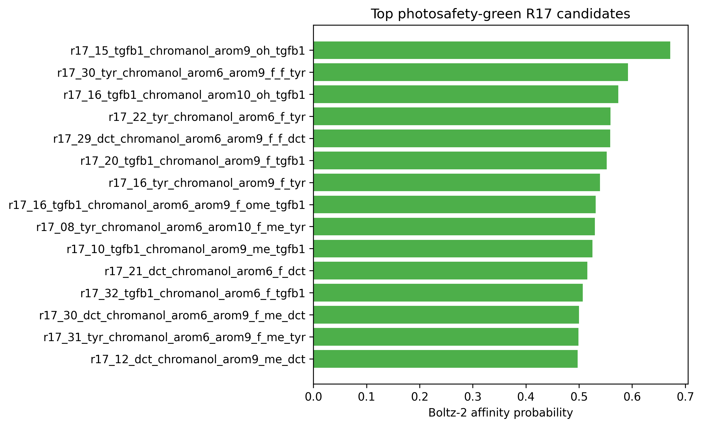
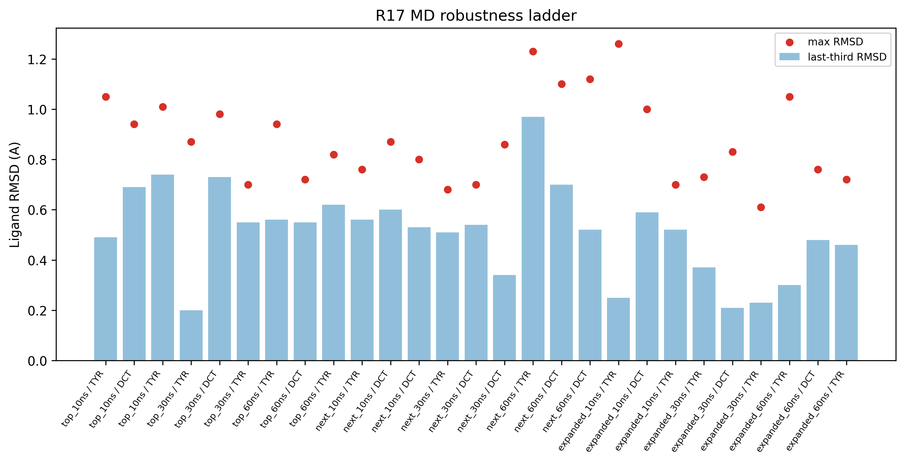
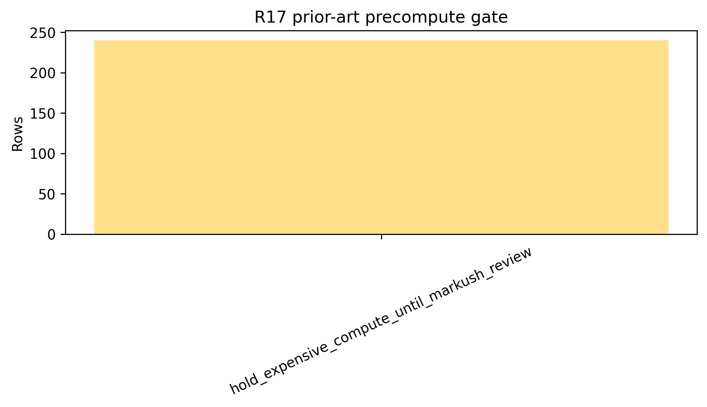

# R17 Constrained Generative Chromanol Analog Atlas: Photosafety-Gated Boltz-2 Cofolding and 10-60 ns MD Robustness

## Abstract

R17 extends the R16 topical chromanol program with a constrained generative analog atlas. The goal was not an unconstrained novelty claim, but a disciplined hit-to-lead expansion that keeps the chromanol core compact while varying substitution patterns and tracking target, photosafety, and prior-art gates. The atlas contains `240` Boltz-2 cofold rows across balanced skin-relevant targets. Photosafety-green candidates reached affinity probabilities up to `0.672`, while aryl-halogen candidates were retained only with explicit photosafety review labels. The MD ladder covers top, next, and expanded green-target panels through 10, 30, and 60 ns. Expanded 60 ns status is `3/3` ok, so this manuscript status is `complete`. All findings are in silico only and remain Markush/FTO and wet-lab validation pending.

**Keywords**: chromanol, generative design, Boltz-2, OpenMM, photosafety, prior-art gate, in silico

## 1. Research Question

Can a constrained R17 chromanol analog generator produce target-relevant, photosafety-gated candidates that remain stable through staged MD robustness checks without overclaiming novelty, freedom to operate, or clinical efficacy?

## 2. Data Sources

| file | role |
| --- | --- |
| `pilot/cpu_meaningful/r17_chromanol_generative_batch*_cofold.csv` | 240-row Boltz-2 cofold atlas |
| `pilot/md_r17_chromanol_generative_top_green_*/summary.json` | top green-target 10/30/60 ns MD ladder |
| `pilot/md_r17_chromanol_generative_next_green_*/summary.json` | next green-target 10/30/60 ns MD ladder |
| `pilot/md_r17_chromanol_generative_expanded_green_*/summary.json` | expanded green-target 10/30/60 ns MD ladder |
| `pilot/cpu_meaningful/precompute_prior_art_gate.csv` | technical prior-art and Markush pre-gate |

## 3. Results

### 3.1 Cofold atlas by target

### 3.2 Top photosafety-green candidates

| job_id | target | design | affinity probability | cLogP | QED | photosafety proxy |
| --- | --- | --- | --- | --- | --- | --- |
| r17_15_tgfb1_chromanol_arom9_oh_tgfb1 | TGFB1 | chromanol_arom9_OH_tgfb1 | 0.672 | 0.64 | 0.576 | none_detected |
| r17_30_tyr_chromanol_arom6_arom9_f_f_tyr | TYR | chromanol_arom6+arom9_F+F_tyr | 0.592 | 1.21 | 0.741 | none_detected |
| r17_16_tgfb1_chromanol_arom10_oh_tgfb1 | TGFB1 | chromanol_arom10_OH_tgfb1 | 0.574 | 0.64 | 0.616 | none_detected |
| r17_22_tyr_chromanol_arom6_f_tyr | TYR | chromanol_arom6_F_tyr | 0.559 | 1.07 | 0.709 | none_detected |
| r17_29_dct_chromanol_arom6_arom9_f_f_dct | DCT | chromanol_arom6+arom9_F+F_dct | 0.559 | 1.21 | 0.741 | none_detected |
| r17_20_tgfb1_chromanol_arom9_f_tgfb1 | TGFB1 | chromanol_arom9_F_tgfb1 | 0.552 | 1.07 | 0.709 | none_detected |
| r17_16_tyr_chromanol_arom9_f_tyr | TYR | chromanol_arom9_F_tyr | 0.540 | 1.07 | 0.709 | none_detected |
| r17_16_tgfb1_chromanol_arom6_arom9_f_ome_tgfb1 | TGFB1 | chromanol_arom6+arom9_F+OMe_tgfb1 | 0.532 | 1.08 | 0.795 | none_detected |
| r17_08_tyr_chromanol_arom6_arom10_f_me_tyr | TYR | chromanol_arom6+arom10_F+Me_tyr | 0.530 | 1.38 | 0.739 | none_detected |
| r17_10_tgfb1_chromanol_arom9_me_tgfb1 | TGFB1 | chromanol_arom9_Me_tgfb1 | 0.525 | 1.24 | 0.707 | none_detected |

### 3.3 Staged MD robustness

The R17 staged MD ladder currently contains `27` ok rows. The completed top and next green-target 60 ns panels were stable. The expanded 60 ns panel is the final promotion gate and is `3/3` complete in this manuscript snapshot.

| panel | target | analog | affinity probability | mean RMSD A | last-third RMSD A | max RMSD A |
| --- | --- | --- | --- | --- | --- | --- |
| expanded_10ns | DCT | chromanol_arom6+arom9_F+F_dct | 0.559 | 0.49 | 0.59 | 1.00 |
| expanded_10ns | TYR | chromanol_arom6+arom9_F+F_tyr | 0.592 | 0.69 | 0.25 | 1.26 |
| expanded_10ns | TYR | chromanol_arom6_F_tyr | 0.559 | 0.51 | 0.52 | 0.70 |
| expanded_30ns | DCT | chromanol_arom6+arom9_F+F_dct | 0.559 | 0.33 | 0.21 | 0.83 |
| expanded_30ns | TYR | chromanol_arom6+arom9_F+F_tyr | 0.592 | 0.28 | 0.37 | 0.73 |
| expanded_30ns | TYR | chromanol_arom6_F_tyr | 0.559 | 0.30 | 0.23 | 0.61 |
| expanded_60ns | DCT | chromanol_arom6+arom9_F+F_dct | 0.559 | 0.51 | 0.48 | 0.76 |
| expanded_60ns | TYR | chromanol_arom6+arom9_F+F_tyr | 0.592 | 0.42 | 0.30 | 1.05 |
| expanded_60ns | TYR | chromanol_arom6_F_tyr | 0.559 | 0.48 | 0.46 | 0.72 |
| next_10ns | DCT | chromanol_arom9+arom10_Cl+Cl_dct | 0.575 | 0.51 | 0.60 | 0.87 |
| next_10ns | DCT | chromanol_arom6+arom9_F+Me_dct | 0.500 | 0.51 | 0.53 | 0.80 |
| next_10ns | TYR | chromanol_arom9+arom10_F+Cl_tyr | 0.578 | 0.51 | 0.56 | 0.76 |
| next_30ns | DCT | chromanol_arom9+arom10_Cl+Cl_dct | 0.575 | 0.53 | 0.54 | 0.70 |
| next_30ns | DCT | chromanol_arom6+arom9_F+Me_dct | 0.500 | 0.50 | 0.34 | 0.86 |
| next_30ns | TYR | chromanol_arom9+arom10_F+Cl_tyr | 0.578 | 0.51 | 0.51 | 0.68 |
| next_60ns | DCT | chromanol_arom9+arom10_Cl+Cl_dct | 0.575 | 0.53 | 0.70 | 1.10 |
| next_60ns | DCT | chromanol_arom6+arom9_F+Me_dct | 0.500 | 0.49 | 0.52 | 1.12 |
| next_60ns | TYR | chromanol_arom9+arom10_F+Cl_tyr | 0.578 | 0.97 | 0.97 | 1.23 |
| top_10ns | DCT | chromanol_arom6+arom9_Cl+Cl_dct | 0.582 | 0.71 | 0.69 | 0.94 |
| top_10ns | TYR | chromanol_arom6+arom9_F+Cl_tyr | 0.607 | 0.50 | 0.49 | 1.05 |
| top_10ns | TYR | chromanol_arom9_F_tyr | 0.540 | 0.50 | 0.74 | 1.01 |
| top_30ns | DCT | chromanol_arom6+arom9_Cl+Cl_dct | 0.582 | 0.50 | 0.73 | 0.98 |
| top_30ns | TYR | chromanol_arom6+arom9_F+Cl_tyr | 0.607 | 0.31 | 0.20 | 0.87 |
| top_30ns | TYR | chromanol_arom9_F_tyr | 0.540 | 0.53 | 0.55 | 0.70 |
| top_60ns | DCT | chromanol_arom6+arom9_Cl+Cl_dct | 0.582 | 0.54 | 0.55 | 0.72 |
| top_60ns | TYR | chromanol_arom6+arom9_F+Cl_tyr | 0.607 | 0.50 | 0.56 | 0.94 |
| top_60ns | TYR | chromanol_arom9_F_tyr | 0.540 | 0.55 | 0.62 | 0.82 |

### 3.4 Expanded 60 ns final gate

| name | target | analog | mean RMSD A | last-third RMSD A | max RMSD A |
| --- | --- | --- | --- | --- | --- |
| r17_30_tyr_chromanol_arom6_arom9_f_f_tyr__chromanol_arom6_arom9_F_F_tyr__60ns | TYR | chromanol_arom6+arom9_F+F_tyr | 0.42 | 0.30 | 1.05 |
| r17_29_dct_chromanol_arom6_arom9_f_f_dct__chromanol_arom6_arom9_F_F_dct__60ns | DCT | chromanol_arom6+arom9_F+F_dct | 0.51 | 0.48 | 0.76 |
| r17_22_tyr_chromanol_arom6_f_tyr__chromanol_arom6_F_tyr__60ns | TYR | chromanol_arom6_F_tyr | 0.48 | 0.46 | 0.72 |

### 3.5 Prior-art and Markush discipline

The R17 prior-art precompute gate counts are `{'hold_expensive_compute_until_markush_review': 240}`. This gate does not kill the scientific atlas, but it blocks stronger commercial language. A PubChem no-hit result is not freedom to operate, because Markush and use claims can still cover unmade or unlisted analogs.

## 4. Development Interpretation

R17 is best interpreted as a constrained hit-to-lead expansion paper. Its strongest contribution is a reproducible design queue that combines target cofolding, photosafety labeling, staged MD robustness, and prior-art discipline. R16 remains the cleaner immediate topical lead manuscript; R17 supplies the broader analog design space.

## 5. Limitations

All findings are in silico only. Boltz-2 cofolding is not biochemical binding evidence. MD RMSD stability is not potency, residence time, target engagement, or skin exposure. Photosafety, sensitization, hERG, AMES, DILI, irritation, IVRT/IVPT, PBPK, formulation compatibility, and target-engagement assays remain required. Markush/FTO review is mandatory before synthesis, purchasing, commercial novelty claims, or additional expensive 100-200 ns/RBFE/ABFE expansion.

## 6. Conclusion

The R17 atlas is complete for manuscript-level reporting as a disciplined constrained-design workflow: the 240-row cofold atlas and all top/next/expanded 10/30/60 ns MD panels are finished, including the final expanded 60 ns 3/3 stable gate. The next step is not another automatic long-MD expansion, but cross-model/decoy or PLIF checks, Markush/FTO review, and wet-lab/formulation packages.
